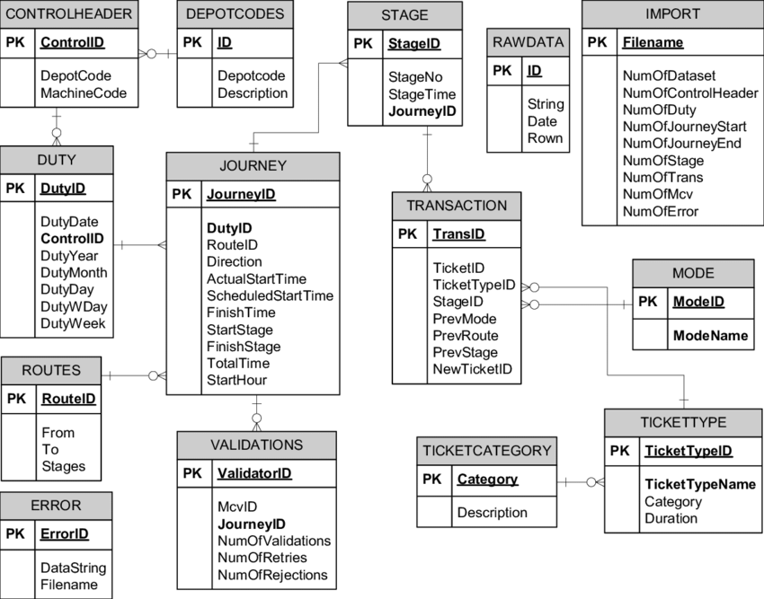

# Lecture 20 - Backend 7 | Start Working with Mongoose

এর আগের ক্লাসে আমরা ডাটাবেজ নিয়ে একটা ওভারভিউ দিয়েছিলাম। আর বলেছিলাম আমরা প্রথমে মঙ্গোডিব শিখবো। তার জন্য লেকচার ১৭ তে একটা টাস্কও দেয়া হয়েছিল মঙ্গোডিবির উপর একটা ধারণা নেয়ার জন্য। আমরা ডেভেলপাররা কেন জানিনা ডাটাবেজকে একটু এড়িয়ে চলতে চাই। আমরা আমাদের প্রজেক্টে raw মঙ্গোডিবি কোড লিখিনা। আমরা ব্যবহার করি ORM (Object Relational Mapper)। এই ORM সব ধরণের ফ্রেমওয়ার্কেই আছে। যারা PHP/LARAVEl নিয়ে কাজ করেন তাদের জন্য আছে Eloquent নামে একটা ORM, জাভাতে আছে Hibernate। তো এরকম প্রতিটা ফেমওয়ার্কে কিছু না কিছু উপায় থাকে যে উপায় ব্যবহার করে আপনি খুব সহজেই ডাটাবেজের সাথে কমিউনিকেট করতে পারবেন প্রোগ্রামারের ওয়েতে। প্রোগ্রামারের ওয়েতে মানে কিরকম? প্রোগ্রামাররা কুয়েরি লিখতে পছন্দ করেন না। কারণ এটা আলাদা একটা কনসেপ্ট, আলাদাভাবে শিখতে হয়। এত ঝামেলায় না গিয়ে আমরা ORM ব্যবহার করি। এতে আমরা ফাংশন বা ক্লাস কল করার মাধ্যমে ডাটাবেজ রিলেটেড কাজ করতে পারি। তার মানে কি আমরা ডাটাবেজ না শিখেই ডাটাবেজের গভীরের কাজগুলো করতে পারবো? কখনোই না। কিন্তু ডেইলি বেসিসে যে বেসিক কাজগুলো আছে সেগুলো করতে পারবো। যেহেতু আমরা এখনও বিগিনার আমাদের ডাটাবেজের অতো গভীরে যাওয়ার কোনো প্রয়োজন নেই। আমরা আপাতত Mongoose নিয়ে কাজ করবো।

Mongoose নিয়ে কাজ করতে গেলে আমাদের মেশিনে মঙ্গোডিবি কানেক্টেড থাকতে হবে। আমরা অনেকভাবেই মঙ্গোডিবি কানেক্ট করতে পারি। আমরা [Compass](https://www.mongodb.com/products/compass) ডাউনলোড করে ইনস্টল করে কানেক্ট করতে পারি। আমরা [MongoDB Installation](https://www.mongodb.com/docs/manual/tutorial/install-mongodb-on-windows/) ফলো করে মঙ্গোডিবি ইনস্টল করে কানেক্ট করতে পারি। আমরা [Docker](https://www.docker.com/) ব্যবহার করে কানেক্ট করতে পারি। যেকোনো ভাবে আমরা কানেক্ট করতে পারি। ভিএস কোডে MongoDB নামে একটা এক্সটেনশন আছে। সেটা ব্যবহার করে আমাদের ডাটাগুলো আমরা দেখতে পারি। এখানে docker কনসেপ্টটা একটু নতুন। এটা নিয়ে পরের বিস্তারিত আলোচনা করা হবে। আপাতত সামান্য জেনে রাখুন। ধরুন আপনি একটা অ্যাপ বানালেন উইন্ডোজে। আমাকে দিলেন সেটা। আমি ব্যবহার করি লিনাক্স। এখন সেটা আমার মেশিনে কাজ করছে না। এই সমস্যার সল্যুশন হলো। আপনি ডকারে এই অ্যাপ্লিকেশনের ইমেজ ক্রিয়েট করে সেটা আমাকে দিবেন। আমি ডকারে সেটা রান করবো। ডকার থাকলে কোন মেশিন সেটা কোনো সমস্যা না। যেকোনো মেশিনের কোড ভিন্ন মেশিনে রান করানো যাবে।

কম্পাস ব্যবহার করে কিভাবে কানেক্ট করবেন একটু দেখাচ্ছি। প্রথমে কম্পাস ইনস্টল করে নিবেন। এরপর রান করবেন। রান করলে নিচের ছবির মতো স্ক্রিন পাবেন।


URI এ `mongodb://localhost:27017` এটা লিখে কানেক্ট বাটনে প্রেস করবেন। আপনার ডাটাবেজ কানেক্ট হয়ে যাবে।

এবার দেখাই কিভাবে কমান্ড লাইন ব্যবহার করে কানেক্ট করবেন। [MongoDB Installation](https://www.mongodb.com/docs/manual/tutorial/install-mongodb-on-windows/) ফলো করে যেভাবে যা যা বলেছে সব কাজ করুন। করার পর পাওয়ারশেল বা আপনার কমান্ড লাইন ওপেন করুন। করার পর `mongod` লিখে এন্টার করুন। আপনার ডাটাবেজ কানেক্ট হয়ে যাবে।

Mongoose নিয়ে কাজ করতে হলে আমাদের প্রথমে Mongoose ইনস্টল করে নিতে হবে `yarn add mongoose` লিখে। এবার আমরা mongoose কিভাবে কাজ করে তা দেখবো।

প্রথমে আমাদের জানতে হবে ডাটাবেজের কাজ কি? একদম বেসিক কাজ হলো CRUD (Create, Read, Update, Delete) করা। এখন এগুলো আমরা কিভাবে করতে পারি? ডাটার স্কিমা (Schema) তৈরি করে। এখন মঙ্গোডিবিতে আবার স্কিমা কেন? মঙ্গোডিবি তো স্কিমালেস। তাহলে কেন আমরা এখানে স্কিমা বানাবো। কিছু পয়েন্ট আছে। চলুন সেগুলো আলোচনা করি।

- আমরা ডাটা রাখবো ডাটাবেজে। এখন ডাটা রাখা অনেক ব্যয়বহুল। এখন যদি আমরা ডাটা ভ্যালিডেশন ছাড়া জাংক ডাটা রাখি সেক্ষেত্রে তো আমাদের খরচ বেড়ে যাবে অকারণে। আমি কেন কিছু জাংক ডাটার জন্য এত খরচ করবো। আমি সেগুলোই রাখতে দিবে যেগুলো অর্থবহ ডাটা। এই ডাটা ভ্যালিডেশনের জন্য আমরা স্কিমা বানাই।
- দ্বিতীয় পয়েন্ট হলো আমরা ডেভেলপাররা বুঝি আমাদের কতটুকু পর্যন্ত স্বাধীনতা প্রয়োজন। যেমন জাভাস্ক্রিপ্টে ডাটা টাইপ ডিফাইন করার কোনো সিস্টেম নেই। আমরা যেকোনো ডাটা নিয়ে কাজ করতে করতে একসময় কখন যে আমাদের অ্যাপ্লিকেশন ফেইলিওর হয়ে যাবে সেটা আমরা বুঝতে পারবো না। কারণ আমি ভুলভাল ডাটা নিয়ে কাজ করতে পারি। এজন্য টাইপস্ক্রিপ্ট আমাদের পছন্দ। কারণ সে কিছু সীমাবদ্ধতা আমাদের জন্য রেখে দিয়েছে। যার কারণে আমরা ভুলভাল ডাটা নিয়ে কাজ করতে গেলে সে আমাদের তা করতে দিবে না। সেরকম মঙ্গোডিবি যখন আস্তে আস্তে স্ট্রাকচারড ডাটার জন্য ব্যবহার শুরু হলো, তখন তার জন্য একটা স্ট্রাকচার দরকার ছিল, ডাটাসমূহের রিলেশনশীপের জন্য একটা শেইপ বা মডেল দরকার হলো, ভ্যালিডেশনের জন্য একটা সিস্টেম দরকার হলো। এই সবকিছু আমাদের প্রোভাইড করছে Mongoose। Mongoose এর মাধ্যমে আমরা স্কিমা তৈরি করতে পারি, আর Mongoose আমাদের হয়ে ডাটাবেজের সাথে কমিউনিকেট করছে।

স্কিমার আরেকটা সুন্দর নাম আছে। সেটা হলো Entity। যখন আপনি SQL ডাটাবেজ নিয়ে কোনো কোর্স করবেন বা কাজ করবেন তখন একটা কনসেপ্ট আপনার সামনে আসবে। সেটা হলো Entity Diagram। যা দেখতে অনেকটা নিচের ছবির মতো।



এখানে উপরে হাইলাইট করে টেবিলের নাম আছে। যখন আমরা SQL নিয়ে কাজ করবো তখন এটা টেবিল আর যখন NoSQL নিয়ে কাজ করবো তখন তা হলো কালেকশন। তারপর SQL Database এ প্রাইমারি কী (PK) দরকার হয়, কিন্তু NoSQL ডাটাবেজে প্রাইমারি কী প্রয়োজন হয় না। এরপর আছে আমাদের প্রোপার্টিগুলো। এখানে কোনো ডাটা টাইপ বলে দেয়া হয়নি। যদি আপনি চান তাহলে ডাটা টাইপও বলে দিতে পারেন। এরপর দেখবেন অনেক ধরণের কানেক্টিং লাইন দেখা যাচ্ছে। এই লাইনগুলোর একেকটার মিনিং একেকরকম। কোনোটা One to One relationship বুঝায়, কোনোটা One to many relationship বুঝায়, কোনোটা আবার Many to Many relationship বুঝায়। এই রিলেশনশীপগুলো একট্য বুঝার চেষ্টা করি।

- One to One Relationship - ধরেন একজন ইউজারের একই সময় একটাই প্রোফাইল থাকবে। দুইটা কখনই হতে পারবে না। আবার ঐ প্রোফাই্লের মালিক একজন ইউজারই হতে পারবে, দুইজন কখনই হতে পারবে না। এখানে যদি আমরা ইউজারকে একটা স্কিমা আর প্রোফাইলে আরেকটা স্কিমা ধরি তাহলে এটা হচ্ছে One to One Relationship।
- One to many relationship - ধরেন ইউজার পোস্ট করেন। এখন একজন ইউজারের অনেকগুলো পোস্ট থাকতে পারে। সে দিনে ১০টা পোস্টও করতে পারে। তার মানে একজন ইউজারের অনেক পোস্ট। কিন্তু সব পোস্টের মালিক ঐ একজন ইউজারই। দুইজন হতে পারবে না। এটাকে বলে One to many relationship.
- Many to Many relationship - ধরেন ইউডেমি বা অন্য কোনো সাইটে একটা কোর্স ৩ জন মিলেও বানাতে পারে। আবার ঐ ৩ জন আলাদা আলাদা ভাবে আরো কোর্স বানাতে পারে। তার মানে একটা কোর্সের মালিক ৩ জন হতে পারে, আবার ঐ ৩ জনের মাল্টিপল কোর্স থাকতে পারে। এটাই হচ্ছে Many to Many relationship।

এবার আমরা Mongoose নিয়ে একটু কাজ করবো। তার জন্য আমরা একটা জাভাস্ক্রিপ্ট ফাইল ক্রিয়েট করবো। [Mongoose](https://mongoosejs.com/docs/guide.html) এর ডকুমেন্টেশন অনেক বড়। এটা যদি আমরা মোটামুটি বুঝতে পারি তাহলে ডাটাবেজ নিয়ে কাজ করা আমাদের জন্য অনেক সহজ হয়ে যাবে। আমরা প্রথমে আমাদের ফাইলে Mongoose ইমপোর্ট করে নিবো। এবং কানেক্ট করবো ডকুমেন্টেশন অনুযায়ী।

```js
// index.js

const mongoose = require('mongoose');

mongoose.connect('mongodb://localhost:27017/mongo-demo');
```

এখানে `mongo-demo` আমাদের ডাটাবেজের নাম। আপনারা এর পরিবর্তে যা খুশি দিতে পারেন। ডকুমেন্টেশনে এতটুকুতে শেষ করে দিয়েছে। কিন্তু আমরা আরেকতু গভীরে যাবো। এই ফাংশনটা একটা প্রমিজ রিটার্ন করে। যেহেতু প্রমিজ রিটার্ন করে সেহেতু আমরা then catch ব্লক ইউজ করতে পারি।

```js
// index.js

const mongoose = require('mongoose');

mongoose
	.connect('mongodb://localhost:27017/mongo-demo')
	.then(async () => {
		console.log('Database connected');
	})
	.catch((e) => {
		console.log(e);
	});
```

আমরা এখানে দিলাম যখন ডাটাবেজ কানেক্টেড হবে তখন আমাদের একটা ম্যাসেজ দিবে। যদি এরর হয় তার জন্য আমরা ক্যাচ ব্লক লিখলাম। এবার একটু রান করে দেখি আমাদের ডাটাবেজ কানেক্ট হয় কিনা। যদি রান করার পর 'Database connected' লেখা আসে তাহলে ধরে নিবেন আপনার ডাটাবেজ কানেক্ট হয়েছে। যদি কম্পাসে গিয়ে দেখি দেখবো কোনোকিছু নেই mongo-demo নামে। কারণ ডাটাবেজ কানেক্ট হয়ে যে বসে আছে, সেটা ক্লোজ করিনি। ক্লোজ না করলে তা কানেক্ট হয়ে বসে থাকবে। আর কিছুই করবে না। তাই আমাদের ক্লোজ করতে হবে কানেক্ট হওয়ার পর। যদিও এরপরও দেখা যাবে না কারণ কোনো ডাটা এখনও আমরা ক্রিয়েট করিনি। ক্রিয়েট করলে দেখা যাবে।

```js
const mongoose = require('mongoose');

mongoose
	.connect('mongodb://localhost:27017/mongo-demo')
	.then(async () => {
		console.log('Database connected');
	})
	.catch((e) => {
		console.log(e);
	})
	.finally(() => {
		mongoose.connection.close();
	});
```

ডাটাবেজ কানেকশনের পর আমরা then ব্লকের ভিতর আমাদের যাবতীয় কাজসমূহ করবো।

এখন যদি আমাদের ডাটাবেজে কোনো এরর ঘটে, ধরেন আমরা কানেকশন স্ট্রিং এ কিছু ভুল করলাম লিখতে, তাহলে Mongoose নিজস্ব টাইমআউট শেষ না হওয়া পর্যন্ত কানেক্ট হওয়ার চেষ্টা করবে, এরপর এরর দিবে। এখন আমরা চাইছি যদি ভুল হয় তাহলে সাথে সাথে যেন এরর দেয়। এটার জন্য Mongoose এ একটা সিস্টেম আছে। আমরা connect মেথডে আর্গুমেন্ট হিসেবে এই টাইমআউট সেট করে দিতে পারি।

```js
const mongoose = require('mongoose');

mongoose
	.connect('mongodb://loclhost:27017/mongo-demo', {
		serverSelectionTimeoutMS: 10,
	})
	.then(async () => {
		console.log('Database connected');
	})
	.catch((e) => {
		console.log(e);
	})
	.finally(() => {
		mongoose.connection.close();
	});
```

দেখবেন ইনস্ট্যান্ট একটা এরর দিয়ে দিবে। তবে এত কম টাইমআউট দেয়া ভাল না। কারণ সবার নেট স্পীড একই না। কারো একটু স্লো। এখন যদি স্লো নেটের কেউ আমাদের ডাটাবেজের সাথে কানেক্ট হতে চায় সেক্ষেত্রে অতক্ষণ সে অপেক্ষা না করে ১০ মিলিসেকেন্ড পরেই এরর দিয়ে দিবে। তাই এটা আমরা ব্যবহার করলেও একটা লজিক্যাল টাইমআউট দিয়ে দিবো যেন যা স্লো নেটে কাজ করে তারাও কানেক্ট হতে পারে।

এবার আমরা একটু Mongoose এর অফিসিয়াল ডকুমেন্টেশনে যাবো। Mongoose নিয়ে কাজ করতে গেলে সবার প্রথমে আমাদের যে জিনিসটা জানতে হয় সেটা হলো স্কিমা। মডেল বানানোর জন্য অবশ্যই আমাদের একটা স্কিমা লাগবে। তার মানে Mongoose এ সবচেয়ে গুরুত্বপূর্ণ element হচ্ছে Schemas। এরপর আছে SchemaTypes। এটা স্কিমার সাথে রিলেটেড। Connections এই মুহূর্তে খুব গুরুত্বপুর্ণ না। তবে আমরা যখন প্রোডাকশনে যাবো তখন বিভিন্নভাবে এরর হ্যান্ডলিং করতে হবে। তখন আমাদের Connections এর প্রয়োজন হবে। এরপর আছে Models। স্কিমা থেকে তৈরি হয় মডেল। আমরা সরাসরি স্কিমা নিয়ে কাজ করি না। স্কিমা জাস্ট একটা ডেফিনেশন, আমার ডাটার চেহারা কেমন হবে সেটা। স্কিমা থেকে তৈরি করা হয় মডেল। আর সেই মডেল নিয়ে আমরা কাজ করে থাকি। MVC (Model View Controller) প্যাটার্নে যে মডেলের কথা বলা হয় এখানে সেই একই মডেলের কথা বলা হচ্ছে। এরপর আছে Documents. ডকুমেন্ট বলতে বুঝায় আমরা কুয়েরি করার পর যে জিনিসটা রিটার্ন পাই সেটাই হচ্ছে ডকুমেন্ট। বা নতুন কিছু ইনসার্ট করার পর যে ডাটা আমরা রিটার্ন পাচ্ছি সেটা হলো ডকুমেন্ট। মূলত একটা json অবজেক্ট, যার মধ্যে আমরা স্টোর করে রেখেছি আমাদের সমস্ত ইনফরমেশন। একটা ডকুমেন্টের মধ্যে সাবডকুমেন্ট থাকতে পারে। সেই সাবডকুমেন্ট নিয়ে প্রপার ওয়েতে, ফ্লেক্সিবলি কাজ করার সুযোগ আমাদের মঙ্গোডিবি দেয় না, সেই সুযোগ খুব সহজে আমাদের দেয় Mongoose। যখন আমরা কুয়েরি করবো তখন আমাদের ডকুমেন্ট আর সাবডকুমেন্টের কাজ আসবে। এরপর আছে Queries। এরপর আছে Validation। এটা আমাদের যখন আমরা ডাটা ইনসার্ট করতে চাই বা আপডেট করতে চাই তখন আমাদের এই ভ্যালিডেশনটা কাজে লাগে। যেমন আপনি চাইছেন যে আমার কোনো নাম empty string হওয়া যাবে না, কিন্তু ইউজার empty string দিয়ে বসে আছে। এখন সেটা তো আপনি ডাটাবেজে স্টোর করবেন না। এই জায়গাটাই কাজ করে ভ্যালিডেশন। তারপর আছে মিডলওয়্যার। অনেকটা এক্সপ্রেস মিডলওয়্যারের মতোই। সার্ভার থেকে ডাটা ডাটাবেজে পাঠানোর পর ডাটাবেজে সেভ হওয়ার আগে আমরা সেই ডাটা ট্রান্সফর্ম করতে পারি, বা ডিলিট করতে পারি। সেই কাজটা করে এই মিডলওয়্যার। এরপর সবচেয়ে গুরুত্বপূর্ণ সিস্টেম হচ্ছে Populate। রিলেশনশীপ নিয়ে কাজ করতে চাইলে আমাদের এই পপুলেট নিয়ে কাজ করতে হবে। Discriminators অতো গুরুত্বপুর্ণ না। Plugins কিছু কিছু ক্ষেত্রে গুরুত্বপূর্ণ। আমরা বিভিন্ন কাস্টম প্লাগিন বানিয়ে কাজ করতে পারি। Transactions অ্যাডভান্সড কনসেপ্ট, সেটা নিয়ে আমরা পরে জানবো। ধরেন আপনি এটিএম বুথ থেকে টাকা তুলতে গেলেন। আপনি কার্ড ঢুকিয়ে পাসওয়ার্ড দিয়ে, অ্যামাউন্ট সিলেক্ট করলেন। আপনার টাকা কেটে ফেললো। এখন টাকা বের হওয়ার সময় কোনো কারণে টাকা আটকে গেলো, কিন্তু আপনার টাকা কাটা হয়ে গেছে। এক্ষেত্রে দুইটা উপায় আছে। হয় টাকা হাতে পাওয়ার পর টাকা কাটবে। আর যদি টাকা কেটেও ফেলে, তা কোনো কারণে আটকে গেলে সেটা আবার রিভার্স হয়ে যাবে। দুইটা অপারেশন যারা একে অন্যের উপর নির্ভরশীল, দুইটাই সাক্সেসফুল হলে তা সাক্সেস রিটার্ন করবে, নাহয় রোলব্যাক করবে, এরকম কাজ করার জন্য Transaction ব্যবহার করা হয়।

আমরা স্কিমাটাইপস দিয়ে শুরু করি। আগে আমাদের জানতে হবে কোন কোন ডাটা টাইপের ডাটা ইউজ করা যাবে। তা নিচে দেয়া হলো।


কিভাবে স্কিমা টাইপ লিখতে হবে তার একটা ফরমেট ডকুমেন্টেশনে দেয়া আছে, যার স্ন্যাপশট দেয়া হলো।


এবার আমাদের ফাইলে আমরা একটা স্কিমা বানাবো। আমরা একজন মানুষের জন্য স্কিমা বানাবো। আমরা লিখবো এভাবে

```js
const mongoose = require('mongoose');

const personSchema = new mongoose.Schema({});

mongoose
	.connect('mongodb://loclhost:27017/mongo-demo', {
		serverSelectionTimeoutMS: 10,
	})
	.then(async () => {
		console.log('Database connected');
	})
	.catch((e) => {
		console.log(e);
	})
	.finally(() => {
		mongoose.connection.close();
	});
```

mongoose একটা ক্লাস। আমরা new mongoose.Schema() দিয়ে স্কিমা তৈরি করবো। এই স্কিমার মধ্যে কি কি থাকবে সেটা বলে দেয়ার জন্য একটা অবজেক্ট পাস করতে হবে। সেখানে থাকবে একজন মানুষের ফার্স্টনেইম, লাস্টনেইম, ইমেইল, বয়স, একটা বায়ো আর বৈবাহিক অবস্থা।

```js
const mongoose = require('mongoose');

const personSchema = new mongoose.Schema({
	firstName: String,
	lastName: String,
	email: String,
	age: Number,
	bio: String,
	single: Boolean,
});

mongoose
	.connect('mongodb://loclhost:27017/mongo-demo')
	.then(async () => {
		console.log('Database connected');
	})
	.catch((e) => {
		console.log(e);
	})
	.finally(() => {
		mongoose.connection.close();
	});
```

আমরা আমাদের স্কিমা তৈরি করে ফেললাম। এবার আমরা মডেল তৈরি করবো।

```js
const mongoose = require('mongoose');

const personSchema = new mongoose.Schema({
	firstName: String,
	lastName: String,
	email: String,
	age: Number,
	bio: String,
	single: Boolean,
});

const Person = mongoose.model('Person', personSchema);

mongoose
	.connect('mongodb://loclhost:27017/mongo-demo')
	.then(async () => {
		console.log('Database connected');
	})
	.catch((e) => {
		console.log(e);
	})
	.finally(() => {
		mongoose.connection.close();
	});
```

এরপর আমরা আমাদের ডাটাবেজে ডাটা ইনসার্ট করবো। এই কাজটা অবশ্যই করতে হবে then ব্লকের ভেতর। আমরা প্রথমে কোনো ডাটা ইনপুট না দিয়ে empty object দিয়ে দেখি আউটপুট কেমন আসে।

```js
const mongoose = require('mongoose');

const personSchema = new mongoose.Schema({
	firstName: String,
	lastName: String,
	email: String,
	age: Number,
	bio: String,
	single: Boolean,
});

const Person = mongoose.model('Person', personSchema);

mongoose
	.connect('mongodb://loclhost:27017/mongo-demo')
	.then(async () => {
		console.log('Database connected');
		const person = new Person({});
		await person.save();
		console.log('Person created');
	})
	.catch((e) => {
		console.log(e);
	})
	.finally(() => {
		mongoose.connection.close();
	});
```

এবার আমরা ডাটাবেইজে কি সেভ হলো একটু দেখি। আপনারা কম্পাসে গিয়ে দেখতে পারবেন। আমি এখানে মঙ্গোডিবির ভিএস কোড এক্সটেনশন ব্যবহার করছি। সেখানে থেকেই আউটপুটটা দেখাচ্ছি।


দেখা যাচ্ছে আইডি ছাড়া আর কিছুই এখানে নেই। এবার আমরা ফার্স্টনেইম আর লাস্টনেইম দিয়ে দেখি।

```js
const mongoose = require('mongoose');

const personSchema = new mongoose.Schema({
	firstName: String,
	lastName: String,
	email: String,
	age: Number,
	bio: String,
	single: Boolean,
});

const Person = mongoose.model('Person', personSchema);

mongoose
	.connect('mongodb://loclhost:27017/mongo-demo')
	.then(async () => {
		console.log('Database connected');
		const person = new Person({});
		await person.save();
		console.log('Person created');
	})
	.catch((e) => {
		console.log(e);
	})
	.finally(() => {
		mongoose.connection.close();
	});
```


এবার দেখা যাচ্ছে ফার্স্টনেইম আর লাস্টনেইম ছাড়া আর কিছু আসে নি। আমরা এখানে যেকোনো ডাটা ইনপুট করতে পারি। কারণ আমরা এখানে কোনো ভ্যালিডেশন করিনি। ভ্যালিডেশন না করার কারণে কেউ খালি ডাটা দিতে পারে, কেউ একটা দিবে বাকিটা দিবে না এরকম করতে পারে। আমি তা চাই না। আমি এখন কি করবো? আমাদের স্কিমাতে ডাটা ভ্যালিডেশনের কিছু অপশন রাখবো।

```js
const mongoose = require('mongoose');

const personSchema = new mongoose.Schema({
	firstName: {
		type: String,
		required: true,
		minlength: [3, 'Minimum 3 chars'],
		maxlength: [20, 'Maximum 20 chars'],
	},
	lastName: {
		type: String,
		required: true,
		minlength: [3, 'Minimum 3 chars'],
		maxlength: [20, 'Maximum 20 chars'],
	},
	email: {
		type: String,
		required: true,
		validate: {
			validator: function (v) {
				return v.endsWith('.com');
			},
			message: 'Invalid email formats',
		},
	},
	age: Number,
	bio: String,
	single: Boolean,
});

const Person = mongoose.model('Person', personSchema);

mongoose
	.connect('mongodb://localhost:27017/mongo-demo')
	.then(async () => {
		console.log('Database connected');

		await person.save();
	})
	.catch((e) => {
		console.log(e);
	})
	.finally(() => {
		mongoose.connection.close();
	});
```

ফার্স্টনেইমের ক্ষেত্রে আমাদের ডাটা টাইপ স্ট্রিং, এটা খালি রাখা যাবে না তার জন্য `required: true`, মিনিমাম ৩ অক্ষরের হতে হবে এবং ম্যাক্সিমাম ২০ অক্ষরের হতে হবে এরকম করে তৈরি করলাম। লাস্টনেইমের জন্যও তা সেইম। এরপর ইমেইল। টাইপ এবং রিকোয়ারড আগের মতোই স্ট্রিং এবং true। এরপর আমরা একটা ভ্যালিডেশন করবো। Mongoose এ উপরের মতো করে ভ্যালিডেশন করা হয় ইমেইল, একটা ফাংশন লিখে। বাকিগুলোতে আমাদের ভ্যালিডেশনের তেমন প্রয়োজন নেই। কেউ এই ৩টা দিলেও সমস্যা নাই, না দিলেও সমস্যা নাই। আমরা চাই ইউজার অন্তত তার ফার্স্টনেইম, লাস্টনেইম আর ইমেইল এই তিনটা ফিল্ড অবশ্যই দিবে।

এবার আমরা একটু দেখি যদি ইমেইল ফিল্ড না দিয়ে বাকিগুলো দিই তাহলে তা নিবে নাকি এরর দিবে।

```js
const mongoose = require('mongoose');

const personSchema = new mongoose.Schema({
	firstName: {
		type: String,
		required: true,
		minlength: [3, 'Minimum 3 chars'],
		maxlength: [20, 'Maximum 20 chars'],
	},
	lastName: {
		type: String,
		required: true,
		minlength: [3, 'Minimum 3 chars'],
		maxlength: [20, 'Maximum 20 chars'],
	},
	email: {
		type: String,
		required: true,
		validate: {
			validator: function (v) {
				return v.endsWith('.com');
			},
			message: 'Invalid email formats',
		},
	},
	age: Number,
	bio: String,
	single: Boolean,
});

const Person = mongoose.model('Person', personSchema);

mongoose
	.connect('mongodb://localhost:27017/mongo-demo')
	.then(async () => {
		console.log('Database connected');
		const person = new Person({
			firstName: 'Aditya',
			lastName: 'Chakraborty',
			age: 30,
			bio: 'Backend Developer',
			single: true,
		});
		await person.save();
		console.log('Person created');
		console.log(person);
	})
	.catch((e) => {
		console.log(e);
	})
	.finally(() => {
		mongoose.connection.close();
	});
```

দেখা যাবে এটা ডাটাবেজে সেইভ হবে না আর বড়সড় একটা এরর দিবে নিচের মতো।


এবার সব যদি ঠিকমতো দিই তাহলে কি হবে একটু দেখি।

```js
const mongoose = require('mongoose');

const personSchema = new mongoose.Schema({
	firstName: {
		type: String,
		required: true,
		minlength: [3, 'Minimum 3 chars'],
		maxlength: [20, 'Maximum 20 chars'],
	},
	lastName: {
		type: String,
		required: true,
		minlength: [3, 'Minimum 3 chars'],
		maxlength: [20, 'Maximum 20 chars'],
	},
	email: {
		type: String,
		required: true,
		validate: {
			validator: function (v) {
				return v.endsWith('.com');
			},
			message: 'Invalid email formats',
		},
	},
	age: Number,
	bio: String,
	single: Boolean,
});

const Person = mongoose.model('Person', personSchema);

mongoose
	.connect('mongodb://localhost:27017/mongo-demo')
	.then(async () => {
		console.log('Database connected');
		const person = new Person({
			firstName: 'Aditya',
			lastName: 'Chakraborty',
			email: 'aditya@example.com',
			age: 30,
			bio: 'Backend Developer',
			single: true,
		});
		await person.save();
		console.log('Person created');
		console.log(person);
	})
	.catch((e) => {
		console.log(e);
	})
	.finally(() => {
		mongoose.connection.close();
	});
```

এবার দেখা যাবে সেটা সাক্সেসফুল হয়েছে। আর ডাটাবেজেও তা ক্রিয়েট হয়েছে।


আজ মোটামুটি Mongoose দিয়ে কিভাবে ডাটাবেজ কানেক্ট করা যায়, কিভাবে স্কিমা তৈরি করতে হয়, কিভাবে মডেল তৈরি করতে হয় তার একটা মোটামুটি ধারণা আমরা পেলাম। ব্যাকএন্ডের পূর্বের ক্লাসের এটাই শেষ ক্লাস। পরবর্তীতে আমরা আবার আমাদের অ্যাটেন্ডেন্স মডেলের প্রজেক্টে ফিরে যাবে। আপনাদের জন্য একটা টাস্ক হলো, [MongooseJs Docs](https://mongoosejs.com/docs/) থেকে আপনারা Schemas, SchemaTypes, Connections, Models, Documents, Subdocuments, Queries and Validation স্টাডি করবেন এবং প্র্যাকটিস করবেন।

## Resource for this lecture

এই লেকচারের সমস্ত রিসোর্স [লেকচার ২০](../../resources/lecture-20/README.md) এ পাবেন।

## Source Code

এই লেকচারের সোর্স কোডসমূহ এই [লিংক](../../src/mongo-demo/) এ পাবেন।

## AUTHOR

[Aditya Chakraborty](https://github.com/adityackr)
