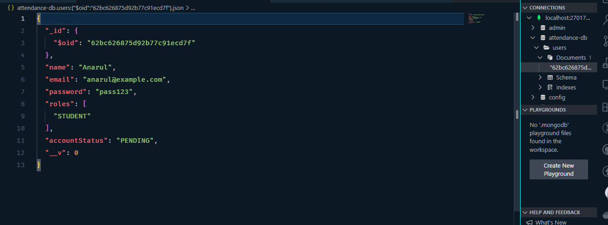

# Lecture 22 - Authentication System from Pseudo Code to Real Code

[লেকচার ১৩](../Lecture-13/README.md) তে আমরা অ্যাটেনডেন্স সিস্টেম প্রজেক্টের মডেল তৈরি করেছিলাম। আর অথেনটিকেশনের রেজিস্ট্রেশন আর লগইন প্রসেসের সুডোকোড লিখেছিলাম। সেগুলোসহ reset password এর সুডোকোড নিচে দেয়া হলো। এরপর আমরা এই সুডোকোডকে কোডে রূপান্তরিত করবো।

**Registration Process:**

```txt
Start
name = input()
email = input()
password = input()
if name && email && password is invalid:
  return 400 error

user = find user with email
if user found:
  return 400 error

hash = hash password
user = save name, email, hash to user model
return 201
End
```

**Login Process:**

```txt
Start
email = input()
password = input()

user = find user with email
if user not found:
  return 400 error

if password not equal to user hash:
  return 400 error

token = generate token using user
return token
End
```

**Reset Password:**

```txt
Start
new-password = Input()
old-password = Input()
TODO
                                     I
if old-password not equal to user.hash password:
   return 400 error
else hashNewPassword = hash new-password
   save hashNewPassword
   return 201
End
```

অনেকের মনে প্রশ্ন থাকতে পারে, আমরা মডেল কেন তৈরি করি। এখন এই প্রশ্নের উত্তর পেতে হলে ডাটাবেজ একটু হলেও আমাদের বুঝতে হবে। এখন মডেলের সাথে ডাটাবেজের কি সম্পর্ক? আমরা MVC টার্মটা প্রায়ই শুনে থাকি। M মানে হলো মডেল। মডেল মানে হলো আমাদের ডাটার একটা শেইপ। কিভাবে আমরা ডাটা ডাটাবেজে স্টোর করবো সেটাই হচ্ছে মডেল। আমরা চাইলে সরাসরি ডাটাবেজ নিয়ে কাজ করতে পারি। যেমন মঙ্গোডিবিতে json রিটার্ন করে। সেই json আমরা জাভাস্ক্রিপ্টে অবজেক্টে পরিণত করে কাজ করতে পারি। তার মানে আমরা কোনোরকম কোনো মডেল মাঝখানে না রেখে সুন্দরভাবে মঙ্গোডিবি নিয়ে কাজ করতে পারি। কিন্তু অন্যান্য ডাটাবেজের ক্ষেত্রে আমরা কি করবো? যেমন SQL ডাটাবেজ। আমরা যখন কুয়েরি ব্যবহার করে ডাটাগুলোকে বের করে আনি সেগুলো আসে টেবিল আকারে। এখন এই টেবিল নিয়ে তো আমরা কাজ করতে পারবো না। আমাদের সেই টেবিলগুলো অবজেক্টের পরিণত করতে হবে বা কোনো অ্যারেতে পরিণত করতে হবে বা কোনো ক্লাস নিয়ে সেই ক্লাসের শেইপে ফেলতে হবে। এই কাজগুলো খুব রিপিটেটিভ কাজ। তাই এই কাজগুলোকে আমরা একটা লাইব্রেরির মধ্যে রাখতে পারি। পরবর্তীতে যেকোনো প্রজেক্টে আমরা সেগুলো প্রয়োজন বুঝে ব্যবহার করতে পারি। সেরকমই একটা লাইব্রেরি হলো [Mongoose](https://mongoosejs.com/)। এটা নিয়ে বিস্তারিত [লেকচার ২০](../Lecture-20/README.md) এ আলোচনা করা হয়েছিল। এর কাজ হচ্ছে ডাটাবেজের সাথে ডিল করা। আমরা ডাটাবেইজের একটা শেইপ বা মডেল তৈরি করবো, সেটা আমরা আমাদের লাইব্রেরিকে দিয়ে দিবো। এবার লাইব্রেরির কাজ হলো ডাটাবেজের সাথে আমাদের মডেল নিয়ে ডিল করা। এ কারণেই আমরা মডেল তৈরি করি।

এবার আমাদের সিস্টেমে ডাটাবেজ নাই। আগে ডাটাবেজ কানেক্ট করতে হবে। নাহয় আমরা ডাটা স্টোর করতে পারবো না। আর ডাটাবেজ কিভাবে কানেক্ট করতে হয় তা বিস্তারিত [লেকচার ২০](../Lecture-20/README.md) এ দেখানো হয়েছিল। যাদের ইনস্টল করতে প্রব্লেম হয়েছিল তাদের জন্য ভিডিওতে ইনস্টলেশন সিস্টেম দেখানো হয়েছে। আপনারা দেখে নিবেন।

আমরা আমাদের ফোল্ডারে db.js নামে একটা ফাইল ক্রিয়েট করবো। সেখানে গিয়ে আমরা আমাদের mongoose এর মাধ্যমে ডাটাবেজ কানেক্ট করবো। কিভাবে কানেক্ট করতে হবে তা অলরেডি আপনারা জানেন। আগের লেকচারে দেখানো হয়েছিল।

```js
// db.js

const mongoose = require('mongoose');

function connectDB(connectionStr) {
	return mongoose.connect(connectionStr);
}

module.exports = connectDB;
```

আমরা এখানে সরাসরি Mongoose কানেক্ট করবো না। আমরা এখানে একটা ফাংশন তৈরি করবো। যেটাকে আমরা পুরো অ্যাপ্লিকেশনের যেখানে খুশি সেখানে ব্যবহার করে কানেক্ট করতে পারবো।

এবার আমরা server.js এ গিয়ে এই ফাংশনটাকে ইমপোর্ট করবো।

```js
// server.js

const express = require('express');
const connectDB = require('./db');

const app = express();

app.get('/', (req, res) => {
	const obj = {
		name: 'Ayman',
		email: 'ayman@example.com',
	};
	res.json(obj);
});

app.listen(4000, () => {
	console.log("I'm listening on port 4000");
});
```

এবার আমরা ডাটাবেজ কানেক্ট করবো।

```js
// server.js

const express = require('express');
const connectDB = require('./db');

const app = express();

app.get('/', (req, res) => {
	const obj = {
		name: 'Ayman',
		email: 'ayman@example.com',
	};
	res.json(obj);
});

app.listen(4000, () => {
	console.log("I'm listening on port 4000");
});

connectDB('mongodb://localhost:27017/attendance-db')
	.then(() => {
		console.log('Database Connected');
		app.listen(4000, () => {
			console.log("I'm listening on port 4000");
		});
	})
	.catch((e) => console.log(e));
```

এবার আমরা লেকচার ১২ তে রেজিস্ট্রেশনের যে ড্রয়িং করেছিলাম সেগুলো একটু দেখি।


আমাদের প্রথম কাজ হলো /register রাউট হ্যান্ডেল করা। আমরা আলাদাভাবে রাউটস ফোল্ডারে হ্যান্ডেল করতে পারি। তবে এখন আমরা আপাতত server.js এই হ্যান্ডেল করছি। আমরা যে সুডোকোড লিখেছিলাম সেই অনুযায়ী কোডে পরিণত করবো।

```js
// server.js

const express = require('express');
const connectDB = require('./db');

const app = express();

app.post('/register', async (req, res, next) => {});

app.get('/', (req, res) => {
	const obj = {
		name: 'Ayman',
		email: 'ayman@example.com',
	};
	res.json(obj);
});

app.listen(4000, () => {
	console.log("I'm listening on port 4000");
});

connectDB('mongodb://localhost:27017/attendance-db')
	.then(() => {
		console.log('Database Connected');
		app.listen(4000, () => {
			console.log("I'm listening on port 4000");
		});
	})
	.catch((e) => console.log(e));
```

আমাদের সুডোকোডে প্রথমে দেখা যাচ্ছে কোনো জায়গা থেকে আমাদের name, email আর password আসবে। একটা রিকোয়েস্টে ইনপুট আসতে পারে মূলত পাঁচটা জায়গা থেকে। সেগুলো হলো -

- req Body
- req Param
- req Query
- req Header
- req Cookies

যে ডাটাগুলো ইউজার ফর্ম থেকে পাঠায় সাদারণত সেই রিকোয়েস্টগুলো আসে বডি থেকে। আমরা প্রথমে আমাদের বডিতে কি আছে একটু দেখে নিই। আপনারা পোস্টম্যান দিয়ে সেই রিকোয়েস্ট পাঠাতে পারেন। আমি ভিএস কোড এক্সটেনশন thunder client ব্যবহার করছি।

```js
// server.js

const express = require('express');
const connectDB = require('./db');

const app = express();

app.use(express.json());

app.post('/register', async (req, res, next) => {
	console.log(req.body);
});

app.get('/', (req, res) => {
	const obj = {
		name: 'Ayman',
		email: 'ayman@example.com',
	};
	res.json(obj);
});

app.listen(4000, () => {
	console.log("I'm listening on port 4000");
});

connectDB('mongodb://localhost:27017/attendance-db')
	.then(() => {
		console.log('Database Connected');
		app.listen(4000, () => {
			console.log("I'm listening on port 4000");
		});
	})
	.catch((e) => console.log(e));
```


এখন এখানে বডিতে যা লিখলাম সেগুলো আমাদের রাউটার হ্যান্ডেল করতে পারবে ঠিক কিন্তু কোনো রেসপন্স ব্যাক করবে না। কারণ এখানে রেসপন্স ব্যাক করার মতো কোনো কোডই আমরা লিখিনি। তো সে কি করবে সে হ্যাং হয়ে বসে থাকবে আর বডিতে যে ডাটা লিখেছিলাম সেটা কনসোলে লগ করবে। আপাতত আমরা সেটাই দেখি।


দেখুন যখন আমরা রিকোয়েস্ট পাঠিয়েছি সেটা গোল গোল ঘুরছে আর কনসোলে সেই বডিটা লগ হয়েছে। বডিটা লগ হওয়ার জন্য আমরা express.json() নামে একটা মিডলওয়্যার লিখেছি আমরা। তো এখন আমরা name, email আর password বডি থেকে নিয়ে নিই।

```js
// server.js

const express = require('express');
const connectDB = require('./db');

const app = express();

app.use(express.json());

app.post('/register', async (req, res, next) => {
	const { name, email, password } = req.body;
});

app.get('/', (req, res) => {
	const obj = {
		name: 'Ayman',
		email: 'ayman@example.com',
	};
	res.json(obj);
});

app.listen(4000, () => {
	console.log("I'm listening on port 4000");
});

connectDB('mongodb://localhost:27017/attendance-db')
	.then(() => {
		console.log('Database Connected');
		app.listen(4000, () => {
			console.log("I'm listening on port 4000");
		});
	})
	.catch((e) => console.log(e));
```

অবজেক্ট ডিস্ট্রাকচারিং ব্যবহার করলাম। এবার আমরা ডাটা ভ্যালিডেশন করবো। সুডোকোডে আছে যদি যেকোনো একটা ইনপুট না দেয়া হয় তাহলে 400 রিটার্ন করবে।

```js
// server.js

const express = require('express');
const connectDB = require('./db');

const app = express();

app.use(express.json());

app.post('/register', async (req, res, next) => {
	const { name, email, password } = req.body;

	if (!name || !email || !password) {
		return res.status(400).json({ message: 'Invalid Data' });
	}
});

app.get('/', (req, res) => {
	const obj = {
		name: 'Ayman',
		email: 'ayman@example.com',
	};
	res.json(obj);
});

app.listen(4000, () => {
	console.log("I'm listening on port 4000");
});

connectDB('mongodb://localhost:27017/attendance-db')
	.then(() => {
		console.log('Database Connected');
		app.listen(4000, () => {
			console.log("I'm listening on port 4000");
		});
	})
	.catch((e) => console.log(e));
```

যদি তিনটা ইনপুটের যেকোনো একটা দেয়া না হয় তবে সে রিটার্ন করবে `{ message: 'Invalid Data' }` এই ম্যাসেজটা।


দেখুন পাসওয়ার্ড না দেয়াতে এটি `{ message: 'Invalid Data' }` শো করছে। এখন ডাটা ইনভ্যালিড হলে কি হবে সেটা লিখলাম। এটা একটা প্যাটার্ন। একে বলে এরর ফার্স্ট প্যাটার্ন। প্রথমে যা যা এরর হতে পারে সেগুলো হ্যান্ডেল করাকে বলে এরর ফার্স্ট প্যাটার্ন। এবার ভ্যালিড হলে কি হবে তা লেখা যাক। সুডোকোডে লেখা আছে ইমেইলের সাহায্যে ইউজারকে বের করে আনা। মানে ইউজার যে ইমেইল দিয়েছে তা চেক করা। যদি ইমেইল থেকে থাকে তাহলে তো খুবই সিম্পল, আমরা একাউন্ট ক্রিয়েট করতে দিবো না। আর যদি না থাকে তাহলে ধরে নিবো সে নতুন ইউজার, তাকে আমরা একাউন্ট ক্রিয়েট করতে দিবো। এখন ইউজারকে যে বের করবো, ইউজার আছে কোথায়? ডাটাবেজে। আর ডাটাবেজের সাথে কমিউনিকেট করার দায়িত্ব মডেলের। মডেল ক্রিয়েট করার পরই Mongoose এর কাজ শেষ। মডেল ক্রিয়েট করা মানেই Mongoose তার সমস্ত পাওয়ার মডেলকে দিয়ে দিয়েছে। এরপর থেকে আমরা মডেল নিয়ে কাজ করতে পারি। আমরা আমাদের User মডেলকে আমাদের সার্ভারে নিয়ে আসবো। কোনো কিছু find করার জন্য মঙ্গোডিবিতে একটা মেথড আছে `findOne`। সেটা দিয়ে আমরা ইউজার মডেল থেকে ইমেইল বের করে আনবো।

```js
// server.js

const express = require('express');
const connectDB = require('./db');
const User = require('./models/User');

const app = express();

app.use(express.json());

app.post('/register', async (req, res, next) => {
	const { name, email, password } = req.body;

	if (!name || !email || !password) {
		return res.status(400).json({ message: 'Invalid Data' });
	}

	let user = await User.findOne({ email });
	if (user) {
		return res.status(400).json({ message: 'User already exists' });
	}

	user = new User({ name, email, password });
	await user.save();

	return res.status(201).json({ message: 'User Created Successfully', user });
});

app.get('/', (req, res) => {
	const obj = {
		name: 'Ayman',
		email: 'ayman@example.com',
	};
	res.json(obj);
});

app.listen(4000, () => {
	console.log("I'm listening on port 4000");
});

connectDB('mongodb://localhost:27017/attendance-db')
	.then(() => {
		console.log('Database Connected');
		app.listen(4000, () => {
			console.log("I'm listening on port 4000");
		});
	})
	.catch((e) => console.log(e));
```

উপরে দেখলাম যদি ইমেইল থেকে থাকে তাহলে 400 স্ট্যাটাস রিটার্ন করবে। আর যদি না থাকে তাহলে আপাতত নেইম, ইমেইল আর পাসওয়ার্ড দিয়ে একটা নতুন ইউজার ক্রিয়েট করবে। এবং সেটা ডাটাবেজে সেইভ করতে হবে। ইউজার সেইভ হয়ে গেলে আমরা যে ইউজারটা ক্রিয়েট হলো সেটাকে রিটার্ন করে দিলাম। এবার আমরা একটু চেক করবো।


দেখুন এটা আমাদের সাক্সেস ম্যাসেজ দিয়েছে। আমরা যদি ডাটাবেজে গিয়ে দেখি দেখবো সেখানেও সেইভ হয়ে গিয়েছে।



এখন এখানে একটা সমস্যা হলো আমরা পাসওয়ার্ডটা খুব সহজেই দেখতে পাচ্ছি। কেউ যদি আমাদের ডাটাবেজের এক্সেস পায় তাহলে সে সহজেই আমাদের একাউন্ট হ্যাক করে ফেলতে পারে। সেটার সল্যুশন হিসেবে আমাদের পাসওয়ার্ডটাকে হ্যাশ করতে হবে। এর জন্য `bcrypt` নামে একটা লাইব্রেরি আছে। আমরা প্রথমে সেটা ইনস্টল করে নিবো। এরপর আমাদের সার্ভারে সেটা ইমপোর্ট করে নিবো।

```js
// server.js

const express = require('express');
const connectDB = require('./db');
const User = require('./models/User');
const bcrypt = require('bcryptjs');

const app = express();

app.use(express.json());

app.post('/register', async (req, res, next) => {
	const { name, email, password } = req.body;

	if (!name || !email || !password) {
		return res.status(400).json({ message: 'Invalid Data' });
	}

	let user = await User.findOne({ email });
	if (user) {
		return res.status(400).json({ message: 'User already exists' });
	}

	user = new User({ name, email, password });

	const salt = await bcrypt.genSalt(10);
	const hash = await bcrypt.hash(password, salt);
	user.password = hash;

	await user.save();

	return res.status(201).json({ message: 'User Created Successfully', user });
});

app.get('/', (req, res) => {
	const obj = {
		name: 'Ayman',
		email: 'ayman@example.com',
	};
	res.json(obj);
});

app.listen(4000, () => {
	console.log("I'm listening on port 4000");
});

connectDB('mongodb://localhost:27017/attendance-db')
	.then(() => {
		console.log('Database Connected');
		app.listen(4000, () => {
			console.log("I'm listening on port 4000");
		});
	})
	.catch((e) => console.log(e));
```

প্রথমে আমরা কত রাউন্ডের পাসওয়ার্ড চাইছি সেটা লিখে দিতে হবে। আমরা ১০ দিলাম। এরপর হ্যাশ করলাম। সেই হ্যাশ পাসওয়ার্ডকে আমরা পাসওয়ার্ড হিসেবে সেইভ করলাম। চলুন এবার চেক করে দেখি।

একটা জিনিস খেয়াল করুন আমরা এক্সিসটিং ইমেইল দিয়ে যখন রিকোয়েস্ট দিয়েছি তা আমাদের এরর রিটার্ন করেছে।


এবার ভিন্ন নাম আর ইমেইল দিয়ে দেখি।


দেখুন পাসওয়ার্ড হ্যাশ হয়ে গেছে। এই পাসওয়ার্ড পেলেও এটা দিয়ে লগইন করা যাবে না। আর এটা থেকে আমাদের পাসওয়ার্ড পাওয়া সম্ভবও না।

আমরা ইউজার মডেলে গতো ক্লাসের মতো ভ্যালিডেশন ব্যবহার করবো।

```js
// User.js

const { model, Schema } = require('mongoose');

const userSchema = new Schema({
	name: {
		type: String,
		required: true,
		minlength: 3,
		maxlength: 10,
	},
	email: {
		type: String,
		required: true,
		validate: {
			validator: function (v) {
				return /^\w+([\.-]?\w+)*@\w+([\.-]?\w+)*(\.\w{2,3})+$/.test(v);
			},
			message: (prop) => `Invalid Email: ${prop.value}`,
		},
	},
	password: {
		type: String,
		minlength: [6, 'Password is too short'],
		required: true,
	},
	roles: {
		type: [String],
		required: true,
		default: ['STUDENT'],
	},
	accountStatus: {
		type: String,
		enum: ['PENDING', 'ACTIVE', 'REJECTED'],
		default: 'PENDING',
		required: true,
	},
});

const User = model('User', userSchema);

module.exports = User;
```

এগুলো আর বিশ্লেষণ করার দরকার আছে বলে মনে হয় না। শুধু enum সম্পর্কে একটু বলি। enum একটা অ্যারে যা ঐ অ্যারের মধ্যে থাকা ভ্যালু ছাড়া আর কোনো ভ্যালু এক্সেপ্ট করবে না।

আপনারা আপনাদের মতো করে এই ভ্যালিডেশন চেক করে দেখতে পারেন postman বা thunder client এ।

এবার আমরা আমাদের সার্ভারে একটা গ্লোবাল এরর হ্যান্ডলার বানাবো যেন সার্ভার রিলেটেড কোনো এরর হলে তা আমাদের শো করে। এবং আমাদের রাউটকে একটা try catch ব্লকের ভিতর এনে catch ব্লকে সেই গ্লোবাল এররের মধ্যে রিকোয়েস্ট পাঠিয়ে দেবো

```js
// server.js

const express = require('express');
const connectDB = require('./db');
const User = require('./models/User');
const bcrypt = require('bcryptjs');

const app = express();

app.use(express.json());

app.post('/register', async (req, res, next) => {
	const { name, email, password } = req.body;

	if (!name || !email || !password) {
		return res.status(400).json({ message: 'Invalid Data' });
	}

	try {
		let user = await User.findOne({ email });
		if (user) {
			return res.status(400).json({ message: 'User already exists' });
		}
		user = new User({ name, email, password });
		const salt = await bcrypt.genSalt(10);
		const hash = await bcrypt.hash(password, salt);
		user.password = hash;
		await user.save();
		return res.status(201).json({ message: 'User Created Successfully', user });
	} catch (error) {
		next(error);
	}
});

app.get('/', (req, res) => {
	const obj = {
		name: 'Ayman',
		email: 'ayman@example.com',
	};
	res.json(obj);
});

app.listen(4000, () => {
	console.log("I'm listening on port 4000");
});

app.use((err, req, res, next) => {
	console.log(err);
	res.status(500).json({ message: 'Server Error Occurred' });
});

connectDB('mongodb://localhost:27017/attendance-db')
	.then(() => {
		console.log('Database Connected');
		app.listen(4000, () => {
			console.log("I'm listening on port 4000");
		});
	})
	.catch((e) => console.log(e));
```

এবার আমরা লগইন এর রাউট নিয়ে কাজ করবো।

```js
// server.js

const express = require('express');
const connectDB = require('./db');
const User = require('./models/User');
const bcrypt = require('bcryptjs');

const app = express();

app.use(express.json());

app.post('/register', async (req, res, next) => {
	const { name, email, password } = req.body;

	if (!name || !email || !password) {
		return res.status(400).json({ message: 'Invalid Data' });
	}

	try {
		let user = await User.findOne({ email });
		if (user) {
			return res.status(400).json({ message: 'User already exists' });
		}
		user = new User({ name, email, password });
		const salt = await bcrypt.genSalt(10);
		const hash = await bcrypt.hash(password, salt);
		user.password = hash;
		await user.save();
		return res.status(201).json({ message: 'User Created Successfully', user });
	} catch (error) {
		next(error);
	}
});

app.post('/login', async (req, res, next) => {
	const { email, password } = req.body;
	try {
		const user = await User.findOne({ email });

		if (!user) {
			return res.status(400).json({ message: 'Invalid Credential' });
		}

		const isMatch = await bcrypt.compare(password, user.password);
		if (!isMatch) {
			return res.status(400).json({ message: 'Invalid Credential' });
		}

		delete user._doc.password;
		return res.status(200).json({ message: 'Login Successful', user });
	} catch (e) {
		next(e);
	}
});

app.get('/', (req, res) => {
	const obj = {
		name: 'Ayman',
		email: 'ayman@example.com',
	};
	res.json(obj);
});

app.listen(4000, () => {
	console.log("I'm listening on port 4000");
});

app.use((err, req, res, next) => {
	console.log(err);
	res.status(500).json({ message: 'Server Error Occurred' });
});

connectDB('mongodb://localhost:27017/attendance-db')
	.then(() => {
		console.log('Database Connected');
		app.listen(4000, () => {
			console.log("I'm listening on port 4000");
		});
	})
	.catch((e) => console.log(e));
```

সুডোকোড অনুযায়ী আমরা বডি থেকে ইমেইল পাসওয়ার্ড নিলাম। এরপর ইমেইল ম্যাচ করে কিনা দেখবো। যদি ম্যাচ না হয় তাহলে এরর দেবে। আর যদি ম্যাচ হয় এরপর পাসওয়ার্ড ম্যাচ করে কিনা দেখবে। পাসওয়ার্ড কমপেয়ার করার জন্য আমরা bcrypt.compare() মেথড ব্যবহার করবো। যদি পাসওয়ার্ড ম্যাচ না করে এরর দিবে। আর ম্যাচ করলে সাক্সেস ম্যাসেজ দিবে সাথে ইউজার অবজেক্টটা দেখাবে। এখন আমি চাইনা ক্লায়েন্টকে হ্যাশ করা পাসওয়ার্ডটা দেখাতে। তাই রেসপন্স ব্যাক করার আগে আমরা আমাদের পাসওয়ার্ডকে ডিলিট করে দিবো। অবজেক্ট থেকে ডিলিট করা একদম সোজা। জাস্ট এক লাইনের কোড। `delete user._doc.password;`। `_doc` দেয়ার কারণ হচ্ছে আমরা ডাটাবেজে যতো ডাটা সেইভ করি সব থাকে `_doc` প্রোপার্টির মধ্যে।

এবার একটু আমরা আমাদের কোড কাজ করছে কিনা ট্রাই করি।


কাজ করছে। লক্ষ্য করুন অবজেক্টের মধ্যে কিন্তু পাসওয়ার্ড দেখা যাচ্ছে না। কারণ রেসপন্স ব্যাক করার পূর্বেই আমরা তা ডিলিট করে দিয়েছি।

যদি পাসওয়ার্ড ভুল দিই তাহলে এরর দিচ্ছে দেখুন। তার মানে আমাদের কোড কাজ করছে।


লগইন সুডোকোডের মধ্যে টোকেন জেনারেট করার কথা আছে। সেটা আমরা পরের ক্লাসে করবো।

রিসেট পাসওয়ার্ডের কাজও আমরা নেক্সট ক্লাসে করবো।

## Resource for this lecture

এই লেকচারের সমস্ত রিসোর্স [লেকচার ২২](../../resources/lecture-22/README.md) এ পাবেন।

## Source Code

এই লেকচারের সোর্স কোডসমূহ এই [লিংক](../../src/lecture-22/) এ পাবেন।

## AUTHOR

[Aditya Chakraborty](https://github.com/adityackr)
