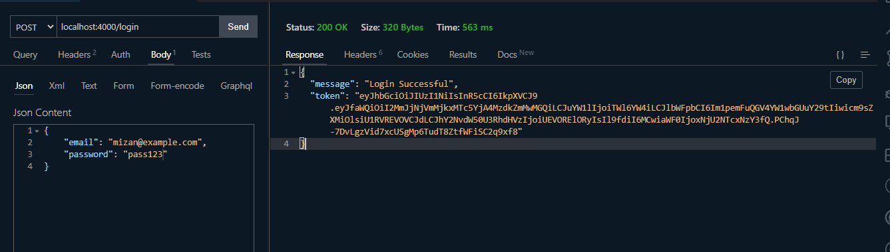

# Lecture 23 - Implement JWT and Refactor The Project Structure

আমাদের অথেনটিকেশনের সব কাজ গত ক্লাসে আমরা করেছি। শুধু একটা কাজ বাকি ছিল JWT Token জেনারেট করা। ওটা আমরা আজ দেখবো।

JWT নিয়ে কাজ করতে গেলে প্রথমে আমাদের জানতে হবে JWT কি? এটা কেন ব্যবহার করা হয়? সেশন কুকি দিয়েও তো কাজ করা যায়, তাহলে কেন JWT ব্যবহার করা হয়?

এই API এর যুগে কি হচ্ছে? আমরা ফেসবুক থেকে ডাটা নিচ্ছি, আমরা গুগল থেকে ডাটা নিচ্ছি, আমরা AWS থেকে ডাটা নিচ্ছি। বিভিন্ন সার্ভার থেকে ডাটা নিয়ে আমরা একটা অ্যাপ্লিকেশনে মার্জ করছি। ধরেন আমরা ওয়েদার অ্যাপ্লিকেশন বানাবো, আমরা ওয়েদারের ডাটা অন্য জায়গা থেকে নিয়ে আসছি, আমরা ব্যাংকিং সিস্টেমের অ্যাপ্লিকেশন বানাবো, আমরা বিভিন্ন ব্যাংকের ডাটা সংগ্রহ করছি বিভিন্ন ব্যাংকের সার্ভার থেকে। এখন যদি আমরা তাদের সার্ভারে সেশন কুকিজ রাখতে চাই তারা তো আমাকে রাখতে দেবে না। আর তাদের সার্ভারে যদি থাকি তাহলে আমরা ভেরিফাই করতে পারবো না। তাই এমন একটা সিস্টেম দরকার যেটার মাধ্যমে আমরা খুব সহজে পোর্টেবল উপায়ে ভেরিফাই করতে পারি যে আমি ভেরিফায়েড ইউজার। এজন্য ব্যবহার করা হয় টোকেন। যেটাকে আমরা বলছি JSON Web Token (JWT)। এটা ইন্ডাস্ট্রি স্ট্যান্ডার্ড, সবাই ব্যবহার করে। এটা কোনো হ্যাশড বা এনক্রিপটেড সিস্টেম না। এটা হলো ওপেন, যাকে বলা হয় এনকোডেড। এনকোডেড মানে হলো দেখতে ভিন্ন, কিন্তু ডাটা ওপেন। এটাকে ডিকোড করে সঠিক ডাটা পাওয়া সম্ভব। কিন্তু হ্যাশড বা এনক্রিপটেড ডাটা থেকে কখনই আসল ডাটা বের করে আনা সম্ভব না। আমরা পাসওয়ার্ড যেভাবে হ্যাশ করেছিলাম সেটা কখনোই বের করা সম্ভব না। কিন্তু এক্ষেত্রে ডাটা এনকোডেড থাকে।

এবার আমরা JWT জেনারেট করবো। এর জন্য কিছু [jsonwebtoken](https://www.npmjs.com/package/jsonwebtoken) নামে একটা প্যাকেজ আছে। এটাকে আমরা আমাদের অ্যাপ্লিকেশনে ইনস্টল করে নিবো। এরপর আমরা আমাদের সার্ভারে সেটা ইমপোর্ট করে নিবো।

এবার আমরা টোকেন জেনারেট করবো। একটা টোকেন জেনারেট করতে হলে প্রথমে jwt.sign() মেথডটা আমরা নিবো। এবং আর্গুমেন্ট আকারা পেলোড পাস করার জন্য আমরা ইউজারের যে যে ইনফরমেশনগুলো সিক্রেট না সে সে ইনফরমেশনগুলো দিয়ে দিতে পারি। আমরা এখানে পাস করবো `user._doc`। কারণ আমরা গত ক্লাসে দেখেছিলাম user এর সমস্ত ডাটা স্টোর হয় `_doc` এর মধ্যে। সেকেন্ড আর্গুমেন্ট আকারে আমাদের jwt.Secret এই কী ব্যবহার করতে হবে। এখানে যে সিক্রেট কী ব্যবহার করা হবে সেটা পরবর্তীতে ভেরিফাই করার কাজেও ব্যবহার করা যাবে। এটা খুবই গুরুত্বপূর্ণ। যদি এই সিক্রেট কী কোনো কারণে এক্সপোজ হয়ে যায় তাহলে যে কেউ আমাদের সিস্টেমের এক্সেস নিয়ে নিতে পারবে। যে কেউ একটা টোকেন অ্যাসাইন করতে পারবে আর যে কেউ ঐ টোকেন ব্যবহার করে লগইন করে ফেলতে পারবে। তাই এই কী সবচেয়ে সিকিউর ওয়েতে রাখতে হয়। যদিও আমরা এখন সবচেয়ে ইনসিকিউর ওয়েতে এই কী রাখবো। এরপর থার্ড আর্গুমেন্ট আকারে আমরা একটা অবজেক্ট পাস করতে পারি যার মধ্যে বিভিন্ন অপশন আছে। আমরা চাইলে আমাদের পছন্দমতো অ্যালগরিদম চেইঞ্জ করে দিতে পারি। এখানে ডিফল্ট হিসেবে HS256 অ্যালগরিদম ইউজ করা হয়, যেটা খুবই স্ট্রং, তাই আমাদের এটা নিয়ে চিন্তা করার দরকার নেই। আমাদের এখন এতকিছু কাস্টমাইজ করার দরকার নেই। আমরা ডিফল্ট যে সিস্টেম সেটাই রাখবো। **তবে ভবিষ্যতের জন্য একটা নোট রাখতে পারেন, যে RS দিয়ে যে অ্যালগরিদমগুলো আছে সেগুলো আপনারা ব্যবহার করবেন না। এতে কিছু ইস্যু তৈরি হয়েছিল। এগুলো খুব একটা ভাল না।**

```js
const express = require('express');
const connectDB = require('./db');
const bcrypt = require('bcryptjs');
const jwt = require('jsonwebtoken');
const User = require('./models/User');

const app = express();

app.use(express.json());

app.post('/register', async (req, res, next) => {
	const { name, email, password } = req.body;
	if (!name || !email || !password) {
		return res.status(400).json({ message: 'Invalid Data' });
	}
	try {
		let user = await User.findOne({ email });
		if (user) {
			return res.status(400).json({ message: 'User already exists' });
		}
		user = new User({ name, email, password });
		const salt = await bcrypt.genSalt(10);
		const hash = await bcrypt.hash(password, salt);
		user.password = hash;
		await user.save();
		return res.status(201).json({ message: 'User Created Successfully', user });
	} catch (error) {
		next(error);
	}
});

app.post('/login', async (req, res, next) => {
	const { email, password } = req.body;
	try {
		const user = await User.findOne({ email });

		if (!user) {
			return res.status(400).json({ message: 'Invalid Credential' });
		}

		const isMatch = await bcrypt.compare(password, user.password);
		if (!isMatch) {
			return res.status(400).json({ message: 'Invalid Credential' });
		}

		delete user._doc.password;

		const token = jwt.sign(user._doc, 'secret-key');

		return res.status(200).json({ message: 'Login Successful', token });
	} catch (e) {
		next(e);
	}
});

app.get('/', (_req, res) => {
	const obj = {
		name: 'Ayman',
		email: 'ayman@example.com',
	};
	res.json(obj);
});

app.use((err, _req, res, _next) => {
	console.log(err);
	res.status(500).json({ message: 'Server Error Occurred' });
});

connectDB('mongodb://localhost:27017/attendance-db')
	.then(() => {
		console.log('Database Connected');
		app.listen(4000, () => {
			console.log("I'm listening on port 4000");
		});
	})
	.catch((e) => console.log(e));
```

এই যে এতটুকু কোড লিখলাম সে আমাদের জন্য একটা টোকেন জেনারেট করে দিবে। বেসিক্যালি আমাদের দরকার এখন এই টোকেনটা। আমরা রেসপন্স ম্যাসেজের মধ্যে user অবজেক্ট না পাঠিয়ে এর মধ্যে token দিয়ে দিবো। আমাদের login এর যতটুকু কাজ বাকি ছিল ততটুকু কাজ কমপ্লিট। এখন এই কাজটা করার পরে কি ঘটছে একটু দেখে আসি চলুন। প্রথমে সার্ভারটা রান করে নিতে হবে। এরপর পোস্টম্যান বা thunder client এ আমাদের রিকোয়েস্ট পাঠাবো। দেখবো আগের বার আমরা যে ইউজার অবজেক্ট পেয়েছিলাম তার জায়গায় হিজিবিজি লেখা কিছু এসেছে token প্রোপার্টির মধ্যে। এই হিজিবিজি লেখাই হলো আমাদের জেনারেটেড টোকেন।



এখন এই টোকেনটা কিন্তু মোটেও সিকিউর না। আমরা এই টোকেনটা কপি করে যদি আমরা [jwt.io](https://jwt.io/) তে গিয়ে যদি পেস্ট করি তাহলে আমরা যে যে ইনফরমেশন দিয়েছিলাম সব পেয়ে যাবো।


দেখুন আমাদের পুরো ইউজার অবজেক্ট দেখাচ্ছে। পাসওয়ার্ড নেই কারণ আমরা টোকেন জেনারেট করার পূর্বে পাসওয়ার্ড ডিলিট করে দিয়েছি। ডাটাগুলো এখানে অ্যাভেইলেবল তার মানে এটা না যে অন্য কেউ অন্য কোনো সার্ভার থেকে এই ডাটাগুলো ভেরিফাই করতে পারবে। ততক্ষণ করতে পারবে না, যতক্ষণ পর্যন্ত তার সাথে আমাদের দেয়া sign মেথডের মধ্যে সিক্রেট কী ম্যাচ না করবে। এবার আমরা এই টোকেন নিয়ে কিছু কাজ করতে পারি। কোথায় করতে পারি? ঐ যে থার্ড আর্গুমেন্টের অবজেক্টে। আমরা আপাতত শুধু expiresin নিয়ে কাজ করবো। আমরা বলে দিলাম শুধু ২ ঘন্টার জন্য একটা টোকেন জেনারেট করবে।

```js
const express = require('express');
const connectDB = require('./db');
const bcrypt = require('bcryptjs');
const jwt = require('jsonwebtoken');
const User = require('./models/User');

const app = express();

app.use(express.json());

app.post('/register', async (req, res, next) => {
	const { name, email, password } = req.body;
	if (!name || !email || !password) {
		return res.status(400).json({ message: 'Invalid Data' });
	}
	try {
		let user = await User.findOne({ email });
		if (user) {
			return res.status(400).json({ message: 'User already exists' });
		}
		user = new User({ name, email, password });
		const salt = await bcrypt.genSalt(10);
		const hash = await bcrypt.hash(password, salt);
		user.password = hash;
		await user.save();
		return res.status(201).json({ message: 'User Created Successfully', user });
	} catch (error) {
		next(error);
	}
});

app.post('/login', async (req, res, next) => {
	const { email, password } = req.body;
	try {
		const user = await User.findOne({ email });

		if (!user) {
			return res.status(400).json({ message: 'Invalid Credential' });
		}

		const isMatch = await bcrypt.compare(password, user.password);
		if (!isMatch) {
			return res.status(400).json({ message: 'Invalid Credential' });
		}

		delete user._doc.password;

		const token = jwt.sign(user._doc, 'secret-key', { expiresIn: '2h' });

		return res.status(200).json({ message: 'Login Successful', token });
	} catch (e) {
		next(e);
	}
});

app.get('/', (_req, res) => {
	const obj = {
		name: 'Ayman',
		email: 'ayman@example.com',
	};
	res.json(obj);
});

app.use((err, _req, res, _next) => {
	console.log(err);
	res.status(500).json({ message: 'Server Error Occurred' });
});

connectDB('mongodb://localhost:27017/attendance-db')
	.then(() => {
		console.log('Database Connected');
		app.listen(4000, () => {
			console.log("I'm listening on port 4000");
		});
	})
	.catch((e) => console.log(e));
```

এবার যদি আবার লগইন করি তাহলে দেখবো আরেকটা নতুন টোকেন জেনারেট হয়েছে। যতবার লগইন করবো ততবার একটা টোকেন জেনারেট করবে। আগেরটার সাথে কোনো মিল থাকব না। এবার এটা ডিকোড করলে দেখবো আরেকটা এক্সট্রা প্রোপার্টি এসেছে। সেটা হলো "exp"। মানে কতক্ষণ পর সেটা এক্সপায়ার হয়ে যাবে সেটা।


যদিও টাইমটা বুঝা যাচ্ছে না। আপনি যদি কনসোলে গিয়ে `new Date(1656580042 * 1000)` লিখেন তাহলে দেখবেন কখন এক্সপায়ার হবে সেটা আপনাকে দিয়ে দিবে। ১০০০ দিয়ে গুণ করার কারণ হলো এই টাইমটা আছে সেকেন্ডে। আমাদের Date অবজেক্ট কাউন্ট করে মিলিসেকেন্ডে। মিলিসেকেন্ডে নেয়ার জন্য আমরা ১০০০ দিয়ে গুণ করে নিলাম।


এবার আমরা JWT নিয়ে আলোচনা করি। আপনি যদি [JWT Introduction](https://jwt.io/introduction) এই লিংকে যান তাহলে দেখবেন JWT নিয়ে একটা ওভারভিউ দেয়া হয়েছে। এখানে দেখা যাচ্ছে অথোরাইজেশন আর ইনফরমেশন এক্সচেইঞ্জের কাজে ব্যবহার করা হয়। এর প্রথমে থাকে Header যেটা দিয়ে আমরা বুঝতে পারি এখানে কোন অ্যালগরিদম ইউজ করা হয়েছে, এরপর আছে Payload যেটা হচ্ছে আমরা আমাদের কোডে যেই user এর একটা বেসিক ইনফরমেশন রেখেছিলাম ওরকম ইনফরমেশন যেটা দিয়ে ফ্রন্টএন্ড ডেভেলপার ইনফরমেশন বের করে নিতে পারবে, এরপর আছে Signature যেটা খুব সিকিউর আর যেটা নিয়ে আমাদের কোনো কাজ নেই। আমাদের কাজ মূলত পেলোড নিয়ে। আপনারা একটু [JWT Introduction](https://jwt.io/introduction) লিংকে গিয়ে ভালভাবে পড়ে নিবেন। ডিটেইলস বলা হয়েছে এখানে।

এবার আমরা একটা সিক্রেট বা প্রাইভেট রাউট তৈরি করতে চাইছি দেখার জন্য যে লগইন সিস্টেমটা কিভাবে কাজ করে। আমরা একটা get রাউট বানাবো আমাদের সার্ভারে লগইন রাউটের নিচে এবং '/' রাউটের আগে। এখানে আর পুরো ফাইল দেখাচ্ছি না। আপনারা সোর্স কোডের লিংক এই আর্টিকেলের শেষ পেয়ে যাবেন।

```js
// server.js

app.get('/private', (req, res) => {
	return res.status(200).json({ message: 'I am a private route' });
});
```

যদি আমরা ব্রাউজারে গিয়ে `localhost:4000/private' লিখে সার্চ দিই তাহলে দেখা যাবে এই ম্যাসেজটা আসবে। কিন্তু এটা তো আসার কথা না। যেহেতু আমাদের সিস্টেম প্রাইভেট করা। এবার আমরা একটা পাব্লিক রাউট ক্রিয়েট করে দেখি। আমরা বুঝার চেষ্টা করি প্রাইভেট আর পাব্লিক রাউট কিভাবে কাজ করে।

```js
app.get('/private', (req, res) => {
	return res.status(200).json({ message: 'I am a private route' });
});

app.get('/public', (req, res) => {
	return res.status(200).json({ message: 'I am a public route' });
});
```

যদি রিকোয়েস্ট পাঠাই এই ম্যাসেজটা দিবে। এখন একটা রাউটকে আমরা কিভাবে প্রাইভেট বানাতে পারি? যদি সেই রাউটের হেডারের মধ্যে রিকোয়েস্টের মধ্যে আমাদের টোকেনটা না আসে সেই রাউটকে আমরা এক্সেস নিতে দিবো না। তাকে আমরা রিটার্ন স্টেটমেন্ট পর্যন্ত আসতেই দিবো না। গত ক্লাসে আমরা দেখেছিলাম রিকোয়েস্ট থেকে ডাটা অনেকভাবে আসতে পারে। তার একটা সিস্টেম হলো রিকোয়েস্ট বডি। এখন get রিকোয়েস্টে কিভাবে বডি পাবে, get রিকোয়েস্টে তো বডিই থাকে না। এখানে সমাধান হচ্ছে রিকোয়েস্ট হেডার। আমরা একটু কনসোলে লগ করে দেখি হেডারে কি আছে।

```js
app.get('/private', (req, res) => {
	console.log(req.headers);
	return res.status(200).json({ message: 'I am a private route' });
});
```

দেখবো একটা অবজেক্ট এসেছে।


এখন এই অবজেক্ট আসলো কোথা থেকে? আমরা তো এটা পাঠাই নি। এগুলো ব্রাউজার থেকে এসেছে। আপনি যদি ইনস্পেক্টে গিয়ে নেটওয়ার্ক ট্যাবে যান, সেখানে হেডার হিসেবে এগুলোই দেখবেন। এখন হেডার হিসেবে আমাদের টোকেনটা পাস করতে হবে। তবে এই মুহূর্তে আমরা ব্রাউজার থেকে পারবো না। আমরা পোস্টম্যান থেকে পারবো। ব্রাউজার থেকে যখন আমাদের অ্যাপ্লিকেশন রেডি হয়ে যাবে তখন আমরা পাঠাতে পারবো। JWT এর ক্ষেত্রে এটা থাকবে হেডারের authorization কী তে। আমরা একটু এটা লগ করে দেখি।

```js
app.get('/private', (req, res) => {
	console.log(req.headers.authorization);
	return res.status(200).json({ message: 'I am a private route' });
});
```

আমরা দেখবো এখানে undefined রিটার্ন করছে। এখন যদি undefined হয় তাহলে আমরা নিচে আর যেতে দিবো না। এবার একটা কন্ডিশন লিখি।

```js
app.get('/private', (req, res) => {
	if (!req.headers.authorization) {
		return res.status(401).json({ message: 'Unauthorized' });
	}
	return res.status(200).json({ message: 'I am a private route' });
});
```

এবার আপনি আর প্রাইভেট রাউটে ঢুকতেই পারবেন না। দেখবেন ঢুকতে গেলে আপনাকে `{ message: 'Unauthorized' }` এটা দিবে।


এখন যদি আমরা এখানে টোকেনটা দিয়ে দিই তাহলে কী হবে? এটা আমাদের দিতে হবে হেডারে গিয়ে Authorization নামক প্রোপার্টির মধ্যে।


এখন দেখেন Authorization এ টোকেন দেয়াতে এটা আবার প্রাইভেট রাউটের এক্সেস পাচ্ছে। যদিও আমরা এখনও ব্যাকএন্ডে ভেরিফাই করিনি। আমরা জাস্ট এতটুকু করেছি যদি টোকেন না পায় তাহলে সে আর নিচে যাবে না।

আরেকটা উপায় আছে। যেটা আসলে ফরমাল ওয়ে এবং যে উপায়ে আমরা সাধারণত কাজ করে থাকি। সেটা হলো Header এ না গিয়ে Authorization এ গিয়ে bearer token হিসেবে দিয়ে দেয়া।


```js
app.get('/private', (req, res) => {
	const token = req.headers.authorization;

	if (!token) {
		return res.status(401).json({ message: 'Unauthorized' });
	}
	console.log(token);
	return res.status(200).json({ message: 'I am a private route' });
});
```

যদি আমরা এভাবে টোকেনটা প্রিন্ট করে দেখি দেখবো কনসোলে টোকেনের আগে Bearer নামে একটা লেখা এসেছে আর মাঝে এক স্পেস আছে। এটা কনভেনশন। এখন আমাদের জন্য এই কাজ করছে পোস্টম্যান বা থান্ডার ক্লায়েন্ট। কিন্তু আমরা যখন ফ্রন্টএন্ডে কাজ করবো তখন নিজেরা লাগিয়ে দিবো। এটা কনভেনশন। লাগালে বা না লাগালে কোনো অসুবিধা হয়না।

এতক্ষণ আমরা কাজ করেছি যদি টোকেন পাওয়া না যায় তা নিয়ে। এখন যদি পাওয়া যায় তাহলে সেটাকে ভেরিফাই করে দেখতে হবে সেই টোকেনটা আমাদের জেনারেট করা টোকেন কিনা। সেটার জন্য jsonwebtoken প্যাকেজে verify নামক একটা মেথড আছে। সেটা ব্যবহার করে আমরা এটা ভেরিফাই করবো। প্রথমে আমাদের টোকেন থেকে Bearer কথাটা বাদ দিতে হবে। এরপর ঐ টোকেন ভেরিফাই করবো। নাহয় এরর দেখাবে।

```js
app.get('/private', (req, res) => {
	let token = req.headers.authorization;

	if (!token) {
		return res.status(401).json({ message: 'Unauthorized' });
	}

	try {
		token = token.split(' ')[1];
		const user = jwt.verify(token, 'secret-key');
		console.log(user);
	} catch (e) {
		return res.status(400).json({ message: 'Invalid Token' });
	}

	return res.status(200).json({ message: 'I am a private route' });
});
```

যদি টোকেন ঠিক থাকে তাহলে নিচের রেসপন্স দিবে।


যদি টোকেন ভুল হয় তাহলে নিচের রেসপন্স দিবে।


এখন এখানে আরেকটা সমস্যা আছে। সেটা হলো যে কেউ কোনোভাবে যদি আমাদের সিক্রেট কী পেয়ে যায় তাহলে তো সে টোকেন জেনারেট করে ফেলতে পারবে। এখন টোকেন জেনারেট করলেই তো হবে না। ইউজারের আইডি ম্যাচ করছে কিনা সেটাও দেখা দরকার। আমরা আইডি দিয়ে খুঁজার চেষ্টা করি ডাটাবেজে ঐ আইডির ইউজার সত্যিই আছে কিনা।

```js
app.get('/private', async (req, res) => {
	let token = req.headers.authorization;

	if (!token) {
		return res.status(401).json({ message: 'Unauthorized' });
	}

	try {
		token = token.split(' ')[1];
		const decoded = jwt.verify(token, 'secret-key');
		const user = await User.findById(decoded._id);

		if (!user) {
			return res.status(401).json({ message: 'Unauthorized' });
		}

		return res.status(200).json({ message: 'I am a private route' });
	} catch (e) {
		return res.status(400).json({ message: 'Invalid Token' });
	}
});
```

পাবলিক রাউটের ক্ষেত্রে কোনো টোকেন নাই কোনো ঝামেলা নাই।

এখন আমরা যদি আমাদের রিকোয়ারমেন্ট অ্যানালাইসিসটা একটু দেখি, তাহলে দেখা যাবে ওখানে ম্যাক্সিমাম রাউটই প্রাইভেট রাউট। এখন প্রতিটার জন্য যদি আমরা প্রাইভেট রাউট বানাতে যায় তাহলে কত কোডের পুনরাবৃত্তি হবে বুঝতে পারছেন? আর কোড পুনরাবৃত্তিও ব্যাপার না। ব্যাপার হলো যদি কোনো ভুল হয় বা আপডেট আসে তখন কি হবে। এই সমস্যা থেকে মুক্তির জন্য আমরা একটা কন্ট্রোলার বানাবো যাকে আমরা বলি মিডলওয়্যার। কন্ট্রোলার আর মিডলওয়্যারের মধ্যে একটা বেসিক পার্থক্য হচ্ছে মিডলওয়্যার যদি অথোরাইজড ডাটা পায় তাহলেই কন্ট্রোলারের কাছে পাঠাবে। আর যদি না পায় তাহলে ওখানে থেকেই সোজা ফেরত পাঠিয়ে দিবে। এখন আমরা আমাদের server ফোল্ডারে middleware নামে একটা ফোল্ডার ক্রিয়েট করবো। এই ফোল্ডারে আমরা authenticate.js নামে একটা ফাইল ক্রিয়েট করবো। করে এর মধ্যে আমরা একটা মিডলওয়্যার ফাংশন তৈরি করবো। এবং এটা আমরা এক্সপোর্ট করে দিবো।

```js
function authenticate(req, res, next) {}

module.exports = authenticate;
```

এবার আমরা আমাদের সার্ভার থেকে প্রাইভেট রাউটে যে ফাংশনটা লিখেছিলাম সেটা কাট করে নিয়ে আসবো আমাদের মিডলওয়্যার ফাংশনের মধ্যে। শুধু একটা লাইন আমরা আমাদের প্রাইভেট রাউটে রাখবো সেটা হলো `return res.status(200).json({ message: 'I am a private route' });`.

```js
// authenticate.js

const jwt = require('jsonwebtoken');
const User = require('../models/User');

async function authenticate(req, res, next) {
	try {
		let token = req.headers.authorization;

		if (!token) {
			return res.status(401).json({ message: 'Unauthorized' });
		}
		token = token.split(' ')[1];
		const decoded = jwt.verify(token, 'secret-key');
		const user = await User.findById(decoded._id);

		if (!user) {
			return res.status(401).json({ message: 'Unauthorized' });
		}

		req.user = user;
		next();
	} catch (e) {
		return res.status(400).json({ message: 'Invalid Token' });
	}
}

module.exports = authenticate;
```

এখানে আমরা যে ইউজারটা বের করে এনেছি সেটা কন্ট্রোলারকে কিভাবে বুঝাবো? কন্ট্রোলার কিভাবে বুঝবে এই রিকোয়েস্টে ইউজার অবজেক্ট আছে। req অবজেক্ট একটা মিউটেবল অবজেক্ট। আপনি যেকোনো প্রোপার্টি এতে অ্যাড করতে পারবেন। আমরা তাই এর মধ্যে ইউজারকে রেখে দিলাম। শেষে next() কল করে দিলাম।

এবার আমরা আমাদের সার্ভারে এই মিডলওয়্যার ব্যবহার করবো।

```js
// server.js
const authenticate = require('./middleware/authenticate');

app.get('/private', authenticate, async (req, res) => {
	console.log('I am authenticated', req.user);
	return res.status(200).json({ message: 'I am a private route' });
});
```

এবার রিকোয়েস্ট পাঠিয়ে আপনারা চেক করতে পারবেন। দেখবেন কাজ করছে।

এবার যদি টোকেন এক্সপায়ার হয়ে যায় তাহলে কি হবে। আপনার টাইম কমিয়ে দিয়ে চেক করে দেখতে পারেন। যদি এক্সপায়ার হয়ে যায় ইনভ্যালিড টোকেন দেখাবে। কাজ করবে না।

এবার আমরা চাইলে হাজার হাজার প্রাইভেট রাউট বানাতে পারি এই মিডলওয়্যার দিয়ে।

আমাদের অ্যাপ্লিকেশনের সবচেয়ে কঠিন কাজের মধ্যে অন্যতম কাজ শেষ।

আমরা অনেক রাউট নিয়ে কাজ করবো সব যদি এক ফাইলে থাকে সেটা পরে মেইনটেইন করতে খবর হয়ে যাবে। আমরা এখন কোড রিফ্র্যাক্টর করতে হবে।

প্রথমে আমরা routes নামের একটা ডিরেক্টরি বানিয়ে ফেলবো। এরপর বানাবো controller ডিরেক্টরি। এরপর ক্রিয়েট করবো service ডিরেক্টরি।

প্রথমে আমরা আমাদের কন্ট্রোলারগুলোকে আলাদা করে ফেলি। কন্ট্রোলার হলো রাউটের ভিতরে যে ফাংশনগুলো লিখেছি শুধু সেগুলো। এখন controller ডিরেক্টরিতে auth.js নামের একটা ফাইল বানাই। এখানে রেজিস্টার আর লগইনের রাউটের ফাংশন কাট করে নিয়ে লিখে এক্সপোর্ট করে দিবো।

```js
// auth.js

const User = require('../models/User');
const bcrypt = require('bcryptjs');
const jwt = require('jsonwebtoken');

const registerController = async (req, res, next) => {
	const { name, email, password } = req.body;
	if (!name || !email || !password) {
		return res.status(400).json({ message: 'Invalid Data' });
	}
	try {
		let user = await User.findOne({ email });
		if (user) {
			return res.status(400).json({ message: 'User already exists' });
		}
		user = new User({ name, email, password });
		const salt = await bcrypt.genSalt(10);
		const hash = await bcrypt.hash(password, salt);
		user.password = hash;
		await user.save();
		return res.status(201).json({ message: 'User Created Successfully', user });
	} catch (error) {
		next(error);
	}
};

const loginController = async (req, res, next) => {
	const { email, password } = req.body;
	try {
		const user = await User.findOne({ email });

		if (!user) {
			return res.status(400).json({ message: 'Invalid Credential' });
		}

		const isMatch = await bcrypt.compare(password, user.password);
		if (!isMatch) {
			return res.status(400).json({ message: 'Invalid Credential' });
		}

		delete user._doc.password;

		const token = jwt.sign(user._doc, 'secret-key', { expiresIn: '2h' });

		return res.status(200).json({ message: 'Login Successful', token });
	} catch (e) {
		next(e);
	}
};

module.exports = { registerController, loginController };
```

এবার এই কন্ট্রোলার আমরা সার্ভারে ব্যবহার করবো।

```js
// server.js
const { registerController, loginController } = require('./controller/auth');

app.post('/register', registerController);

app.post('/login', loginController);
```

যদি অ্যাপ্লিকেশন কোনো এরর ছাড়া রানিং থাকে তাহলে আমাদের রিফ্র্যাক্টর সঠিক হয়েছে বলে ধরে নেয়া যায়। এখন আমরা রাউটগুলোকে routes ফোল্ডারের মধ্যে রাখতে চাইছি।

আমরা রাউটস ফোল্ডারে দুইটা ফাইল ক্রিয়েট করবো auth.js, index.js নামে। auth.js এ আমাদের অথেনটিকেশনের রাউটগুলো থাকবে।

```js
// routes/auth.js

const router = require('express').Router();
const { registerController, loginController } = require('../controller/auth');

router.post('/register', registerController);
router.post('/login', loginController);

module.exports = router;
```

আপনারা খেয়াল করলে দেখবেন আমাদের রাউটিং সিস্টেম খুব বাজে। ডোমেইনের নামের সাথেই রাউটস। বড় অ্যাপ্লিকেশনে এমন করা হয় না। Prefixing করা হয়। আমরা /api/v1/auth/register, /api/v1/auth/login এভাবে লিখতে পারি। কিন্তু যদি এক হাজারটা রাউটস হয় তাহলে সমস্যা হয়ে যাবে। তাই আমরা এই প্রিফিক্সিং এর জন্য রাউটস ফোল্ডারে যে ইনডেক্স ফাইল নিয়েছিলা ওখানে একটা রাউট বানিয়ে নিবো।

```js
// routes/index.js

const router = require('express').Router();
const authRoutes = require('./auth');

router.use('/api/v1/auth', authRoutes);

module.exports = router;
```

আমাদের সার্ভারে এই রাউট ইমপোর্ট করি।

```js
const express = require('express');
const connectDB = require('./db');
const authenticate = require('./middleware/authenticate');
const routes = require('./routes');

const app = express();

app.use(express.json());

app.use(routes);
```

এবার আমাদের রাউট লিখতে হবে নিচের ছবির মতো। আমরা টেস্ট করলাম আমাদের সব ঠিক আছে কিনা। যেহেতু লগইন করা যাচ্ছে তাহলে আমাদের সব ঠিকই আছে।


এখন আমরা আমাদের কন্ট্রোলার ফাংশন যেভাবে লিখেছি সেটা আমাদের কন্ট্রোলারের উদ্দেশ্য না। কন্ট্রোলার শুধু রিকোয়েস্ট নিবে, তার হয়ে অন্য কেউ সেটা হ্যান্ডেল করবে, করার পর সে রেস্পন্স ব্যাক করবে। বিজনেস লজিক নিয়ে কাজ করা কন্ট্রোলারের কাজ না। তাই আমরা এগুলোকে কন্ট্রোলার থেকে বের করে আনবো। আমরা চলে যাব service ফোল্ডারে। সেখানে auth.js, user.js নামে দুইটা ফাইল ক্রিয়েট করবো। auth.js এ আমরা auth কন্ট্রোলারের বিষয়গুলো রাখবো। আর যেহেতু ইউজারের ডাটা আপডেটের বিষয়বস্তু আছে সেগুলো আমরা user.js এর মধ্যে রাখবো।

```js
// service/auth.js

const User = require('../models/User');
const bcrypt = require('bcryptjs');
const jwt = require('jsonwebtoken');

const registerService = async ({ name, email, password }) => {
	let user = await User.findOne({ email });
	if (user) {
		return res.status(400).json({ message: 'User already exists' });
	}
	user = new User({ name, email, password });
	const salt = await bcrypt.genSalt(10);
	const hash = await bcrypt.hash(password, salt);
	user.password = hash;
	await user.save();
};

const loginService = async ({ email, password }) => {
	const user = await User.findOne({ email });

	if (!user) {
		return res.status(400).json({ message: 'Invalid Credential' });
	}

	const isMatch = await bcrypt.compare(password, user.password);
	if (!isMatch) {
		return res.status(400).json({ message: 'Invalid Credential' });
	}

	delete user._doc.password;

	const token = jwt.sign(user._doc, 'secret-key', { expiresIn: '2h' });
};

module.exports = { registerService, loginService };
```

এবার আমরা আমাদের auth কন্ট্রোলারকে ক্লিন করি। একটা জিনিস মনে রাখতে হবে আমরা যে কন্ট্রোলার নিয়ে কাজ করবো শুধু সেই সার্ভিস ব্যবহার করবো। অন্য সার্ভিস ব্যবহার করবো না। এখানে auth কন্ট্রোলার নিয়ে কাজ করছি তাই auth সার্ভিস ব্যবহার করবো, user সার্ভিস না। একটা সার্ভিসে আরেকটা সার্ভিস ব্যবহার করা যেতে পারে সেটা কোনো সমস্যা না।

এখন আমাদের কন্ট্রোলার অনেক ক্লিন হয়ে গেছে দেখুন।

```js
// controller/auth.js

const { registerService, loginService } = require('../service/auth');

const registerController = async (req, res, next) => {
	const { name, email, password } = req.body;
	if (!name || !email || !password) {
		return res.status(400).json({ message: 'Invalid Data' });
	}
	try {
		const user = await registerService({ name, email, password });
		return res.status(201).json({ message: 'User Created Successfully', user });
	} catch (error) {
		next(error);
	}
};

const loginController = async (req, res, next) => {
	const { email, password } = req.body;
	try {
		const token = await loginService({ email, password });
		return res.status(200).json({ message: 'Login Successful', token });
	} catch (e) {
		next(e);
	}
};

module.exports = { registerController, loginController };
```

আমাদের auth সার্ভিসের মধ্যে User মডেলের কিছু কাজ আছে। যেমন ডাটাবেজ থেকে ইউজার বের করে আনা। এগুলো তো ইউজারের কাজ। কেন auth এর মধ্যে থাকবে? সুতরাং auth থেকে আমাদের ইউজারকে বের করে এই রিলেটেড কাজগুলো user.js এর মধ্যে লিখবো। আমরা ইউজার খুঁজে বের করার একটা ফাংশন এবং নতুন ইউজার তৈরি করার জন্য একটা ফাংশন লিখবো user.js এর মধ্যে।

```js
// service/user.js

const User = require('../models/User');

const findUserByProperty = (key, value) => {
	if (key === '_id') {
		return User.findById(value);
	}
	return User.findOne({ [key]: value });
};

const createNewUser = ({ name, email, password }) => {
	const user = new User({ name, email, password });
	return user.save();
};

module.exports = {
	findUserByProperty,
	createNewUser,
};
```

এবার আমরা আমাদের auth সার্ভিসের মধ্যে রেজিস্টার সার্ভিসটা রিফ্র্যাক্টর করে ফেলি।

```js
// service/auth.js

const User = require('../models/User');
const bcrypt = require('bcryptjs');
const jwt = require('jsonwebtoken');
const { findUserByProperty, createNewUser } = require('./user');

const registerService = async ({ name, email, password }) => {
	let user = await findUserByProperty('email', email);
	if (user) {
		const error = new Error('User already exists');
		error.status(400);
		throw error;
	}

	const salt = await bcrypt.genSalt(10);
	const hash = await bcrypt.hash(password, salt);
	return createNewUser({ name, email, password: hash });
};

module.exports = { registerService };
```

এবার দেখি আমাদের রিফ্র্যাক্টর করা কোড কাজ করছে কিনা।


কোড কাজও করছে আবার ডাটাবেজেও সেইভ হয়েছে।

এবার আমরা লগইন সার্ভিস নিয়ে কাজ করি একটু।

```js
// /service/auth.js

const bcrypt = require('bcryptjs');
const jwt = require('jsonwebtoken');
const { findUserByProperty, createNewUser } = require('./user');

const registerService = async ({ name, email, password }) => {
	let user = await findUserByProperty('email', email);
	if (user) {
		const error = new Error('User already exists');
		error.status(400);
		throw error;
	}

	const salt = await bcrypt.genSalt(10);
	const hash = await bcrypt.hash(password, salt);
	return createNewUser({ name, email, password: hash });
};

const loginService = async ({ email, password }) => {
	const user = await findUserByProperty('email', email);

	if (!user) {
		const error = new Error('Invalid Credential');
		error.status(400);
		throw error;
	}

	const isMatch = await bcrypt.compare(password, user.password);
	if (!isMatch) {
		const error = new Error('Invalid Credential');
		error.status(400);
		throw error;
	}

	const payload = {
		_id: user._id,
		name: user.name,
		email: user.email,
		roles: user.roles,
		accountStatus: user.accountStatus,
	};

	return jwt.sign(payload, 'secret-key', { expiresIn: '2h' });
};

module.exports = { registerService, loginService };
```

এবার আমাদের কোড কাজ করে কিনা দেখি একটু।


পারফেক্টলি কাজ করছে।

কিন্তু আমাদের auth সার্ভিসে এরর হ্যান্ডেলিং এর জন্য সবসময় একই কোড লিখতে হয়েছে। সেটার জন্য আমরা সিম্পলি একটা ইউটিলিটি ফাংশন তৈরি করতে পারি। আমরা utils নামে একটা ফোল্ডার ক্রিয়েট করবো। সেখানে error.js নামে একটা ফাইল ক্রিয়েট করবো। এরপর সেখানে আমরা আমাদের এরর হ্যান্ডলিং এর কোড লিখবো।

```js
// /utils/error.js

function error(msg = 'Something Went Wrong', status = 500) {
	const e = new Error(msg);
	e.status = status;
	return e;
}

module.exports = error;
```

এবার আমাদের auth সার্ভিস এ আমরা এটা ব্যবহার করবো।

```js
// /service/auth.js

const bcrypt = require('bcryptjs');
const jwt = require('jsonwebtoken');
const error = require('../utils/error');
const { findUserByProperty, createNewUser } = require('./user');

const registerService = async ({ name, email, password }) => {
	let user = await findUserByProperty('email', email);
	if (user) {
		throw error('User already exists', 400);
	}

	const salt = await bcrypt.genSalt(10);
	const hash = await bcrypt.hash(password, salt);
	return createNewUser({ name, email, password: hash });
};

const loginService = async ({ email, password }) => {
	const user = await findUserByProperty('email', email);

	if (!user) {
		throw error('Invalid Credential', 400);
	}

	const isMatch = await bcrypt.compare(password, user.password);
	if (!isMatch) {
		throw error('Invalid Credential', 400);
	}

	const payload = {
		_id: user._id,
		name: user.name,
		email: user.email,
		roles: user.roles,
		accountStatus: user.accountStatus,
	};

	return jwt.sign(payload, 'secret-key', { expiresIn: '2h' });
};

module.exports = { registerService, loginService };
```

আমরা সার্ভারের মধ্যে যে গ্লোবার এরর হ্যান্ডলার নিয়েছিলাম সেটাতে একটু কাজ করবো।

```js
// server.js

app.use((err, _req, res, _next) => {
	console.log(err);
	const message = err.message ? err.message : 'Server Error Occurred';
	const status = err.status ? err.status : 500;

	res.status(status).json({
		message,
	});
});
```

এবার আমাদের কোডটা ১০০% রিইউজেবল। খুব সুন্দর করে সাজিয়ে গুছিয়ে লেখা হয়েছে। কোনো এরর হলে খুব সহজেই বের করে আনা যাবে কোথায় এরর হয়েছে।

## Source Code

এই লেকচারের সোর্স কোডসমূহ এই [লিংক](../../src/lecture-23/) এ পাবেন।

## AUTHOR

[Aditya Chakraborty](https://github.com/adityackr)
