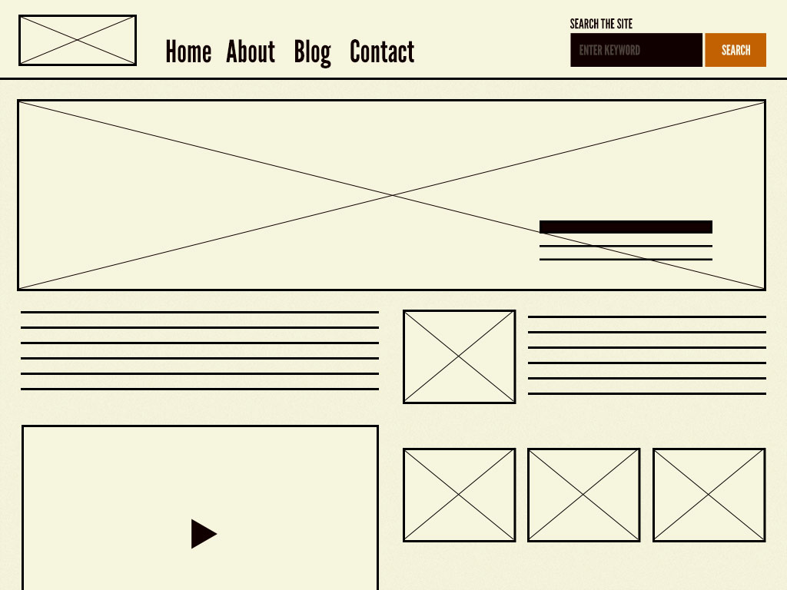
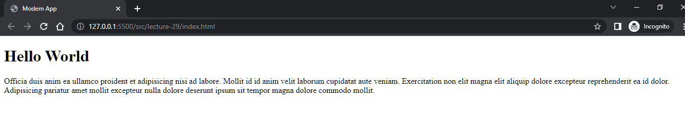
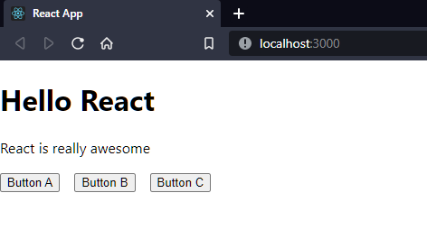

# Lecture 29 [Frontend 2] - Understand React in A Different Way

রিয়্যাক্ট নিয়ে জানতে গেলে আগে আমাদের জানতে হবে ফ্রন্টএন্ডের কাজটা কি। ফ্রন্টএন্ডের মূলত কাজ হলো দুইটা।

- আমরা যে ডাটা ইউজারকে দেখাতে চাইছি সেটা শো করানো হেডিং, প্যারাগ্রাফ, ইমেজ ইত্যাদি ট্যাগের মাধ্যমে
- ইউজার যে ফিডব্যাক দিবে সেটাকে গ্রহণ করা ফর্মের মাধ্যমে।

বর্তমানে ফ্রন্টএন্ড ডেভেলপমেন্ট কঠিন থেকে কঠিনতর হচ্ছে ইউজার ফিডব্যাক বা ইন্টের‍্যাক্টিভিটির কারণে। আমরা প্রথম অবস্থায় ভুলে যায় যে আমাদের ইউজার থেকে ডাটা নিতে হবে। আমাদের প্রাথমিক উদ্দেশ্য কিভাবে ডাটা শো করা যায় সেই ইঞ্জিনিয়ারিংটা বুঝা। এই ইউজারকে ডাটা শো করানোর জন্যই মূলত রিয়্যাক্ট বা অ্যাঙ্গুলারের মতো ফ্রেমওয়ার্কগুলো মার্কেটে জনপ্রিয়তা লাভ করেছে। আমরা একটু নিচের পেইজটা দেখি।


আমাদের যদি বলা হয় এই পেইজটা আমরা কিভাবে ডিজাইন করবো, তাহলে আমাদের উত্তর হবে এরকম। প্রথমে আমরা এইচটিএমএল ফাইলে মার্কআপ করবো এরপর সিএসএস লিখবো। শুরুতে ন্যাভবার তৈরি করবো। এরপর লেফট সেকশন আর রাইট সেকশন তৈরি করবো। এখানে প্রতিটা পেইজের জন্য আমরা আলাদা আলাদা এইচটিএমএল লিখবো। মোটামুটি প্রাথমিকভাবে আমরা এই সিদ্ধান্ত নিলাম। এটা হলো ওয়েব ডিজাইন। এটাকে ওয়েব ডেভেলপমেন্ট বলে না।

ওয়েব ডেভেলপমেন্টে আমাদের চিন্তাটা অন্যরকম হতে হবে। আমাদের সূক্ষ্ম থেকে সূক্ষ্মতর বিষয় নিয়ে চিন্তা করতে হবে। ওয়েব ডেভেলপমেন্টের ক্ষেত্রে একটা কনসেপ্ট আছে। সেটা হলো [Atomic Design](https://bradfrost.com/blog/post/atomic-web-design/)। এই কনসেপ্টটা ভবিষ্যতে অনেকের কাজে লাগবে। আমাদের সবার প্রথমে বুঝতে হবে অ্যাটমিক ডিজাইন কি? কারণ আমরা যখন কোনো ওয়েব ডিজাইন করি তখন আমাদের উপর কিন্তু কোনো প্রেশার থাকে না। আমরা জানিনা এই টেমপ্লেট নিয়ে কিভাবে একজন ডেভেলপার তা ব্যবহার করবে। তাই আমরা যেখানে একই রকম কাজ আছে তা কপি পেস্ট করে করে বানিয়ে ফেলি। কিন্তু রিয়েল লাইফে সিম্পল একটা সার্চবারের জন্য ৫০০-৭০০ লাইনের কোড লেখা লাগে। এখন যারা ওয়েব ডিজাইনার তারা অবাক হতে পারেন কেন এত কোড লেখা লাগছে এই সামান্য জিনিসের জন্য। কারণ এখানে অ্যাক্সেসিবিলিটির ব্যাপার আছে, বিভিন্ন ফিচার্স আছে। যেমন সার্চ বারে ক্লিক করলে তা পুরো width জুড়ে ছড়িয়ে যাচ্ছে, আমরা Esc বাটন প্রেস করলে সেটা পূর্বের অবস্থায় ফিরে যাচ্ছে, যখন আমরা কিছু লিখছি প্রতিটা কীওয়ার্ড লেখার সাথে সাথে সে কিছু সাজেশন্স দেখাচ্ছে এরকম অনেক অনেক ফিচার্স আছে। যখন আমরা ওয়েবসাইট ডিজাইন করি আর যখন ডেভেলপ করি দুইটার মধ্যে আকাশ পাতাল পার্থক্য আছে। তাই যখন আমরা ওয়েব ডেভেলপ করি তখন আমাদের অনেক ছোট ছোট বিষয় নিয়ে ভাবতে হয় এবং এই ছোট ছোট বিষয়কে যতোই আমরা পুনরাবৃত্তি করতে পারবো ততোই আমরা একটা ভাল অ্যাপ্লিকেশনের আশা করতে পারবো। ধরেন আমার হোমপেইজে যে সার্চবার থাকবে ঠিক একই রকম সার্চবার অন্য কোনো পেইজে থাকবে। আমরা সেই ৭০০/৮০০ লাইনের কোড বারবার কপি পেস্ট না করে সেটাকে একবার লিখে তা রিইউজ করতে পারি। এই যে রিইউজের কনসেপ্ট, সেটার জন্যই ফ্রন্টএন্ডের যে ফ্রেমওয়ার্কগুলো সেগুলো অনেক জনপ্রিয় হয়েছিল। ক্লিক করার জন্য বা ইন্টের‍্যাকশনের জন্য না। আমরা একটা কম্পোনেন্ট একবার বানাবো। এরপর সেটা যতো জায়গায় লাগবে সে সে জায়গায় আমরা রিইউজ করবো। কিন্তু আমরা যখন ওয়েব ডিজাইন করি বা এইচটিএমএল সিএসএস দিয়ে কোড লিখি সেখানেও তো কপি পেস্ট করে করে রিইউজই করি। কপি পেস্টের মূল সমস্যা হলো, যদি কোনো এক জায়গায় চেইঞ্জ আছে, সেই কোড যদি আপনি ১০০০ জায়গায় পেস্ট করেন সেই ১০০০ জায়গায় গিয়ে গিয়ে চেইঞ্জ করা লাগবে। আর কম্পোনেন্ট বানালে আপনি শুধু মেইন যে কম্পোনেন্ট সে জায়গায় চেইঞ্জ করলে বাকি সব জায়গায় তা এমনিতেই চেইঞ্জ হয়ে যাবে। এই যে কোড রিইউজ বা ছোট ছোট কম্পোনেন্টে ভাগ করার যে কাজ সেই কনসেপ্ট থেকেই ফ্রন্টএন্ডের বর্তমান ট্রেন্ড চলছে। সেটাকে আরো কিভাবে ডেভেলপ করা যায় তার জন্য বিভিন্ন ডিজাইন প্যাটার্ন এসেছে যার মধ্যে একটা হলো আমাদের উল্লেখিত অ্যাটমিক ডিজাইন প্যাটার্ন। এই প্যাটার্নটা ৫টা জিনিসের উপর ভিত্তি করে গঠিত। সেগুলো হলো -

- Atoms - Atom মানে হলো একটা অ্যাপ্লিকেশনের ছোট একটা জিনিস। সেটা একটা টেক্সট হতে পারে, একটা বাটন হতে পারে, একটা ইনপুট ফিল্ড হতে পারে।


- Molecules - যখন একাধিক অ্যাটম যুক্ত হয় তখন তৈরি হয় একটা মলিকিউল। নিচের ছবিতে দেখুন একটা টেক্সট আছে, একটা ইনপুট ফিল্ড আছে আর একটা বাটন আছে। তিনটা অ্যাটম মিলে তৈরি হয়েছে একটা সার্চ কম্পোনেন্ট। এটাই মলিকিউল।


- Organisms - অনেকগুলো মলিকিউল মিলে তৈরি হয়ে অর্গানিজম। যেমন একটা ন্যাভবার। ন্যাভবারের অনেক মলিকিউল থাকে। একটা লোগো থাকে, লিংক থাকে, ড্রপডাউন থাকে, প্রোফাইল পিক থাকে, সার্চ বার থাকে। এগুলো এক একটা মলিকিউল। এসব মলিকিউল মিলে তৈরি হচ্ছে ন্যাভবার। একে আমরা বলি অর্গানিজম।


- Templates - টেমপ্লেট মানে হলো আমার যেখানে যে যে কনটেন্ট থাকবে তার আসল কনটেন্ট ব্যবহার না করে কিছু প্লেসহোল্ডার রেখে দিয়ে বুঝাতে পারি যে এখানে ইমেজ হবে যার সাইজ হবে এতটুকু, এখানে প্যারাগ্রাফ হবে যার সাইজ এতটুকু। এই জায়গায় তিনটা সেকশন হবে যার দুইটা সেকশনে থাকবে লেখা আর মাঝখানে থাকবে ইমেজ। আমরা সব বুঝিয়ে দিবো কিন্তু কোনো কনটেন্ট ব্যবহার না করে। এটাকেই মূলত বলে টেমপ্লেইট। নিচের ছবিটি দেখলে আপনারা বুঝতে পারবেন।



- Pages - আমরা টেমপ্লেটের উপর যখন কনটেন্ট বসিয়ে ফেলব তখন যেটা দাঁড়াবে সেটা হলো একটা পেইজ।


এই যে অ্যাটমিক ডিজাইনের কনসেপ্ট, এই কনসেপ্টের উপর ভিত্তি করেই ম্যাক্সিমাম ডিজাইন সিস্টেম গড়ে উঠেছে। এটা এখন অনেক জনপ্রিয় একটা কনসেপ্ট ডেভেলপমেন্ট ফিল্ডে।

আমরা একটু কোডে যায় এবার। আমরা index.html, app.js ফাইল ক্রিয়েট করি এবং স্ক্রিপ্ট ফাইলকে এইচটিএমএলের সাথে কানেক্ট করি।

```html
<!-- index.html -->
<!DOCTYPE html>
<html lang="en">
	<head>
		<meta charset="UTF-8" />
		<meta http-equiv="X-UA-Compatible" content="IE=edge" />
		<meta name="viewport" content="width=device-width, initial-scale=1.0" />
		<title>Modern App</title>
		<script src="./app.js" defer></script>
	</head>
	<body>
		<div id="root"></div>
	</body>
</html>
```

```js
// app.js
window.onload = function () {
	main();
};

function main() {}
```

বর্তমান ফ্রন্টেন্ড ডেভেলপমেন্টে এইচটিএমএলের ফাইলটির কোনো কাজ নেই। সেটা আপনি ফ্রেমওয়ার্ক দিয়ে হোক বা আপনি যদি মনে করেন কোনো ফেমওয়ার্ক ব্যবহার না করেই ভ্যানিলা জাভাস্ক্রিপ্ট দিয়ে একটা ওয়েব অ্যাপ্লিকেশন বানাবেন, যখনই ওয়েব অ্যাপ্লিকেশন বানানোর কথা চলে আসবে তখনই আর আমাদের এইচটিএমএল ফাইলের কাজ নেই। এখন প্রশ্ন আসতে পারে যদি কাজই না থাকে তাহলে আমরা ইনস্পেক্ট করলে এইচটিএমএল কোডগুলো কোত্থেকে আসে? এই কোডগুলো জাভাস্ক্রিপ্ট ব্যবহার করে ডায়নামিক্যালি তৈরি করা যায়। ডমের এপিআই আছে। সেগুলো দিয়ে তৈরি করা যায়। এখন এই এপিআইগুলো আপনি ব্যবহার করতে পারেন অথবা আপনি যদি মনে করে রিয়্যাক্ট, ভিউ বা অ্যাঙ্গুলারের মতো ফ্রেমওয়ার্ক ব্যবহার করবেন তাহলে তারা আপনার জন্য এই এপিআইগুলো কল করে রাখবে এবং আপনাকে ফ্রন্টএন্ড ডেভেলপমেন্টের একটা ভিন্ন ফ্লেভার দিবে। পর্দার পিছনে সবাই আল্টিমেটলি ডমের এপিআই ব্যবহার করছে। ডমের এপিআই দিয়ে কিভাবে কাজ করা যায়? আমরা যদি আমাদের এইচটিএমএল ফাইলে লাইভ সার্ভার দিয়ে ব্রাউজারে ওপেন করি তাহলে একটা খালি স্ক্রিন দেখবো।


কিন্তু আমি একটা h1 ইলেমেন্ট দেখতে চাই। সেটা করার জন্য আমরা আমাদের জাভাস্ক্রিপ্ট ফাইলটাতে কিছু লিখবো।

```js
// app.js

window.onload = function () {
	main();
};

function main() {
	const h1 = document.createElement('h1');
	h1.innerText = 'Hello World';

	document.body.appendChild(h1);
}
```

এবার যদি আমরা আমাদের ব্রাউজারে আউটপুট দেখি দেখবো Hello World লেখা দেখাবে।


আমরা কিন্তু এইচটিএমএল ফাইলে হাতই দিইনি। আমরা জাভাস্ক্রিপ্ট দিয়েই ডায়নামিক্যালি কনটেন্ট তৈরি করতে পারছি। এবার আমরা একটা প্যারাগ্রাফ লিখবো।

```js
// app.js

window.onload = function () {
	main();
};

function main() {
	const h1 = document.createElement('h1');
	h1.innerText = 'Hello World';

	const p = document.createElement('p');
	p.innerText = `Officia duis anim ea ullamco proident et adipisicing nisi ad labore. Mollit id id anim velit laborum cupidatat aute veniam. Exercitation non elit magna elit aliquip dolore excepteur reprehenderit ea id dolor. Adipisicing pariatur amet mollit excepteur nulla dolore deserunt ipsum sit tempor magna dolore commodo mollit.`;

	document.body.appendChild(h1);
	document.body.appendChild(p);
}
```

দেখবো আমাদের পেইজে একটা প্যারাগ্রাফ চলে এসেছে।



এখন আমরা চাইছি h1 এবং p কে গ্রুপ করতে বা একটা div এর মধ্যে রাখতে। তার জন্য আমাদের একটা div নিতে হবে।

```js
// app.js

window.onload = function () {
	main();
};

function main() {
	const div = document.createElement('div');

	const h1 = document.createElement('h1');
	h1.innerText = 'Hello World';

	const p = document.createElement('p');
	p.innerText = `Officia duis anim ea ullamco proident et adipisicing nisi ad labore. Mollit id id anim velit laborum cupidatat aute veniam. Exercitation non elit magna elit aliquip dolore excepteur reprehenderit ea id dolor. Adipisicing pariatur amet mollit excepteur nulla dolore deserunt ipsum sit tempor magna dolore commodo mollit.`;

	div.appendChild(h1);
	div.appendChild(p);

	document.body.appendChild(div);
}
```

আমরা ব্রাউজারে কোনো চেইঞ্জ না দেখলেও যদি ইনস্পেক্ট করি তাহলে দেখবো একটা div ক্রিয়েট হয়েছে এবং তার মধ্যে h1 এবং p দুইটা ট্যাগই রয়েছে।


আমরা এই কাজটা আরো ডায়নামিক্যালি করতে পারি। আমরা দুইটা ফাংশন বানাবো। একটা কন্টেইনারের জন্য আরেকটা টেক্সটের জন্য।

```js
function Container(children) {
	const div = document.createElement('div');
	children.forEach((child) => div.appendChild(child));

	return div;
}

function Text(tag, value) {
	const text = document.createElement(tag);
	text.innerText = value;
	return text;
}
```

এবার আমরা মেইন ফাংশনের ভেতরে যা যা লিখেছি সব ডিলিট করে এই ফাংশনগুলো ব্যবহার করবো।

```js
window.onload = function () {
	main();
};

function main() {
	const app = Container([
		Text('h1', 'Hello World'),
		Text('p', 'This is a simple paragraph'),
	]);
	document.getElementById('root').appendChild(app);
}

function Container(children) {
	const div = document.createElement('div');
	children.forEach((child) => div.appendChild(child));

	return div;
}

function Text(tag, value) {
	const text = document.createElement(tag);
	text.innerText = value;
	return text;
}
```

এবার যদি আমরা আউটপুট দেখি দেখবো আমাদের আগের মতো আউটপুট এসেছে।


এটা অনেকটা রিয়্যাক্টের jsx আসার আগে যেভাবে লিখতে হতো সেরকম হয়েছে। এবার আপনি যতো কন্টেইনার বা টেক্সট নিতে চান আপনাকে আর কোড লিখতে হবে না প্রতিটার জন্য। এই ফাংশনগুলো ব্যবহার করেই আপনি ডায়নামিক্যালি পেইজে কনটেন্ট ক্রিয়েট করতে পারবেন। আমরা চাইলে স্টাইলও দিতে পারবো।

```js
window.onload = function () {
	main();
};

function main() {
	const app = Container([
		Text('h1', 'Hello World'),
		Text('p', 'This is a simple paragraph'),
		Container([Text('h3', 'WOW'), Text('h3', 'NICE')], {
			display: 'flex',
			gap: '2rem',
		}),
	]);
	document.getElementById('root').appendChild(app);
}

function Container(children, style = {}) {
	const div = document.createElement('div');
	Object.keys(style).map((key) => {
		div.style[key] = style[key];
	});
	children.forEach((child) => div.appendChild(child));

	return div;
}

function Text(tag, value) {
	const text = document.createElement(tag);
	text.innerText = value;
	return text;
}
```


ফ্রেমওয়ার্কগুলো কিভাবে কাজ করে তার একটা আইডিয়া আমরা পেয়েছি। আর কিভাবে এইচটিএমএলে হাত না দিয়ে আমরা জাভাস্ক্রিপ্ট ব্যবহার করে ডায়নামিক্যালি এইচটিএমএল কোড জেনারেট করতে পারি তাও দেখলাম। আমাদের যদি কনসেপ্ট জানা থাকে আমরা নিজেরাই ফ্রেমওয়ার্ক বানিয়ে ফেলতে পারি।

আমরা আমাদের UI কে এইচটিএমএলের মধ্যে না রেখে একটা জাভাস্ক্রিপ্ট ফাংশনের মধ্যে নিয়ে এসেছি। আমাদের মাথায় নিয়ে রাখতে হবে যে UI এখন আর এইচটিএমএলে নেই এটা এখন জাভাস্ক্রিপ্ট ফাংশনের মধ্যে চলে এসেছে।

এবার আমরা যে কাজ করেছি তা রিয়্যাক্টে গিয়ে করবো। প্রথমে আমরা আমাদের রিয়্যাক্ট অ্যাপ্লিকেশন বানাই। তার জন্য কমান্ড লাইনে লিখতে হবে `npx create-react-app first-app` বা `yarn create react-app first-app`।

আমাদের এখন ফাইল স্ট্রাকচার বুঝার দরকার নেই। আমরা শুধু দেখবো যে কোড আমরা আগে করেছিলাম ওটার সাথে রিয়্যাক্টের মিল আছে কিনা।

আমরা src ফোল্ডারের মধ্যে App.js এর সবকিছু ডিলিট করে দিয়ে নিচের কোডটি লিখবো।

```js
// App.js

import React from 'react';

function App() {
	return React.createElement('div', null, [
		React.createElement('h1', null, 'Hello React'),
		React.createElement('p', null, 'React is all about JavaScript'),
	]);
}

export default App;
```

এবার আমরা `yarn start` বা `npm start` লিখে আমাদের অ্যাপ্লিকেশন চালু করবো। এটা ব্রাউজারে অটোমেটিক রান হয়ে যাবে। সেখানে গেলে দেখবো আমরা নিচের আউটপুট।


আমরা আগে ম্যানুয়েলি যে কোড লিখেছিলাম প্রায় একই। ওখানে document.createElement লিখেছিলাম এখানে React.createElement। তার মানে আমরা যে jsx কোড লিখি তার কোনো ভিত্তিই নেই। সেগুলো আমরা লেখার সুবিধার্থে সেই সিস্টেম করা হয়েছে। কিন্তু সেই jsx কোডই কোনো না কোনো ভাবে ফাংশনে রূপান্তরিত হচ্ছে। এখন এটা ছোট অ্যাপ্লিকেশন বলে এভাবে লিখলেও সমস্যা হচ্ছে না। কিন্তু বড় অ্যাপ্লিকেশন যেখানে হাজার হাজার কোড লিখতে হয় সেখানে এভাবে লিখলে বুঝা যায় না। তাই রিয়্যাক্ট jsx ফিচার এনেছে কোড সহজে লেখার জন্য, বুঝার জন্য এবং ম্যানেজ করার জন্য। এবার আমরা যদি উপরের কোডটা মডার্ন রিয়্যাক্টে লিখি তাহলে দেখুন কতো সহজে এইচটিএমএলের মতো করে লিখতে পারি।

```js
function App() {
	return (
		<div>
			<h1>Hello React</h1>
			<p>React is really awesome</p>
		</div>
	);
}

export default App;
```


দেখুন কতো সহজেই আমরা লিখতে পারছি। যদিও এই কোডটা ব্রাউজারে দেখাবে না। সে আগে জাভাস্ক্রিপ্টে কনভার্ট হবে এরপর ব্রাউজারে শো করবে। সেই কাজটা আমাদের করতে হবে না। সেটা আমাদের হয়ে রিয়্যাক্ট, ওয়েবপ্যাক, ব্যাভেল করবে। আমাদের সেটা নিয়ে ভাবারও দরকার নাই।

আমরা যেটা বলেছিলাম এখন UI মানে ফাংশন সেটা প্রমাণিত হলো। আমরা আরেকটা ফাংশন বানাই এই ফাইলে। আমরা একটা বাটন যুক্ত করতে চাইছি। সেই বাটনের জন্য একটা ফাংশন লিখে ফেলি।

```js
function Button() {
	return <button>This is a button</button>;
}

function App() {
	return (
		<div>
			<h1>Hello React</h1>
			<p>React is really awesome</p>
			<Button />
		</div>
	);
}

export default App;
```

আমরা লিখবো ফাংশন। কিন্তু সেটাকে আমরা আমাদের কোডে লিখবো ট্যাগ আকারে। এবার আউটপুট দেখলে দেখা যাবে একটা বাটন যুক্ত হয়ে গেছে।


তার মানে এখানে যতটা UI ততোটা ফাংশন তৈরি করবো। ছোট ছোট UI এর সমন্বয়ে আমরা একটা বড় UI তৈরি করবো। যেমন আমরা চাইলে h1 এবং p ট্যাগের জন্যও ফাংশন তৈরি করতে পারি।

```js
function Button() {
	return <button>This is a button</button>;
}

function Title() {
	return <h1>Hello React</h1>;
}

function Body() {
	return <p>React is really awesome</p>;
}

function App() {
	return (
		<div>
			<Title />
			<Body />
			<Button />
		</div>
	);
}

export default App;
```


দেখুন সেইম আউটপুট আসছে। তার মানে আশা করি এখন আর কারো মনে সন্দেহ নেই যে একেকটা UI একেকটা ফাংশন।

Why React? এর উত্তর আমরা পেয়ে গেছি। আমরা ডম ম্যানিপুলেশন করে যে প্রজেক্ট করেছিলাম সেটার কোড কতো কমপ্লেক্স আর এখানে কতো সহজ। ডম ম্যানিপুলেশন করে করতে গেলে যে যে সমস্যার সম্মুখীন আমাদের হতে হতো সে সমস্যা থেকে মুক্তির জন্য রিয়্যাক্ট বেস্ট সল্যুশন। তাহলে রিয়্যাক্ট কেন সেই উত্তর আমরা পেলাম।

এবার আমাদের জানতে হবে রিয়্যাক্ট কি, কিভাবে আমরা রিয়্যাক্টে কাজ করবো, রিয়্যাক্ট নিয়ে কাজ করতে গেলে আমাদের পিসিতে কি কি টুলস লাগবে সেগুলো।

প্রথমে আমরা জানি রিয়্যাক্ট কি? রিয়্যাক্টের অফিসিয়াল [সাইট](https://reactjs.org/) এ গেলে দেখবো সেখানে লেখা আছে `A JavaScript library for building user interfaces`। অ্যাঙ্গুলারের [সাইটে](https://angular.io/) গেলে দেখা যাবে সেটা ফ্রেমওয়ার্ক, ভিউ এর [সাইটে](https://vuejs.org/) গেলে দেখা যাবে সেটাও ফ্রেমওয়ার্ক। কিন্তু রিয়্যাক্টকে বলা হচ্ছে লাইব্রেরি। তাহলে লাইব্রেরি আর ফ্রেমওয়ার্কের মধ্যে পার্থক্য কি? বেসিক পার্থক্য হলো আমরা লাইব্রেরিকে কন্ট্রোল করতে পারি, নিজের মতো যেমন খুশি সেভাবে ব্যবহার করতে পারি। কিন্তু ফ্রেমওয়ার্ক আমাদের কন্ট্রোল করে। নিজের মতো করে কিছু আমরা ফ্রেমওয়ার্কে করতে পারি না। এরপর ফ্রেমওয়ার্কে ওদের গন্ডির বাইরে আমরা কোনো প্যাকেজ ব্যবহার করতে পারবো না। ওখানে যে যে কাজের জন্য যে যে প্যাকেজ বা লাইব্রেরির কথা বলা হয়েছে তার বাইরে আমরা যেতে পারি না। কিন্তু লাইব্রেরির ক্ষেত্রে আমরা স্বাধীন। আমরা যদি দেখি গতানুগতিক লাইব্রেরির বাইরে ভাল একটা লাইব্রেরি বা প্যাকেজ আছে সেটা আমরা ব্যবহার করতে পারি। ফ্রেমওয়ার্কের ক্ষেত্রে আরেকটা অসুবিধা হলো যেহেতু তাদের সবকিছুই বিল্টইন ভাবে আছে সেহেতু আমাদের সবকিছুই শিখতে হয় অর্থাৎ এর লার্নিং কার্ভ অনেক বড়। লাইব্রেরির ক্ষেত্রে লার্নিং কার্ভ তুলনামূলক অনেক ছোট।

রিয়্যাক্ট নিয়ে কাজ করতে গেলে আমাদের তিনটা টুলসের দরকার হয়।

- [NodeJS](https://nodejs.org/en/) - এটা মাস্ট ইনস্টল থাকা লাগবেই।
- [Babel Js](https://babeljs.io/) - এটা যদি কাস্টমভাবে আমরা রিয়্যাক্টের সেটআপ তৈরি করতে চাই এটা আমাদের ইনস্টল করতেই হবে। কিন্তু আমরা কাস্টমভাবে রিয়্যাক্টের সেটআপ তৈরি করবো না।
- [Webpack](https://webpack.js.org/) - আমরা আমাদের প্রজেক্টে অসংখ্য ফাইল নিয়ে কাজ করবো। সেই অসংখ্য ফাইলকে বান্ডেল আকারে ছোট ফাইলে একত্রীভূত করার জন্য আমাদের এটা লাগে। যদি কাস্টমভাবে আমরা রিয়্যাক্টের এনভায়রনমেন্ট তৈরি করতে চাই তাহলে আমাদের ওয়েবপ্যাক এবং ব্যাবেল লাগবেই।

আমরা বিগিনার হিসেবে কাস্টমভাবে রিয়্যাক্টের এনভায়রনমেন্ট সেটআপ করবো না। তার জন্য যেভাবে আমরা আমাদের রিয়্যাক্ট অ্যাপ তৈরি করেছিলাম সেভাবেই তৈরি করবো। ঐ create-react-app টুলই আমাদের জন্য বিহাইন্ড দ্য সীণ ব্যাবেল এবং ওয়েবপ্যাক ব্যবহার করে একটা এনভায়রনমেন্ট তৈরি করে দিবে।

এবার আমরা একটু রিয়্যাক্টের ফাইল স্ট্রাকচার দেখি। এখানে node_modules এ আমাদের প্রয়োজনীয় প্যাকেজগুলো ইনস্টল হয়ে আছে। এরপর আছে public ডিরেক্টরি। সেখানে আমরা favicon রাখতে পারি। index.html ফাইল রাখবো যেটা একমাত্র এইচটিএমএল ফাইল। এরপর কিছু লোগো আছে। এরপর আছে manifest.json। এটা আমাদের কাজে লাগবে যখন আমরা প্রোগ্রেসিভ ওয়েব অ্যাপ তৈরি করবো বা ক্রোম এক্সটেনশন তৈরি করবো তখন লাগবে। এরপর আছে robots.txt। এগুলো বিগিনার হিসেবে দরকার নেই এখন। এরপর যাবো src ডিরেক্টরিতে। এখানে App.js আমাদের রুট ফাইল। যদিও এটা আমাদের এন্ট্রি ফাইল না। আমাদের এন্ট্রি ফাইল হলো index.js ফাইল। এটাই সেই ফাইল যেখানে আমরা বুট করি। এই ফাইলে গেলে আমরা দেখবো এটার চেহারা এমন।

```js
import React from 'react';
import ReactDOM from 'react-dom/client';
import './index.css';
import App from './App';
import reportWebVitals from './reportWebVitals';

const root = ReactDOM.createRoot(document.getElementById('root'));
root.render(
	<React.StrictMode>
		<App />
	</React.StrictMode>
);

// If you want to start measuring performance in your app, pass a function
// to log results (for example: reportWebVitals(console.log))
// or send to an analytics endpoint. Learn more: https://bit.ly/CRA-vitals
reportWebVitals();
```

আমরা এখান থেকে React.StrictMode মুছে দিবো। কারণ বিগিনার হিসেবে আমরা স্ট্রিক্টমুড নিয়ে কাজ করবো না। কারণ আমরা জানিই না স্ট্রিক্টমুড কি কি হতে পারে। সুতরাং এটাকে আমরা একটু রিফ্র্যাক্টর করে নিবো এভাবে।

```js
import ReactDOM from 'react-dom/client';
import App from './App';
import './index.css';
import reportWebVitals from './reportWebVitals';

const root = ReactDOM.createRoot(document.getElementById('root'));
root.render(<App />);

// If you want to start measuring performance in your app, pass a function
// to log results (for example: reportWebVitals(console.log))
// or send to an analytics endpoint. Learn more: https://bit.ly/CRA-vitals
reportWebVitals();
```

App.js ডিলিট করে আমরা বানাবো App.jsx ফাইল। .jsx মানে হলো আমরা বুঝতে পারবো এই ফাইলে আমরা কম্পোনেন্ট নিয়ে কাজ করেছি আর .js মানে হলো এখানে শুধু আমরা পিওর জাভাস্ক্রিপ্ট কোড লিখেছি। আরো একটা সুবিধা হচ্ছে আমরা এইচটিএমএলের সমস্ত শর্টহ্যান্ড সুবিধা এখানে পাবো। যেমন .something লিখে এন্টার দিলে যেরকম ক্লাসনেম সহ div তৈরি হয় সেসকল সুবিধা। আরেকটা জিনিস খেয়াল রাখতে হবে আমাদের কাস্টম কম্পোনেন্ট ফাইলের নাম সবসময় ক্যাপিটাল লেটার দিয়ে শুরু হতে হবে। এখন কম্পোনেটের সুবিধা কি। আমরা আমাদের App.jsx এ আগে যে কোড লিখেছিলাম ওখানে যদি ৪টা বাটন থাকতো এবং সেগুলো স্টাইল করা থাকতো এবং সেগুলো যদি কম্পোনেন্ট আকারে না থেকে কপি পেস্ট করে ৪বার করে লিখতাম, তাহলে যদি কখনও কোনো স্টাইল চেইঞ্জ করতে হতো তাহলে ৪টাতেই খুঁজে খুঁজে চেইঞ্জ করতে হতো। কম্পোনেন্ট করার কারণে আমরা শুধু ঐ একটা কম্পোনেন্ট ফাংশনে চেইঞ্জ করবো বাকি জায়গায় এমনিই চেইঞ্জ হয়ে যাবে। এবার যদি আমরা চাই একেকটা বাটনের নাম একেকটা হবে সেটাও ডায়নামিক্যালি আমরা করতে পারি।

```js
function Button({ text }) {
	return <button style={{ marginRight: '1rem' }}>{text}</button>;
}

function Title() {
	return <h1>Hello React</h1>;
}

function Body() {
	return <p>React is really awesome</p>;
}

function App() {
	return (
		<div>
			<Title />
			<Body />
			<Button text="Button A" />
			<Button text="Button B" />
			<Button text="Button C" />
		</div>
	);
}

export default App;
```



দেখুন আমরা কত সহজে তা করতে পারছি। তার মানে এখন ছোট ছোট কম্পোনেন্ট করে কেন কাজ করা হয় আশা করি ধারণা পেয়ে গেছেন আপনারা। এটাই মডার্ণ ওয়েব ডেভেলপমেন্ট।

## Acknowledgement

All images related to atomic design collected from [Atomic Design](https://bradfrost.com/blog/post/atomic-web-design/).

## Source Code

- [Source Code for this lecture](../../src/lecture-29/)

## Author

- [Aditya Chakraborty](https://github.com/adityackr)
