# Lecture 31 - Frontend 4 - React Component Tree and State

## Introduction

আমরা গতো ক্লাসে শিখেছিলাম যখনই আমাদের কোড রিইউজের প্রয়োজন হবে তখনই আমরা একটা কম্পোনেন্ট বানাবো। আরো নির্দিষ্টভাবে যদি বলি, যখন আমাদের কোনো কোডে বাইরে থেকে ডাটা নিয়ে রিইউজের প্রয়োজন হবে তখনই আমরা কম্পোনেন্ট বানাবো। অর্থাৎ যদি ডায়নামিক্যালি ডাটা ইনপুটের মাধ্যমে কোড রিইউজ করতে হয় সেখানেই আমরা কম্পোনেন্ট বানাবো। এই ক্লাসে আমরা রিয়্যাক্ট কম্পোনেন্ট ট্রী এবং স্টেট নিয়ে আলোচনা করবো।

## Component tree

ধরি আমাদের একটা রুট ফাইল আছে যার নাম APP. আমরা আমাদের যাবতীয় সব সেকশন এই ফাইলের মধ্যে রাখতে পারি। কিন্তু সব যদি আমরা এক ফাইলেই রাখি তাহলে আমাদের ফ্রেমওয়ার্ক বা লাইব্রেরির দরকার কি? আমরা তো এইচটিএমএল, সিএসএস দিয়েই করতে পারতাম। আমরা ফ্রেমওয়ার্ক বা লাইব্রেরি ব্যবহার করার কারণই হচ্ছে আমরা যেন কোড রিইউজ করতে পারি, ছোট ছোট কম্পোনেন্টে ভাগ করতে পারি, ছোট ছোট UI তৈরি করতে পারি। ধরলাম আমাদের অ্যাপের তিনটা সেকশন আছে - Section 1, Section 2, Section 3। এখন এই সেকশনগুলোর আবার ছোট ছোট UI থাকতে পারে। যেহেতু আমরা সেকশন আলাদা করেছিলাম তার মানে সেখানে আমাদের ডুপ্লিকেট কোড আছে। তাই আমরা আলাদা কম্পোনেন্ট করেছি। এই সেকশনগুলোতে ডাটা পাঠাবে অ্যাপ। কিন্তু অ্যাপ কখনও সরাসরি UI এর কাছে ডাটা পাঠাতে পারবে না। এখানে যে কনসেপ্টটা আসছে সেটা হচ্ছে প্যারেন্ট-চাইল্ড রিলেশন। আমাদের ডাটার সোর্স সবসময় হবে প্যারেন্ট। গ্র্যান্ডপ্যারেন্ট বা গ্রেট গ্র্যান্ডপ্যারেন্ট না। ধরলাম আমাদের অ্যাপে মাল্টিপল পেইজ আছে। Page1 and Page2। Page1 হচ্ছে সেই পেইজের প্যারেন্ট এবং সমস্ত ডাটা থাকবে এর মধ্যে। একইভাবে Page2 হচ্ছে সেই পেইজের প্যারেন্ট এবং ডাটা থাকবে সেই পেইজের মধ্যে। এখন এই ডাটা কিসের ডাটা হতে পারে? সেটা হতে পারে সার্ভার থেকে আগত কোনো ডাটা যেমন - নাম, ডিটেইলস, প্রোফাইল পিকচার, আবার সেকশনগুলো রেন্ডার করার জন্য বাটন টেক্সট, ইনপুট টেক্সট, হেডিং ট্যাগ ইত্যাদিও হতে পারে। এখানে পেইজ সেকশনকে প্রপ্স আকারে ডাটা দিতে পারবে এবং সেকশন তার UI কে প্রপ্স আকারে ডাটা দিতে পারবে। অর্থাৎ সেকশনের জন্য প্যারেন্ট হচ্ছে পেইজ, UI এর জন্য প্যারেন্ট হচ্ছে সেকশন। এখন পেইজ চাইলে কখনও UI কে ডাটা দিতে পারবে না। সহজ বাংলায় আমরা যেটা বুঝতে পারছি সেটা হলো আমি আমার বাপের সম্পত্তি পাবো, আমার সন্তান আমার সম্পত্তি পাবে। আমি চাইলে সরাসরি আমার দাদুর সম্পত্তি পাবো না। এটাই প্যারেন্ট চাইল্ড রিলেশন। এটা মেইনটেইন করেই প্যারেন্ট থেকে চাইল্ডে প্রপ্সের মাধ্যমে ডাটা পাস হয়। এই পুরো কথাকে যদি আমরা একটা ডায়াগ্রাম দিয়ে বুঝাই তাহলে সহজেই আমাদের মাথায় ঢুকে যাবে।

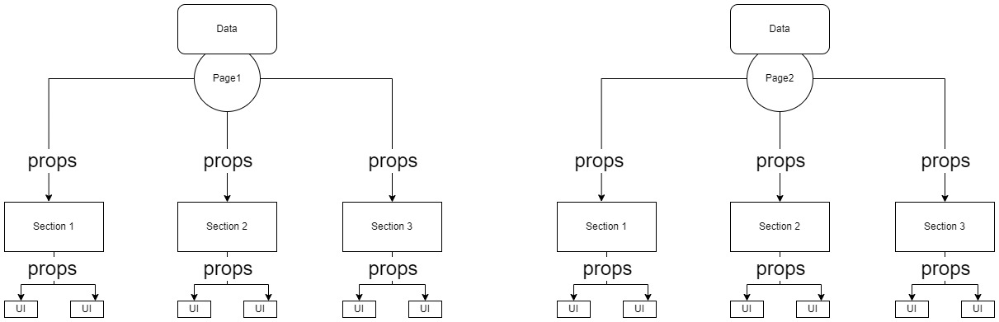

রিয়্যাক্টে এটাকে বলা হয় কম্পোনেন্ট ট্রী। এবং এই স্ট্রাকচার রিয়্যাক্টের জন্য মাথায় রাখা খুবই গুরুত্বপূর্ণ। এই কম্পোনেন্ট ট্রী তে আমরা উপর থেকে নিচে ডাটা ফ্লো করতে পারবো কিন্তু কখনই নিচ থেকে উপরে ডাটা ফ্লো করতে পারবো না।

এবার আমরা একটা সিম্পল অ্যাপ্লিকেশন বানানোর চেষ্টা করি।

## অ্যাপ্লিকেশন স্ট্রাকচার

আমাদের অ্যাপ্লিকেশনটা অনেক সিম্পল হবে। একটা নেভিগেশন বার থাকবে, নিচে কিছু কনটেন্ট থাকবে এবং একটা ফুটার থাকবে। আমাদের অ্যাপ ফাইলের স্ট্রাকচার হবে এমন -

```jsx
function App() {
	return (
		<div>
			<nav>
				<div>
					<h3>Brand Name</h3>
				</div>
				<div>
					<ul>
						<li>Link One</li>
						<li>Link Two</li>
						<li>Link Three</li>
					</ul>
				</div>
			</nav>
			<main>
				<h1>This is a body title</h1>
				<p>
					Lorem ipsum dolor sit amet consectetur adipisicing elit. Voluptatum,
					vero fugit. Vitae adipisci aliquid aperiam iste magni maiores
					accusamus atque ad minus ab animi non iusto eligendi, tempore, omnis
					facilis.
				</p>
			</main>
			<footer>
				<h3>Footer</h3>
				<ul>
					<li>Footer Link One</li>
					<li>Footer Link Two</li>
					<li>Footer Link Three</li>
				</ul>
			</footer>
		</div>
	);
}

export default App;
```

এখান থেকে আমরা বুঝতে পারছি আমাদের ন্যাভবার এবং ফুটারে কম্পোনেন্ট বানাতে হবে। সেই কাজটা আমরা পরে করবো। আগে আমরা সিএসএস ফাইল বানাই। আমরা src ফোল্ডারের মধ্যে App.css নামে একটা ফাইল বানাবো। এবং তাতে একটা ব্যাকগ্রাউন্ড সেট করবো।

```css
/* App.css */

.app {
	background-color: aqua;
}
```

এবার এই সিএসএস ফাইলকে আমাদের অ্যাপ ফাইলে ইমপোর্ট করে ক্লাসনেইমটা দিয়ে দিতে হবে।

```jsx
import './App.css';

function App() {
	return (
		<div className="app">
			<nav>
				<div>
					<h3>Brand Name</h3>
				</div>
				<div>
					<ul>
						<li>Link One</li>
						<li>Link Two</li>
						<li>Link Three</li>
					</ul>
				</div>
			</nav>
			<main>
				<h1>This is a body title</h1>
				<p>
					Lorem ipsum dolor sit amet consectetur adipisicing elit. Voluptatum,
					vero fugit. Vitae adipisci aliquid aperiam iste magni maiores
					accusamus atque ad minus ab animi non iusto eligendi, tempore, omnis
					facilis.
				</p>
			</main>
			<footer>
				<h3>Footer</h3>
				<ul>
					<li>Footer Link One</li>
					<li>Footer Link Two</li>
					<li>Footer Link Three</li>
				</ul>
			</footer>
		</div>
	);
}

export default App;
```

এবার যদি আমরা `yarn start` লিখে আমাদের অ্যাপ্লিকেশন রান করি তাহলে দেখা যাবে এরকম -

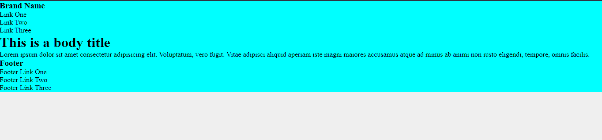

তার মানে আমাদের সবকিছু পারফেক্ট আছে।

### সিএসএস মডিউল

আমরা উপরের যেভাবে সিএসএস লিখেছি সেই সিস্টেমে একটা সমস্যা আছে। আমরা যে সিএসএস লিখেছি সেটা গ্লোবাল সিএসএস। আমরা যদি একই ক্লাসনেইম দিয়ে অন্য স্টাইলও বানাই তাহলে একটা আরেকটাকে ওভাররাইড করে দিবে। উদাহরণস্বরূপ আমরা গত ক্লাসে যে বাটন নিয়ে কাজ করেছিলাম সেটার ইনলাইন সিএসএসকে আমরা আলাদা ফাইল করে লিখি।

```css
/* /components/button/Button.css */
.button {
	font-size: 0.9rem;
	font-weight: 700;
	text-transform: uppercase;
	letter-spacing: 1px;
	border: none;
	margin-right: 1rem;
	cursor: pointer;
	border-radius: 0.15rem;
}
```

এবার এই ক্লাসনেইমকে আমরা বাটন কম্পোনেন্টে ইমপোর্ট করে ব্যবহার করবো।

```jsx
// /components/button/Button.jsx

import './Button.css';

const variant = {
	primary: {
		backgroundColor: '#2196f3',
		color: '#fff',
	},
	success: {
		backgroundColor: '#4caf50',
		color: '#000',
	},
	error: {
		backgroundColor: '#f44336',
		color: '#fff',
	},
	warning: {
		backgroundColor: '#ff9800',
		color: '#000',
	},
	info: {
		backgroundColor: '#80d8ff',
		color: '#000',
	},
};

const sizes = {
	small: { padding: '0.5rem 1rem' },
	medium: { padding: '1rem 2rem' },
	large: { padding: '1.5rem 3rem' },
};

const Button = (props) => {
	const userVariant = variant[props.variant];
	const userSize = sizes[props.size];
	return (
		<button
			type={props.type}
			className="button"
			style={{
				...userVariant,
				...userSize,
			}}
		>
			{props.text}
		</button>
	);
};

export default Button;
```

এবার আমরা আরেকটা কম্পোনেন্ট নিবো button2 নামে। সেখানে Button.jsx এবং Button.css নামে দুইটা ফাইল ক্রিয়েট করবো। এরপর আমরা আমাদের পূর্বের বাটনের কোড এই বাটনে পেস্ট করবো। কিন্তু সিএসএস একটু মডিফাই করবো।

```css
/* /components/button2/Button.css */

.button {
	font-size: 0.9rem;
	font-weight: 700;
}
```

এবার যদি আমাদের অ্যাপ ফাইলে দুইটি বাটন কম্পোনেন্ট ইমপোর্ট করবো।

```jsx
// App.jsx

import './App.css';
import Button from './components/button/Button';
import Button2 from './components/button2/Button';

function App() {
	return (
		<div className="app">
			<nav>
				<div>
					<h3>Brand Name</h3>
				</div>
				<div>
					<ul>
						<li>Link One</li>
						<li>Link Two</li>
						<li>Link Three</li>
					</ul>
				</div>
			</nav>
			<main>
				<h1>This is a body title</h1>
				<p>
					Lorem ipsum dolor sit amet consectetur adipisicing elit. Voluptatum,
					vero fugit. Vitae adipisci aliquid aperiam iste magni maiores
					accusamus atque ad minus ab animi non iusto eligendi, tempore, omnis
					facilis.
				</p>
			</main>
			<footer>
				<h3>Footer</h3>
				<ul>
					<li>Footer Link One</li>
					<li>Footer Link Two</li>
					<li>Footer Link Three</li>
				</ul>
			</footer>
			<Button variant="primary" size="medium" text="Button" />
			<Button2 variant="primary" size="medium" text="Button2" />
		</div>
	);
}

export default App;
```

যদি আমরা আমাদের UI দেখি তাহলে দেখা যাবে এরকম -

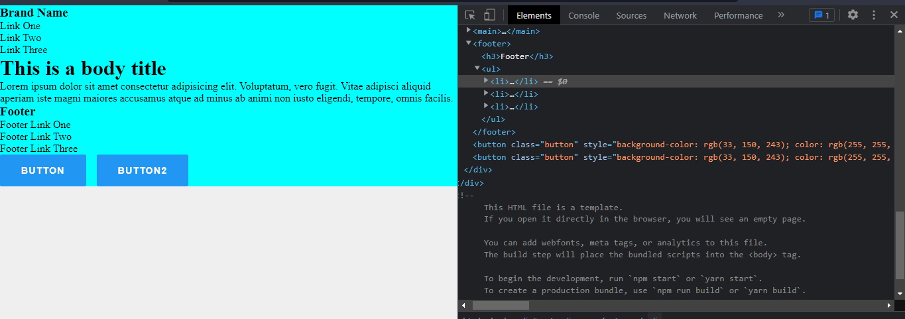

অর্থাৎ আমরা পরে যে বাটনটা বানিয়েছিলাম তার স্টাইল এখানে পাওয়া যায় নি। প্রথম বাটনের স্টাইল পরবর্তী বাটনের স্টাইলকে ওভাররাইড করে দিয়েছে। এই সমস্যা থেকে মুক্তির জন্য আমরা রিয়্যাক্টে ব্যবহার করবো সিএসএস মডিউল। সেটা কিভাবে একটু দেখি চলুন। সেটার জন্য আমাদের সিএসএস ফাইলের নাম দিতে হবে `{name}.module.css` এই ফরমেটে। সুতরাং আমাদের Button.css এর ফাইলনেইম চেইঞ্জ করে দিতে হবে Button.module.css। এরপর আমাদের ইমপোর্ট করতে হবে `import classes from './Button.module.css';` এভাবে। এখানে classes হলো একটা অবজেক্ট যেটা ঐ সিএসএস ফাইলের সব ক্লাসকে এই অবজেক্টের মধ্যে রেখে দেয়। এখন আমাদের `className='button'` এর পরিবর্তে লিখতে হবে `className={classes.button}` এভাবে। যদি এগুলো চেইঞ্জ করি তবে কি হয় একটু দেখি।

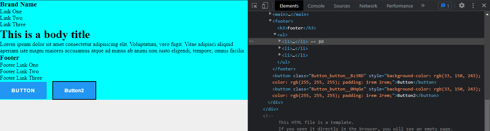

এখানে দেখুন যেটার জন্য যেমন স্টাইল দিয়েছিলাম সেটার জন্য সেই স্টাইলই পেয়েছে। এবং ইন্সপেক্টে খেয়াল করলে দেখবে আগে যেখানে ক্লাসের নাম দুইটার ক্ষেত্রেই একই ছিল এখন সেখানে ভিন্ন ভিন্ন দুইটা ক্লাস দেয়া আছে। এই নামটা আমরা দিচ্ছি না। এটা আমাদের জন্য করে দিচ্ছে ওয়েবপ্যাক। ওয়েবপ্যাক সিএসএসের ক্লাসগুলোকে বিহান্ড দ্য সীন অবজেক্টে রূপান্তরিত করছে যেটা আমরা আমাদের ফাইলে ইমপোর্ট করছি।

এর ফলে যার যার সিএসএস সেই সেই কম্পোনেন্টের জন্য এখন scoped হয়ে গেলো। এখন আর কেউ কাউকে ওভাররাইড করতে পারবে না।

### অ্যাপের সিএসএস মডিউল ফাইল তৈরি করা

আমরা এবার অ্যাপের জন্য সিএসএস ফাইলের নাম মডিউলে চেইঞ্জ করে নিবো। অর্থাৎ App.css থেকে App.module.css এ চেইঞ্জ করবো। এরপর অ্যাপ ফাইলে সেটাকে ইমপোর্ট করবো।

```jsx
// App.jsx

import classes from './App.module.css';

function App() {
	return (
		<div className={classes.app}>
			<nav>
				<div>
					<h3>Brand Name</h3>
				</div>
				<div>
					<ul>
						<li>Link One</li>
						<li>Link Two</li>
						<li>Link Three</li>
					</ul>
				</div>
			</nav>
			<main>
				<h1>This is a body title</h1>
				<p>
					Lorem ipsum dolor sit amet consectetur adipisicing elit. Voluptatum,
					vero fugit. Vitae adipisci aliquid aperiam iste magni maiores
					accusamus atque ad minus ab animi non iusto eligendi, tempore, omnis
					facilis.
				</p>
			</main>
			<footer>
				<h3>Footer</h3>
				<ul>
					<li>Footer Link One</li>
					<li>Footer Link Two</li>
					<li>Footer Link Three</li>
				</ul>
			</footer>
		</div>
	);
}

export default App;
```

এবার আমরা আমাদের অ্যাপের সিএসএস ফাইলে কিছু সিএসএস লিখবো।

```css
/* App.module.css */

.app {
	font-family: 'Franklin Gothic Medium', 'Arial Narrow', Arial, sans-serif;
}

.nav {
	width: 100%;
	padding: 0.5rem 1rem;
	background-color: #333;
	color: #fff;
	display: flex;
	align-items: center;
	justify-content: space-between;
}

.menu ul {
	list-style: none;
	display: flex;
	gap: 1rem;
}

.main {
	width: 70%;
	margin: 0 auto;
}

.footer {
	background-color: #666;
	color: #fff;
	padding: 2rem 4rem;
}
```

```jsx
// App.jsx

import classes from './App.module.css';

function App() {
	return (
		<div className={classes.app}>
			<nav className={classes.nav}>
				<div className={classes.brand}>
					<h3>Brand Name</h3>
				</div>
				<div className={classes.menu}>
					<ul>
						<li>Link One</li>
						<li>Link Two</li>
						<li>Link Three</li>
					</ul>
				</div>
			</nav>
			<main className={classes.main}>
				<h1>This is a body title</h1>
				<p>
					Lorem ipsum dolor sit amet consectetur adipisicing elit. Voluptatum,
					vero fugit. Vitae adipisci aliquid aperiam iste magni maiores
					accusamus atque ad minus ab animi non iusto eligendi, tempore, omnis
					facilis.
				</p>
			</main>
			<footer className={classes.footer}>
				<h3>Footer</h3>
				<ul>
					<li>Footer Link One</li>
					<li>Footer Link Two</li>
					<li>Footer Link Three</li>
				</ul>
			</footer>
		</div>
	);
}

export default App;
```

এসব করার পরে আমাদের UI দাঁড়াবে এরকম -

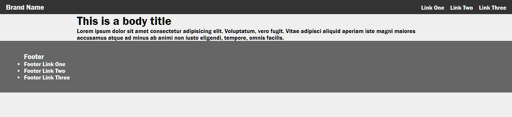

জাস্ট বেসিক একটা স্ট্রাকচার।

### কি কি রিইউজ হতে পারে সেই সিদ্ধান্ত গ্রহণ

ধরলাম আমাদের যে ন্যাভ লিংক আছে সেগুলোতে ক্লিক করলে যে পেইজগুলো আসবে সেগুলোতে ন্যাভবার, ফুটার সব পেইজেই দেখা যাবে এবং মেইন কনটেন্ট যেরকম সেন্টারে আছে সেরকমই থাকবে তবে কন্টেন্ট ভিন্ন হবে। তার মানে আমাদের এগুলো রিইউজ করার প্রয়োজন আছে। সেগুলো আমরা কিভাবে করতে পারি? আমরা একটা লেআউট কম্পোনেন্ট বানিয়ে ফেলতে পারি যেখানে ন্যাভবার, ফুটার, মেইন সেকশন এসব থাকবে।

### layout component

আমরা কম্পোনেন্ট ফোল্ডারের মধ্যে layout নামক একটা ফোল্ডার নিবো। সেখানে Layout.jsx এবং Layout.module.css নামক দুইটা ফাইল নিবো। এবং সেগুলোতে আমরা নিচের কোড লিখবো।

```jsx
// /components/layout/Layout.jsx

import classes from './Layout.module.css';

function Layout() {
	return (
		<div className={classes.app}>
			<nav className={classes.nav}>
				<div className={classes.brand}>
					<h3>Brand Name</h3>
				</div>
				<div className={classes.menu}>
					<ul>
						<li>Link One</li>
						<li>Link Two</li>
						<li>Link Three</li>
					</ul>
				</div>
			</nav>
			<main className={classes.main}></main>
			<footer className={classes.footer}>
				<h3>Footer</h3>
				<ul>
					<li>Footer Link One</li>
					<li>Footer Link Two</li>
					<li>Footer Link Three</li>
				</ul>
			</footer>
		</div>
	);
}

export default Layout;
```

```css
/* /components/layout/Layout.module.css */

.app {
	font-family: 'Franklin Gothic Medium', 'Arial Narrow', Arial, sans-serif;
}

.nav {
	width: 100%;
	padding: 0.5rem 1rem;
	background-color: #333;
	color: #fff;
	display: flex;
	align-items: center;
	justify-content: space-between;
}

.menu ul {
	list-style: none;
	display: flex;
	gap: 1rem;
}

.main {
	width: 70%;
	margin: 2rem auto;
}

.footer {
	background-color: #666;
	color: #fff;
	padding: 2rem 4rem;
}
```

এবার আমরা আমাদের App.jsx ফাইলটা একটু ক্লিন করবো এবং সেখানে Layout কম্পোনেন্ট ইমপোর্ট করে কয়েকবার তা jsx আকারে লিখবো।

```jsx
// App.jsx

import Layout from './components/layout/Layout';

function App() {
	return (
		<div>
			<Layout />
			<Layout />
			<Layout />
		</div>
	);
}

export default App;
```

এবার আমাদের UI কিরকম দেখতে হয় দেখি।

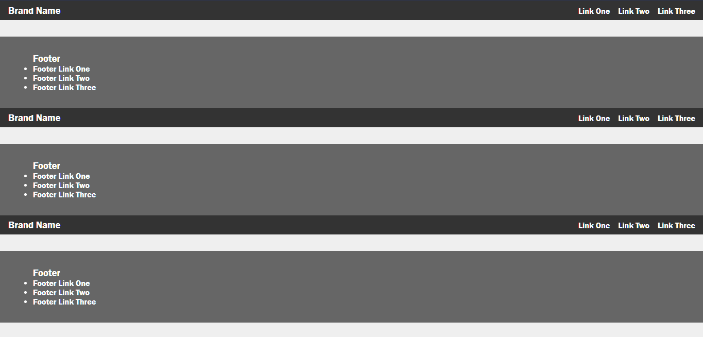

দেখা যাচ্ছে ন্যাভবার, ফুটার আছে কিন্তু মাঝে মেইন সেকশনের জায়গা থাকলেও কোনো কনটেন্ট নেই। এবার আমরা Layout কম্পোনেন্টকে সেলফ ক্লোজিং ট্যাগে না লিখে ওপেনিং এবং ক্লোজিং ট্যাগ হিসেবে লিখে মাঝে কিছু কনটেন্ট দিয়ে দেখি।

```jsx
import Layout from './components/layout/Layout';

function App() {
	return (
		<div>
			<Layout>
				<h3>Hello World</h3>
			</Layout>
			<Layout>
				<h3>Hello React</h3>
			</Layout>
			<Layout>
				<h3>Hello Component</h3>
			</Layout>
		</div>
	);
}

export default App;
```

এবারও কিন্তু কিছু আসলো না। আমরা জানি আমাদের যদি ডাটার ভিন্নতা থাকে তা আসবে প্রপ্সের মাধ্যমে। আমাদের Layout কম্পোনেন্টে আমরা প্রপ্স অবজেক্টটা একটু কনসোলে লগ করে দেখি কি আসে।

```jsx
// /components/layout/Layout.jsx

import classes from './Layout.module.css';

function Layout(props) {
	console.log(props);
	return <div className={classes.app}>...</div>;
}

export default Layout;
```

এবার আমরা আমাদের ব্রাউজারে গেলে দেখবো props অবজেক্টে children নামে একটা প্রোপার্টি আছে। তার মানে আমরা যদি props.children পাস করি তাহলেই আমাদের children UI তে পেয়ে যাবে।

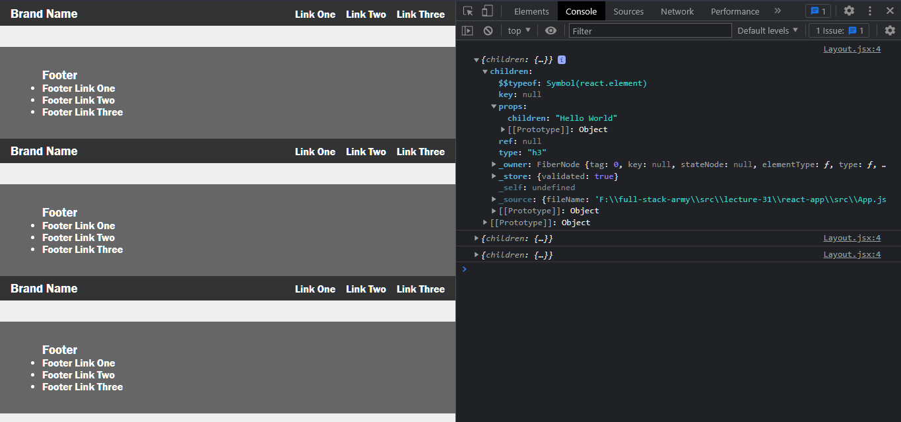

```jsx
// /components/layout/Layout.jsx

import classes from './Layout.module.css';

function Layout(props) {
	console.log(props);
	return (
		<div className={classes.app}>
			...
			<main className={classes.main}>{props.children}</main>
			...
		</div>
	);
}

export default Layout;
```

এবার দেখুন আমাদের UI তে সব কনটেন্ট চলে এসেছে।

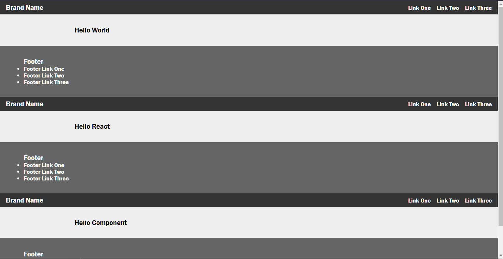

এবার আমরা চাইলে আমাদের কনটেন্ট আমাদের মতো করে চেইঞ্জ করতে পারি। যেমন -

```jsx
import Button from './components/button/Button';
import Layout from './components/layout/Layout';

function App() {
	return (
		<div>
			<Layout>
				<h3>Hello World</h3>
				<p>
					Lorem ipsum dolor sit amet consectetur adipisicing elit. Ad explicabo
					reprehenderit, exercitationem nemo rem modi dolorem minus officia
					fugit vero cum atque iure dignissimos, eveniet veniam veritatis sunt
					labore architecto?
				</p>
				<Button variant="primary" size="medium" text="Call to action" />
			</Layout>
			<Layout>
				<h3>Submit a form</h3>
				<input type="email" />
				<Button variant="primary" size="small" text="Subscribe" />
			</Layout>
			<Layout>
				<h3>Hello Component</h3>
			</Layout>
		</div>
	);
}

export default App;
```

আমাদের UI কেমন দেখায় দেখি।

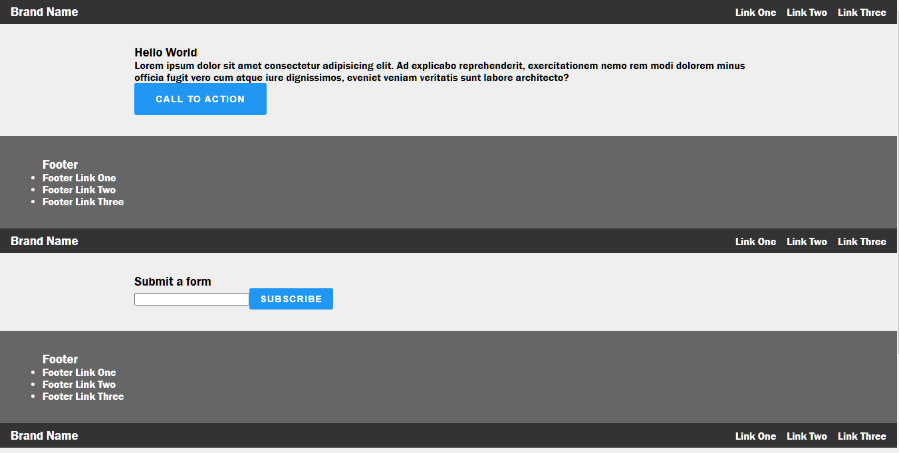

### লিংক ক্লিকেবল করা

এবার আমরা আমাদের লিংকগুলোকে ক্লিকেবল করবো। সাধারণত নরমালি আমরা অ্যাংকর ট্যাগ ব্যবহার করে কোনো লিংককে ক্লিকেবল করি যেটা এক পেইজ থেকে আরেক পেইজে নিয়ে যায়। কিন্তু রিয়্যাক্টে আমরা কোনো লিংকে ক্লিক করলে দেখতে পাই সেটা লোড না নিয়ে সাথে সাথে নতুন পেইজ শো করছে। সেটা কিভাবে হচ্ছে? সেটা হচ্ছে আমরা কোনো নতুন পেইজে যাচ্ছি না। কারণ রিয়্যাক্টে একটা এইচটিএমএল ফাইল। আমরা বারবার সেই একই পেইজই দেখছি। তাহলে ডাটা কিভাবে চেইঞ্জ হলো? রিয়্যাক্ট খুব সূক্ষ্মভাবে বিহাইন্ড দ্য সীন আগের ডাটাগুলোকে মুছে দিয়ে নতুন ডাটা রেন্ডার করে ফেলে একই পেইজের মধ্যে যেটা আমরা টেরও পাই না। এবার আমরা রিয়্যাক্টের মতো করে আমাদের লিংকগুলো ওয়ার্কেবল করবো। এই সিস্টেমকে বলা হয় **রাউটিং**। কিন্তু আমরা এখন তো রিয়্যাক্ট রাউটার শিখবো না। কারণ এটা একটা অ্যাডভান্স কনসেপ্ট। পরবর্তীতে আমরা শিখবো। এখন আমরা ব্যবহার করবো [Reache Router](https://reach.tech/router/). এই কনসেপ্ট আপাতত যদি বুঝতে না পারেন বুঝার দরকার নাই। আমাদের ফোকাস কম্পোনেন্ট বানানোর দিকে। আমরা এসব অ্যাডভান্স কনসেপ্ট পরবর্তীতে বিস্তারিতভাবে শিখবো। আমরা নিচের কমেন্ট ব্যবহার করে এটা ইনস্টল করে নিবো।

```sh
npm install @reach/router
# or
yarn add @reach/router
```

রাউটিং নিয়ে যখন কাজ করতে হবে তখন আমাদের প্রতিটা পেইজের জন্য আলাদা আলাদা কম্পোনেন্ট বানাতে হবে। সেই কম্পোনেন্টগুলো আমরা routes বা pages যেকোনো ফোল্ডারের মধ্যে রাখতে পারি। এখানে আমরা pages ফোল্ডার তৈরি করে নিলাম। এখানে আমরা Home.jsx, About.jsx, Help.jsx নামে তিনটা ফাইল ক্রিয়েট করলাম। এবার এই তিনটা ফাইলে আমরা নিচের মতো করে কোড লিখবো।

```jsx
// Home.jsx

import Layout from '../components/layout/Layout';

const Home = () => {
	return (
		<Layout>
			<h1>Hello, I am Home page</h1>
		</Layout>
	);
};

export default Home;
```

```jsx
// About.jsx

import Layout from '../components/layout/Layout';

const About = () => {
	return (
		<Layout>
			<h1>Hello, I am About page</h1>
		</Layout>
	);
};

export default About;
```

```jsx
// Help.jsx

import Layout from '../components/layout/Layout';

const Help = () => {
	return (
		<Layout>
			<h1>Hello, I am Help page</h1>
		</Layout>
	);
};

export default Help;
```

এবার আমরা আমাদের App.jsx এ গিয়ে আমাদের কোডগুলো চেইঞ্জ করবো।

```jsx
import { Router } from '@reach/router';
import About from './pages/About';
import Help from './pages/Help';
import Home from './pages/Home';

function App() {
	return (
		<Router>
			<Home path="/" />
			<About path="/about" />
			<Help path="/help" />
		</Router>
	);
}

export default App;
```

এবার যদি আমরা `localhost:3000` লিখে হিট করি তাহলে দেখবো তিনটার পরিবর্তে হোম পেইজের কন্টেন্ট এসেছে।

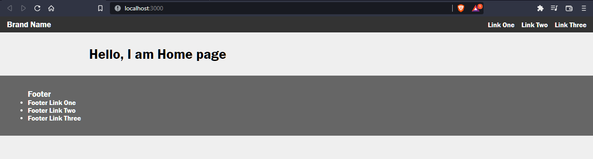

একইভাবে যদি `localhost:3000/about` এবং `localhost:3000/help` লিখে এন্টার দিলে যথাক্রমে About এবং Help পেইজের কনটেন্ট দেখাবে।


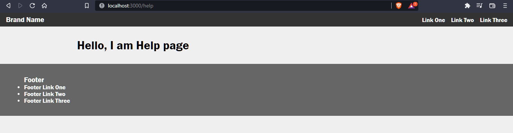

এবার আমরা আমাদের Layout কম্পোনেন্টে গিয়ে আমাদের রাউটারগুলোকে লিংক করবো।

```jsx
// Layout.jsx

import { Link } from '@reach/router';
import classes from './Layout.module.css';

function Layout(props) {
	return (
		<div className={classes.app}>
			<nav className={classes.nav}>
				<div className={classes.brand}>
					<h3>Brand Name</h3>
				</div>
				<div className={classes.menu}>
					<ul>
						<li>
							<Link to="/">Home</Link>
						</li>
						<li>
							<Link to="/about">About</Link>
						</li>
						<li>
							<Link to="/help">Help</Link>
						</li>
					</ul>
				</div>
			</nav>
		</div>
	);
}

export default Layout;
```

এবার আমরা যে ন্যাভ বাটনে ক্লিক করবো আমাদেরকে সেই পেইজেই নিয়ে যাবে কোনো রিলোড করা ছাড়া। অসাধারণ প্রযুক্তি এই রিয়্যাক্টের। নরমালি আমাদের তিনটা পেইজে এই কাজ করতে হতো। কিন্তু রিয়্যাক্টে আমরা একটা জায়গাতেই এই কাজগুলো করতে পারছি।

এবার আমরা চেক করবো আমাদের পাথ কোনটা অ্যাকটিভ। যেটা অ্যাকটিভ সেটাকে আমরা আলাদাভাবে হাইলাইট করে রাখবো অর্থাৎ একটা অ্যাক্টিভ ক্লাস যুক্ত করবো।

পাথ খুঁজার কাজটা রাউটার খুব সহজেই করে ফেলতে পারে। কিন্তু যেহেতু আমরা এখনই রাউটারের অতো গভীরে যাচ্ছি না তাই ম্যানুয়েলি আমরা এই কাজটা করবো। সেটা হলো `window.location.pathname` এর মাধ্যমে।

আমরা প্রথমে সিএসএস ফাইলে একটা ক্লাস বানিয়ে নিবো।

```css
/* Layout.module.css */

.navItemActive {
	color: #ff0000;
	text-decoration: underline;
	font-weight: bold;
}
```

এবার আমরা আমাদের লেআউট কম্পোনেন্টে লজিক লিখবো।

```jsx
// Layout.jsx

import { Link } from '@reach/router';
import classes from './Layout.module.css';

function Layout(props) {
	const path = window.location.pathname;
	return (
		<div className={classes.app}>
			<nav className={classes.nav}>
				<div className={classes.brand}>
					<h3>Brand Name</h3>
				</div>
				<div className={classes.menu}>
					<ul>
						<li>
							<Link
								to="/"
								className={
									path === '/' ? classes.navItemActive : classes.navItem
								}
							>
								Home
							</Link>
						</li>
						<li>
							<Link
								to="/about"
								className={
									path === '/about' ? classes.navItemActive : classes.navItem
								}
							>
								About
							</Link>
						</li>
						<li>
							<Link
								to="/help"
								className={
									path === '/help' ? classes.navItemActive : classes.navItem
								}
							>
								Help
							</Link>
						</li>
					</ul>
				</div>
			</nav>
			<main className={classes.main}>{props.children}</main>
			<footer className={classes.footer}>
				<h3>Footer</h3>
				<ul>
					<li>Footer Link One</li>
					<li>Footer Link Two</li>
					<li>Footer Link Three</li>
				</ul>
			</footer>
		</div>
	);
}

export default Layout;
```

এবার যদি আমাদের UI আমরা দেখি দেখবো যে পেইজে আছি সেটার ন্যাভ বাটন অ্যাক্টিভ দেখাচ্ছে।

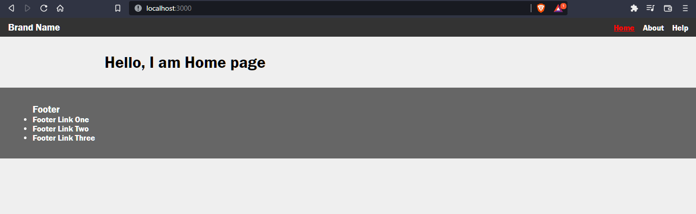

### হোম পেইজ ডেকোরেশন এবং কোড রিইউজ

ধরি আমরা আমাদের হোম পেইজে এরকম কিছু কন্টেন্ট চাইছি।

```jsx
// Home.jsx

import Layout from '../components/layout/Layout';

const Home = () => {
	return (
		<Layout>
			<section>
				<h1>Experience</h1>
				<ul>
					<li>
						Lorem ipsum dolor sit amet consectetur adipisicing elit. Voluptatum,
						sed.
					</li>
					<li>
						Lorem ipsum dolor sit amet consectetur, adipisicing elit.
						Doloremque, pariatur.
					</li>
				</ul>
			</section>

			<section>
				<h1>Education</h1>
				<ul>
					<li>Lorem ipsum dolor sit amet.</li>
					<li>Lorem ipsum dolor sit amet.</li>
				</ul>
			</section>
		</Layout>
	);
};

export default Home;
```

আমরা দেখতে পাচ্ছি দুইটাতেই একটা টাইটেল আছে এবং কিছু লিস্ট আইটেম আছে। আমরা যদি এদেরকে বের করে নিয়ে আসতে পারি তাহলে কোড রিইউজ করতে পারবো। তার জন্য আমরা কম্পোনেন্ট ফোল্ডারে section নামে একটা ফোল্ডার নিয়ে সেখানে Section.jsx নামে একটা ফাইল ক্রিয়েট করবো।

```jsx
// Section.jsx

const Section = ({ title, items }) => {
	const itemsArray = items.map((item) => <li>{item}</li>);
	return (
		<section>
			<h1>{title}</h1>
			<ul>{itemsArray}</ul>
		</section>
	);
};

export default Section;
```

```jsx
// Home.jsx

import Layout from '../components/layout/Layout';
import Section from '../components/section/Section';

const experiences = [
	'Lorem ipsum dolor sit amet consectetur adipisicing elit. Voluptatum, sed.',
	'Lorem ipsum dolor sit amet consectetur adipisicing elit. Voluptatum, sed.',
	'Lorem ipsum dolor sit amet consectetur adipisicing elit. Voluptatum, sed.',
];

const educations = [
	'Lorem ipsum dolor sit amet consectetur adipisicing elit. Voluptatum, sed.',
	'Lorem ipsum dolor sit amet consectetur adipisicing elit. Voluptatum, sed.',
	'Lorem ipsum dolor sit amet consectetur adipisicing elit. Voluptatum, sed.',
	'Lorem ipsum dolor sit amet consectetur adipisicing elit. Voluptatum, sed.',
	'Lorem ipsum dolor sit amet consectetur adipisicing elit. Voluptatum, sed.',
];

const Home = () => {
	return (
		<Layout>
			<Section title="Experiences" items={experiences} />
			<Section title="Educations" items={educations} />
		</Layout>
	);
};

export default Home;
```

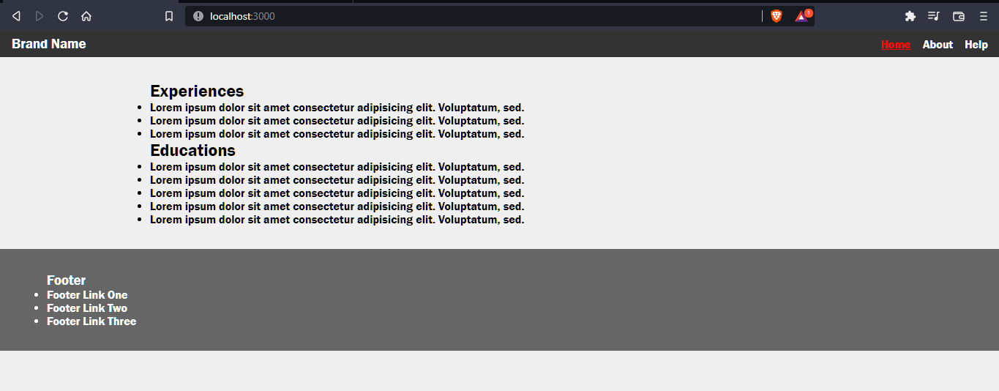

কতটা সহজে ডায়নামিক্যালি কোড রিইউজ করা যায় তা নিশ্চয়ই আপনারা বুঝতে পারছেন।

এতটুকু বুঝে থাকলে এই থিওরির উপর ভিত্তি করেই অনেক কমপ্লেক্স অ্যাপ্লিকেশনও বানিয়ে ফেলতে পারবো আমরা। তবে একটা জায়গায় একটু সমস্যা আছে। যেমন আমরা এখানে ডাটা ব্যবহার করেছি স্ট্যাটিকভাবে একটা অ্যারের মধ্যে রেখে। কিন্তু রিয়েল লাইফ অ্যাপ্লিকেশনে ডাটা আসবে কোনো না কোনো সার্ভার থেকে। সেই ডাটা ম্যানেজ করাটা হচ্ছে মুখ্য বিষয়। আমরা একটু সহজ ভাষায় রিয়্যাক্টের কাজগুলোকে এতক্ষণ পর্যন্ত যা শিখলাম তাতে ভাগ করি তাহলে কি কি পাচ্ছি একটু দেখি -

- Designing Component
  - Props
  - Component tree
  - State

## State

স্টেট হচ্ছে সহজ ভাষায় একটা আইসোলেটেড ডাটা। ধরেন আমরা কোনো একটা UI বা কম্পোনেন্ট এর মধ্যে একটা স্টেট ডিফাইন করি তাহলে সেই স্টেট ঐ নির্দিষ্ট কম্পোনেন্টের এর বাইরে এক্সেস নেয়া যাবে না। তার মানে একটা কম্পোনেন্টের নিজস্ব যে ডাটা সেই ডাটাকে বলা হচ্ছে স্টেট। এখন স্টেট কিভাবে ডিফাইন করা যাবে? যেহেতু আমরা বলছি স্টেট এক ধরণের ডাটা তাহলে তো আমরা একে একটা ভ্যারিয়েবল দিয়ে ডিফাইন করতেই পারি। আমরা যদি About.jsx এ একটা ভ্যারিয়েবল ডিফাইন করে সেটা দেখতে চাই তাহলে লিখতে হবে এভাবে -

```jsx
// About.jsx

import Layout from '../components/layout/Layout';

const About = () => {
	let count = 1;
	return (
		<Layout>
			<h1>Hello, I am About page</h1>
			<h1>COUNT: {count}</h1>
		</Layout>
	);
};

export default About;
```

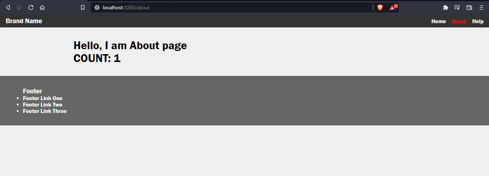

আমরা আমাদের ভ্যারিয়েবলকে শো করাতে পেরেছি। তাহলে কি স্টেটের কাজ শেষ? না এখনও শেষ হয়নি। কারণ আমরা জাস্ট শো করিয়েছি। কিন্তু যদি আমরা আপডেট করতে চাই তাহলে কি ঘটবে?

```jsx
import Layout from '../components/layout/Layout';

const About = () => {
	let count = 1;

	function increment() {
		count++;
		console.log(count);
	}
	return (
		<Layout>
			<h1>Hello, I am About page</h1>
			<h1>COUNT: {count}</h1>
			<button onClick={increment}>Increase by 1</button>
		</Layout>
	);
};

export default About;
```


আমরা দেখছি কাউন্টের ভ্যালু বাড়ছে যা কন্সোলে লগ করছে কিন্তু UI তে শো করছে না। কেন? কারণ রিয়্যাক্টের একটা বৈশিষ্ট্যই হচ্ছে সে দুনিয়ার কোনো পরিবর্তনকে পরিবর্তন বলে মনে করবে না যতক্ষণ না সে নিজের ডাটার কোনো পরিবর্তন দেখে। অর্থাৎ রিয়্যাক্টের নিজস্ব পদ্ধতিতে যদি আমরা ভ্যারিয়েবল ডিফাইন করি তাহলে শুধুমাত্র তখনই রিয়্যাক্ট পরিবর্তনটা গ্রহণ করবে, নাহয় করবে না। কারণ রিয়্যাক্টের দুইটা ডম একটা ভার্চুয়াল যা র‍্যামে থাকে আরেকটা ব্রাউজার ডম। কিছু পরিবর্তন করলে প্রথম পরিবর্তন আসবে ভার্চুয়াল ডমে। ভার্চুয়াল ডম অ্যাকচুয়েল ডমের সাথে কম্পেয়ার করে যদি দেখে কোনো পরিবর্তন আসছে তাহলেই সে ডাটা পরিবর্তন করবে। আমাদের এই কোডে সমস্যা হলো আমরা যখন একটা ভ্যারিয়েবল ডিক্লেয়ার করছি তখন রিয়্যাক্ট বুঝে উঠতে পারছে না যে এই ভ্যারিয়েবলকেও ট্র্যাক করা দরকার। কারণ আমরা আমাদের অ্যাপ্লিকেশনে হাজারটা ভ্যারিয়েবল ডিক্লেয়ার করতে পারি। এখন কোন ভ্যারিয়েবল ট্র্যাক করতে হবে, কোনটাকে রাখতে হবে সেটা রিয়্যাক্ট বুঝার চেষ্টা করে না। সে শুধু তার সিস্টেমেই ভ্যারিয়েবল ডিক্লেয়ার করলে ট্র্যাক করবে, নাহয় সে ফিরেও তাকাবে না। আর এই এত কথার পরে যে সিস্টেমের কথা বলা হচ্ছে সেটাকেই বলে **স্টেট**। যখনই আমরা কোনো বাটনে ক্লিক করি, কোনো কম্পোনেন্টের সাথে ইন্ট্যারেকশন করি তখনই রিয়্যাক্ট পুনরায় রেন্ডার করে। এই কাজ কখন হয় সেই কনসেপ্টটা আমাদের বুঝতে হবে। কখন একটা কম্পোনেন্ট রিরেন্ডার হয়?

- যখন একটা প্রপ্স চেইঞ্জ হয়।
- যখন স্টেট চেইঞ্জ হয়।
- যখন প্যারেন্ট কম্পোনেন্ট রিরেন্ডার হবে।

আমাদের কোডে প্রপ্স নাই সুতরাং চেইঞ্জ হওয়ারও কোনো প্রশ্ন নাই। স্টেট আমরা ডিফাইন করিনি, তাই সেটাও চেইঞ্জের প্রশ্ন নেই। আর প্যারেন্ট কম্পোনেন্ট রিরেন্ডার হওয়ারও কোনো লজিক নাই। এখন আমরা যে ভ্যারিয়েবল ডিক্লেয়ার করেছিলাম সেটাকে এভাবে না করে রিয়্যাক্টের মতো করে ডিক্লেয়ার করবো আর সেটা করবো `useState` হুক ব্যবহার করার মাধ্যমে।

```jsx
import { useState } from 'react';
import Layout from '../components/layout/Layout';

const About = () => {
	const [count, setCount] = useState(0);

	function increment() {
		setCount(count + 1);
	}
	return (
		<Layout>
			<h1>Hello, I am About page</h1>
			<h1>COUNT: {count}</h1>
			<button onClick={increment}>Increase by 1</button>
		</Layout>
	);
};

export default About;
```

এবার যদি বাটনে ক্লিক করি দেখবো ডাটা আপডেট হচ্ছে।

## useState কি

useState হলো রিয়্যাক্টের একটা ফাংশন যেটা একটা অ্যারে রিটার্ন করবে এবং যার আর্গুমেন্ট হিসেবে থাকবে ইনিশিয়াল ভ্যালু। এই অ্যারের প্রথম এলিমেন্ট হলো ডাটা বা স্টেট এবং সেকেন্ড এলিমেন্ট হলো আপডেটার ফাংশন। স্টেট আমরা যেকোনো জায়গায় ব্যবহার করতে পারি, কিন্তু তা আপডেট করতে হবে অবশ্যই আপডেটার ফাংশনের মাধ্যমে। এবং স্টেট আপডেট হলে UI চেইঞ্জ হবে।

## বাইরের কম্পোনেন্টে স্টেট ব্যবহার

ধরি আমাদের একটা আলাদা কম্পোনেন্ট আছে DisplayCount নামে। এর কাজ হলো আমাদের কাউন্টারকে শো করা। এখন এখানে আমরা আমাদের স্টেট কিভাবে ব্যবহার করবো? আমরা প্রপ্সের মাধ্যমে সেটা করতে পারি। চলুন দেখি।

```jsx
const DisplayCount = ({ count }) => {
	return <h1>COUNT: {count}</h1>;
};

export default DisplayCount;
```

```jsx
import { useState } from 'react';
import DisplayCount from '../components/display-count/DisplayCount';
import Layout from '../components/layout/Layout';

const About = () => {
	const [count, setCount] = useState(0);

	function increment() {
		setCount(count + 1);
	}
	return (
		<Layout>
			<h1>Hello, I am About page</h1>
			<DisplayCount count={count} />
			<button onClick={increment}>Increase by 1</button>
		</Layout>
	);
};

export default About;
```

দেখা যাবে আমাদের কাউন্টার আপডেট হবে ঠিকঠাকভাবে। এর কারণ হলো প্রপ্স চেইঞ্জ হচ্ছে। আমরা বলেছিলাম প্রপ্স চেইঞ্জ হলে রিরেন্ডার হবে। যদিও count স্টেট শুধুমাত্র About কম্পোনেন্টের কাছেই সীমাবদ্ধ, কিন্তু সে চাইলে প্রপ্স আকারে তার চাইল্ড কম্পোনেন্টের কাছে এই ডাটা পাস করতে পারে।

এখন যদি বাটন কম্পোনেন্ট অন্য জায়গায় থাকে তবে সেখান থেকে কি আমরা আমাদের স্টেট আপডেট করতে পারবো না? পারবো, তবে সেটা একটু ভিন্ন উপায়ে। সেটাতে পরে যাচ্ছি। আগে আমরা আমাদের বাটন কম্পোনেন্ট বানিয়ে ফেলি।

```jsx
const Buttons = ({ increment, decrement }) => {
	return (
		<div>
			<button onClick={increment}>Increment</button>
			<button onClick={decrement}>Decrement</button>
		</div>
	);
};

export default Buttons;
```

```jsx
import { useState } from 'react';
import Buttons from '../components/buttons/Buttons';
import DisplayCount from '../components/display-count/DisplayCount';
import Layout from '../components/layout/Layout';

const About = () => {
	const [count, setCount] = useState(0);

	function increment() {
		setCount(count + 1);
	}

	function decrement() {
		setCount(count - 1);
	}

	return (
		<Layout>
			<DisplayCount count={count} />
			<Buttons increment={increment} decrement={decrement} />
		</Layout>
	);
};

export default About;
```

আমরা আমাদের UI এ গেলে দেখবো ইনক্রিমেন্ট বাটনে ক্লিক করলে ১ করে বৃদ্ধি পাচ্ছে এবং ডিক্রিমেন্ট বাটনে ক্লিক করলে এক করে হ্রাস পাচ্ছে। এখানে জাস্ট প্রপ্স আকারে ফাংশনটা পাস করে দিচ্ছি। কিন্তু আপডেট হচ্ছে About কম্পোনেন্টেই।

এখানে আমরা এবার একটা ট্যুইস্ট আনবো। সেটা হলো কতো করে বাড়বে বা কমবে তা ইউজার ইনপুটের মাধ্যমে হবে। আমরা দুইটা ইনপুট ফিল্ড নিবো। একটা ইনক্রিমেন্টের জন্য, আরেকটা ডিক্রিমেন্টের জন্য। তার আগে আমাদের দুইটা স্টেট নিতে হবে। পরে কম্পোনেন্ট বানাতে হবে।

```jsx
const UpdateIncrementDecrement = ({
	incrementValue,
	decrementValue,
	handleIncrementChange,
	handleDecrementChange,
}) => {
	return (
		<div>
			<label>Increment</label>
			<input
				type="number"
				value={incrementValue}
				onChange={handleIncrementChange}
			/>
			<label>Decrement</label>
			<input
				type="number"
				value={decrementValue}
				onChange={handleDecrementChange}
			/>
		</div>
	);
};

export default UpdateIncrementDecrement;
```

```jsx
import { useState } from 'react';
import Buttons from '../components/buttons/Buttons';
import DisplayCount from '../components/display-count/DisplayCount';
import Layout from '../components/layout/Layout';
import UpdateIncrementDecrement from '../components/update-incre-decre/UpdateIncrementDecrement';

const About = () => {
	const [count, setCount] = useState(0);
	const [incrementValue, setIncrementValue] = useState(10);
	const [decrementValue, setDecrementValue] = useState(5);

	function increment() {
		setCount(count + incrementValue);
	}

	function decrement() {
		setCount(count - decrementValue);
	}

	function handleIncrementChange(event) {
		setIncrementValue(parseInt(event.target.value));
	}

	function handleDecrementChange(event) {
		setDecrementValue(parseInt(event.target.value));
	}

	return (
		<Layout>
			<DisplayCount count={count} />
			<UpdateIncrementDecrement
				incrementValue={incrementValue}
				decrementValue={decrementValue}
				handleIncrementChange={handleIncrementChange}
				handleDecrementChange={handleDecrementChange}
			/>
			<Buttons increment={increment} decrement={decrement} />
		</Layout>
	);
};

export default About;
```

এবার আমরা যেভাবে ইনপুট দিবো সেভাবেই ডাটা আপডেট হবে।

আশা করি সবাই কনসেপ্টটা বুঝতে পেরেছেন কম্পোনেন্ট কিভাবে রিরেন্ডার হয়।

## সোর্স কোড

এই লেকচারে সব সোর্স কোড এই [লিংক](../../src/lecture-31/) এ পাবেন।

## Author

[Aditya Chakraborty](https://github.com/adityackr)
