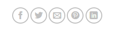
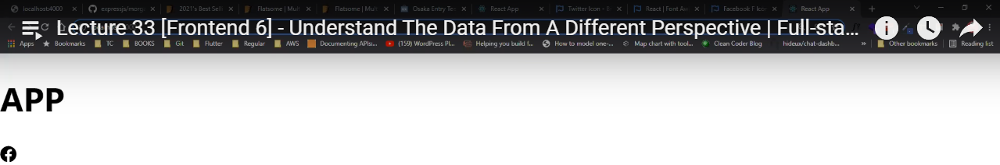
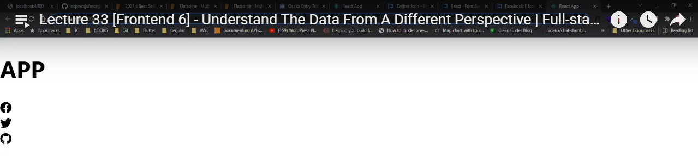
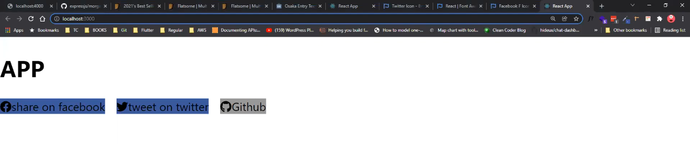
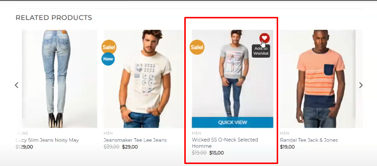
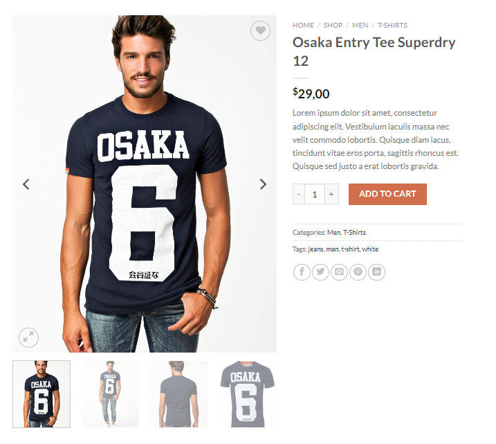
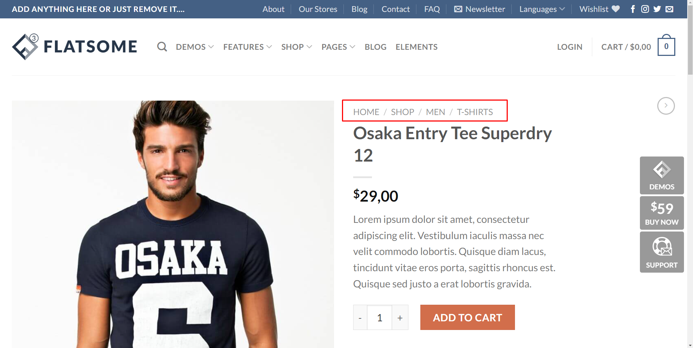

# Lecture 33 [Frontend 6] - Understand The Data From A Different Perspective Full-stack Army

## Introduction

গত ক্লাস এ আমরা শিখেছিলাম কিভাবে রিয়েক্ট ফাংশনে কম্পোনেন্ট এ স্টেট ও লাইফসাইকেল ইভেন্ট ব্যবহার করতে পারি। এর জন্য আমরা শেষের দিকে একটা মোটামোটি লেভেল এর টুডু অ্যাপ তৈরি করেছিলাম। আশা করি অই কন্সেপ্ট ক্লিয়ার হলে আর কারোই স্টেট নিয়ে সমস্যা থাকার কথা না। আজকে আমরা এই ক্লাস এ ডাটা নিয়ে জানবো এক প্রকার বলা যায় ডাটা স্ট্রাকচার { আমি সঠিক জানি না ডাটা স্ট্রাকচার কি? তবে এটা হতে পারি তাই লেখলাম }

## Data Stracture

ইন্টারনেট থেকে একটু সার্চ দিলে আমরা দেখতে পাই যে ->
লিনিয়ার ডাটা স্ট্রাকচার: যে ডাটা স্ট্রাকচারে ডাটা এলিমেন্ট ক্রমানুসারে বা রৈখিকভাবে সাজানো হয়, যেখানে প্রতিটি এলিমেন্ট তার আগের এবং পরবর্তী সন্নিহিত উপাদানের সাথে সংযুক্ত থাকে, তাকে লিনিয়ার ডাটা স্ট্রাকচার বলে। লিনিয়ার ডেটা স্ট্রাকচারের উদাহরণ হল অ্যারে, স্ট্যাক, কিউ, লিঙ্কড লিস্ট ইত্যাদি।

তাই আমরা বলতে পারি যে আজকে আমরা হালকার উপর ঝাপসা ডাটা স্ট্রাকচার নিজে জানব।

## Overview

মূলত এখন আমরা কাজ করছি ফ্রন্টএন্ড নিয়ে তাই বেশিরভাগ কাজ থাকবে আমাদের ওয়েব ডাটা শো করা তাই এখন দেখা যাচ্ছে আমারা এমন কিছু দেখাইতে চাচ্ছি তা ডাটা কতো গুলো আসবে তা নির্দিষ্ট না এই সমস্যা আমরা কিভাবে ইউ আই ডিজাইন করব। কারন আমরা জানিই না আমার কাছে ব্যাকেন্ড থেকে কি ডাটা আসছে তাই আমি মনে করি ফ্রন্টএন্ড এর জন্য ও এখন ব্যাকেন্ড এর বেসিক জানতে হয়।

## Thinking in a different way

আচ্ছা যাই হক চলুন আমার কিছু উদাহরন দেখি। এখানে আমরা কিছু ওয়েব সাইট খুজি এবং চেষ্টা করি তার ভিতরে বিভিন্ন কম্পোনেন্ট গুলা বানানোর এবং ডাটা গুলো প্রোপার শো করার জন্য ডাটা গুলার ফরমেট বা জেসন টা কি হবে তা বের করি তাহলে আমাদের জন্য ইউ আই তৈরি করা অনেক ইজি হবে। এবং বলা যায় ডাটা স্ট্রাকচার ঠিক করে ইউ আই ডিজাইন করলে সেটা আমদের জন্য অনেক সুবিধা হয়।

ওয়েব সাইট URL : [Website-flatesome](https://flatsome3.uxthemes.com/shop/men/t-shirts/osaka-entry-tee-superdry/)

এখানে আমরা প্রথমে এই নিচের ছবিটার কম্পোনেন্ট টা খেয়াল করি।



এখানে দেখুন ৫ টা আইকন আছে। এখন একটু চিন্তা করি এই আইকন গুলার জন্য ডাটার স্ট্রাকচার টা কি হতে পারে । কি কি আসবে ডেটাবেজ থেকে। আমরা এখানে হার্ডকোড করে দিতে পারি যে এখানে এই এই আইকন থাকবে এই লিঙ্ক থাকবে এই টুল্ট্রিপ থাকবে কিন্তু কি হবে যদি ডাটা আমার চেঞ্জ হয় আইকম আমার অনেক অনেক বেশি দরকার হয় । তাহলে আমাদের এখানে এসে প্রতিবার চেঞ্জ করতে হবে যদি আমার দের ১০০ আইকন থেকে তখন ধরে ধরে তা চেঞ্জ করতে হবে তা মোটেই ভালো জিনিস হবে না। তাই আমরা কি করব এমন ভাবে ডিজাইন করব আর ডাটা আসবে ডেটাবেজ থেকে যত আসুক যাই আসুক আমাদের কোড সুন্দর ভাবে সব হ্যান্ডেল করবে।

এখন আমরা এখন কি দেখতে পারছি ডেটাবেজ থেকে কি কি আসতে পারে তাই একটা স্ট্রাকচার তৈরি করি মূলত এটা হবে অ্যারে অফ অবজেক্ট ।

```js
const socialIconData = [
  {
    id: 123,
    icon: 'facebook',
    color: '#3A5694',
    tooltrip: 'Share on facebook',
    link: 'https://facebook.com',
  },
];
```

আমরা দেখতে পাচ্ছি আমাদের ডাটা এর শেপটা মোটামুটি এইরকম হবে। এখানে আমরা একটা লিখলাম কিন্তু এটা আসবে আমাদের ডেটাবেজ থেকে এখন আমরা এটা ইউ আইতে কিভাবে দেখাবো চলুন তার জন্য কোড লিখি ।

```jsx
import {fontAwesomeIcon} from '@fontawesome/react-fontawesome';
import {socialIconData} from './socialIconData';
const App() {
  return (
    <div>
      {socialIconData.map((item)=> (
        <div key={item.id}>
          <FontAwesomeIcon icon={['fab', item.icon]} />
        </div>
      ))}
    </div>
  )
}
export default App;
```

output



এখন আর কোডে আমরা আর টাচ করব না । আমরা ডাটা আপডেট করে দেখবো সবার জন্য কাজ করে কি না।

```js
const socialIconData = [
  {
    id: 123,
    icon: 'facebook',
    color: '#3A5694',
    tooltrip: 'Share on facebook',
    link: 'https://facebook.com',
  },
  {
    id: 124,
    icon: 'twitter',
    color: '#3gffd4',
    tooltrip: 'Share on facebook',
    link: 'https://facebook.com',
  },
  {
    id: 125,
    icon: 'github',
    color: '#t43454',
    tooltrip: 'Share on facebook',
    link: 'https://facebook.com',
  },
];
```

output



এখন চাইলে আমরা বাকি কাজ যেমন টুলট্রিপ দেখানো কালার দেওয়া করতে পারি

```jsx
import {fontAwesomeIcon} from '@fontawesome/react-fontawesome';
import {socialIconData} from './socialIconData';
const App() {
  return (
    <div style={{display: 'flex',gap:'1rem'}}>
      {socialIconData.map((item)=> (
        <div key={item.id} style={{backgroundColor: item.color}}>
          <FontAwesomeIcon icon={['fab', item.icon]} />
          <span>{ item.tooltrip }</span>
        </div>
      ))}
    </div>
  )
}
export default App;
```

output



চলুন আরেকটা করা যাক নিচে একটা ছবি দিয়ে দেওয়া হলো চলুন সিংগেল এই আইটেম এর জন্য কিভাবে স্ট্রাকচারটা হবে বা অবজেক্ট এর শেপটা হবে ।



```js
const products = [
  {
    title: String,
    price: {
      regularPrice: Number,
      salePrice: Number,
    },
    image: Array of String,
    wishlist: false,
    tags: Array of String
  }
]
// মাফ করবেন কোনো কিছু ভুল হলে আমি নতুন চেষ্টা করছি লেখার আর এই ভিডিও এর জন্য কোনো README.md ফাইল ছিলো নাই তাই কন্ট্রিভিউট করার ট্রাই করলাম।
```

এখন দেখুন আমরা আরেকটা প্রোডাক্ট ভিও এর ডাটা স্ট্রাকচার করি ।



```js
const productView = {
  title: String,
  price: {
    regularPrice: Number,
    salePrice: Number,
  },
  description: String,
  // এখানে আমরা ADD TO CART এর বাটন টা নিবো না এমনকি ADD TO CART এর কাউন্ট ইনপুট বক্স ও নিবো না কারন ADD TO CART একটা ফাংশন কাজ করবে আর ইনপুট বক্সটি ADD TO CART এর রিলেটেড
  catagory: [
    {
      name: String,
      link: String,
    },
  ],
  // এখানে যদি ক্লিক এবল না হতো তাইলে শুধু অ্যারে অফ স্ট্রিং নিতাম যেহেতু লিঙ্ক আছে তাই আমরা অ্যারে অফ অবজেক্ট নিলাম
  tag: [
    {
      name: String,
      link: String,
    },
  ],
  // tag ও catagory এর মতো সেইম কন্সেপ্ট
  wishlist: Boolean,
  socialIcon : [
    {
      id: String,
      text:String,
      tooltrip: String,
      icon: String,
      color: String,
    }
  ]
  image: [
    {
      thumb: String,
      original: String,
      altText: String,
      isFeatures: Boolean,
    },
  ],
  // এখানে যদি ফিচার না থাকত তাইলে শুধু অ্যারে অফ ইমেজ পাথ নিতাম যেহেতু এখানে CMS থেকে কোনটা ফিচার ইমেজ হবে তার বলে দেবার একটা বেপার আছে তাই আমরা অ্যারে অফ অবজেক্ট নিলাম
};
```

## 📌Breadcrumb Object Model



এখানে ব্রেডকাম টা আছে এতে প্রত্যেকটা ক্লিকএবল সো আমাদের এখানে ও অ্যারে অব অভজেক্ট লাগবে সাথে তার লিঙ্ক। আর যেহেতু আমার সব প্রোডাক্ট গুলো নিজেও অ্যারে অব অভজেক্ট এ আসবে তাই আমাদের প্রত্যেক্টা সিংগেল প্রোডাক্ট গুলো হলো একেকটা অবজেক্ট। চলুন একটা প্রোডাক্ট এর ডাটা স্ট্রাকচার বানাই।

```js
const product = {
  breadcrumbs: [
    {
      text: 'Home',
      link: 'https://www.google.com/?q=home',
    },
    {
      text: 'Shop',
      link: 'https://www.google.com/?q=shop',
    },
    {
      text: 'Men',
      link: 'https://www.google.com/?q=men',
    },
    {
      text: 'T-Shirts',
      link: 'https://www.google.com/?q=t-shirts',
    },
  ],
  title: ' Osaka Entry Tee Superdry 12',
  price: {
    regularPrice: $29,
    salePrice: 0,
  },
  description:
    'Lorem ipsum dolor sit amet, consectetur adipiscing elit. Vestibulum iaculis massa nec velit commodo lobortis. Quisque diam lacus, tincidunt vitae eros porta, sagittis rhoncus est. Quisque sed justo a erat lobortis gravida',
  catagory: [
    {
      name: Men,
      link: 'https://flatsome3.uxthemes.com/product-tag/man/',
    },
    {
      name: T - Shirts,
      link: 'https://flatsome3.uxthemes.com/product-category/men/t-shirts/',
    },
  ],
  tag: [
    {
      name: Men,
      link: 'https://flatsome3.uxthemes.com/product-tag/man/',
    },
    {
      name: T - Shirts,
      link: 'https://flatsome3.uxthemes.com/product-category/men/t-shirts/',
    },
  ],
  wishlist: false,
  socialIcon: [
    {
      id: shortid.generate(),
      text: 'Facebook',
      tooltrip: 'Share on facebook',
      icon: 'facebook',
      color: 'lightblue',
    },
    {
      id: shortid.generate(),
      text: 'YouTube',
      tooltrip: 'Share on youtube',
      icon: 'youtube',
      color: 'midred',
    },
  ],
  image: [
    {
      thumb: 'https://www.image.com/thum',
      original: 'https://www.image.com/real',
      altText: 'real',
      isFeatures: false,
    },
    {
      thumb: 'https://www.image.com/another-thum',
      original: 'https://www.image.com/another',
      altText: 'another',
      isFeatures: true,
    },
  ],
};
```

এটা হচ্ছে আমাদের একটা প্রোডাক্ট এর ডাটা স্ট্রাকচার। এখন চলুন এখান থেকে শুধু breadcrumb টা শো করার ইউ আই টা করে ফেলি।

```jsx
import product from './product'; //we will ensure this data come from database when we make reallife project. this time ok
function App() {
  return (
    <div className='breadcrumb'>
      {product.breadcrumbs.map((item,index)=>(
        <React.Fragment key={index}>
          <a href={ item.link }>{ item.text }</a>
          {index < product.breadcrumbs.length - 1 && (
            <span> { / } </span>
          )}
        </React.Fragment>
      ))}
    </div>
  )
}
export default App;
```

শেষের দিকে কিছু টাস্ক দিয়েছিলেন নাইম ভাই। এবং পূর্বের ক্লাস এর টুডু অ্যাপ এর কিছু সমস্যা সমাধান করেছিলেন।

## Author

[Tushar Imran](https://github.com/tushar-454)
