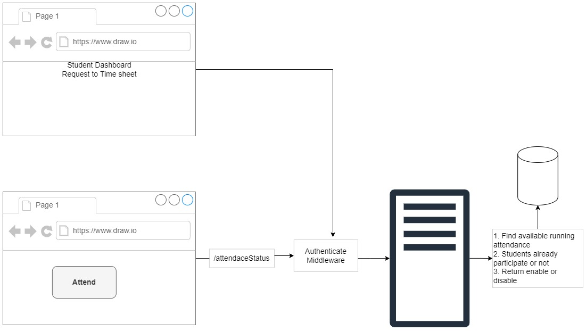

## Attendance System Requirement Analysis

## Introduction

গত ক্লাসে আমরা আমাদের প্রজেক্টের বেসিক যে রিকোয়ারমেন্ট ক্লায়েন্ট থেকে পেয়েছিলাম সেটা দেখেছিলাম। সেটা আলোকে আজ আমরা এর ফাংশনাল রিকোয়ারমেন্টগুলো অ্যানালাইসিস করবো। একটা বেসিক SRS (Software Requirement Specification) বানাবো। আর এই প্রজেক্ট করতে যে যে টেকনোলজি লাগবে তা চুজ করবো। আজকের এজেন্ডাগুলো তাহলে লিখে ফেলা যাক।

- Functional Requirement Analysis
- Create A Basic SRS
- Choose Technologies

প্রোগ্রামার হতে হলে সবচেয়ে বেশি যে বিষয়ে জোর দেয়া লাগে সেটা হলো প্রব্লেম ক্রিয়েশন বা প্রব্লেম ফাইন্ডিং। আমরা সবচেয়ে বেশি জোর দিই প্রব্লেম সলভিং এর দিকে। কিন্তু সবচেয়ে কঠিন কাজ দুই লাইনের একটা রিকোয়ারমেন্ট থেকে ছোট ছোট প্রব্লেম বের করে আনা। যেমন আমি চাইছি এই পেইজে ঢুকলে একটা বল স্ক্রিনের নিচের edge থেকে উপরের edge এ বাউন্স করবে। জাস্ট এক লাইনের রিকোয়ারমেন্ট। কিন্তু এটা করার জন্য আমরা ডেভেলপাররা আমাদের মতো করে প্রব্লেমটাকে সাজিয়ে নিবো। কিভাবে? আমাদের নিচের edge এ যখন বল থাকবে তখন সেটা উপরের দিকে উঠবে একটা নির্দিষ্ট কোণে। ধরে নিলাম বলটি প্রথম অবস্থায় (০, ০) অবস্থানে আছে। এখন যখন সে উপরের দিকে যাবে তখন সে এক্স অক্ষের সাথে ৭০ ডিগ্রি কোণে উঠবে। এরপর উপরের edge এ যখন সে টাচ করবে আবার ৭০ ডিগ্রি কোণে নিচের দিকে নামবে। এভাবে প্রব্লেমটাকে আমরা আমাদের মতো করে ভাগ করে নিয়ে প্রতিটা প্রব্লেম ধরে ধরে কাজ করবো। যে কোনো প্রজেক্টের ক্ষেত্রেই আমাদের প্রথম ক্লায়েন্টের রিকোয়ারমেন্ট থেকে আমরা আমাদের মতো প্রব্লেম বের করে আনবো। এবার সেই প্রব্লেম সলভ করবো। একে বলা হয় ফাংশনাল রিকোয়ারমেন্ট অ্যানালাইসিস। রিকোয়ারমেন্ট অ্যানালাইসিস দুই ধরণের - ফাংশনাল এবং নন ফাংশনাল। এটা নিয়ে [লেকচার ১](../Fundamentals/Welcome%20Decision%20Making/Lecture%2001/README.md) এ ভালভাবে আলোচনা করা হয়েছে। আমরা এবার আমাদের প্রজেক্টের জন্য ফাংশনাল রিকোয়ারমেন্ট অ্যানালাইসিস করবো। প্রথমে আমরা আমাদের ক্লায়েন্টের রিকোয়ারমেন্ট লিখে ফেলি।

## Client's Requirements

We need an attendance system. Students can create their own profile. Admin can see list of students and their attendances. Admin can enable and disable attend button. Also this button can be disabled based on a timer. Each time admin enable attend button, students can participate for only once. Each day, student will have a time sheet of attendance.

Student can see their own time logs and attend button when enable.

## Functional Requirements

রিকোয়ারমেন্ট এবং রিকোয়ারমেন্ট অ্যানালাইসিসের মধ্যে পার্থক্য আছে। আমরা এই দুইটাকে একসাথে ধরে গুলিয়ে ফেলি। রিকোয়ারমেন্ট হলো আমার এই অ্যাপ্লিকেশন কি কি ফিচার্স থাকবে। আর রিকোয়ামেন্ট অ্যানালাইসিস হলো ঐ ফিচারগুলোকে কিভাবে ইমলিমেন্ট করবো। এখন আমরা আগে আমাদের ফাংশনাল রিকোয়ামেন্টস লিখে ফেলি। এরপর অ্যানালাইসিস করবো। এই অ্যাপের দুইটা End User আছে। একটা হলো Admin অন্যটা Student. মূলত এই দুইজনই আমাদের অ্যাপ ইউজ করবে। প্রথমে আমরা Student এর জন্য কি কি রিকোয়ারমেন্ট আছে তা লিখে ফেলি।

**Student Roles:**

- Student can register themselves.
- There will be following account status for a student:
  - Pending
  - Active
  - Reject
- Student can login with their credentials.
- Pending and rejected students won't have anything in their profile.
- Active students can update their profile info.
  - First Name
  - Last Name
  - Email
  - Phone No
  - Profile Picture
- Active student can change / update password.
- Active students can see their time sheet
  - Calender view
  - List view
  - Table view
- Active students can participate in attendance system.
- Student can logout.

এবার Admin এর কি কি কাজ থাকতে পারে তা লিখে ফেলি। Admin এর কথা বলতে গেলে দুইটা কনসেপ্ট চলে আসে। সুপার অ্যাডমিন আর অ্যাডমিন। সুপার অ্যাডমিনের কাজ হলো কাকে কাকে অ্যাডমিন বানাবে তা ঠিক করা। সুপার অ্যাডমিন না থাকলে তো যে কেউই গিয়ে অ্যাডমিন হিসেবে সাইন আপ করে ফেলতে পারে। সুপার অ্যাডমিন অনেকভাবে ক্রিয়েট করার যায়। নিচে কিছু পদ্ধতি দেয়া হলো।

- আমরা অ্যাপ্লিকেশন ডিজাইনের সময়ই আমাদের এনভায়রনমেন্ট ভ্যারিয়েবলের মধ্যে সুপার অ্যাডমিনের ইনফরমেশন দিয়ে দিতে পারি। যখন অ্যাপ্লিকেশন রান হবে তখন অটোমেটিক্যালি সেখানে থেকে ইনফরমেশন নিয়ে সুপার অ্যাডমিন ক্রিয়েট করে ফেলতে পারে।
- অ্যাপ্লিকেশনে যে প্রথম অ্যাডমিন হিসেবে অ্যাপ্লিকেশন ডেপ্লয় করবে তাকে সুপার অ্যাডমিন হিসেবে ধরে নেয়া যেতে পারে। মোটামুটি সব ক্ষেত্রেই এখন এই পদ্ধতি ব্যবহার করা হচ্ছে।
- আরেকটা হচ্ছে আমরা একটা cli টুলস বানিয়ে কমান্ডের মাধ্যমেও সুপার অ্যাডমিন ক্রিয়েট করতে পারি।

আমাদের এই অ্যাপ্লিকেশনে ধরে নিলাম একজনই অ্যাডমিন। মাল্টি অ্যাডমিন রোলে আমরা যাচ্ছি না প্রজেক্টটাকে সিম্পল রাখার জন্য। ধরে নিলাম একজনই অ্যাডমিন এবং সেই সুপার অ্যাডমিন। আমাদের খেয়াল রাখতে হবে আমাদের রিকোয়ারমেন্টস যেন ক্লায়েন্টের রিকোয়ারমেন্টের বাইরে না যায়। ক্লায়েন্টের রিকোয়ারমেন্টসে মাল্টি অ্যাডমিনের কথা বলা নাই, তাই আমরা মাল্টি অ্যাডমিন নিয়ে ভাববো না। এখন অ্যাডমিনের কাজগুলো কি কি হবে?

**Admin Roles:**

- Admin can create student.
- Admin can delete / update / check students information.
- Admin can change status of a student.
- Admin can check time sheet of a student.
- Admin can enable or disable attendance button.
- Admin can check stats of a given day.

আমাদের রিকোয়ারমেন্ট নেয়া শেষ। এবার আমরা রিকোয়ারমেন্ট অ্যানালাইসিস করবো।

## Requirements Analaysis

আপনারা যদি একটু গুগলে সার্চ করেন দেখবেন অনেক বড় বড় বিভিন্ন ফরমেটেড অ্যানালাইসিস পাবেন। আমাদের অ্যাপ্লিকেশনটা যেহেতু সিম্পল তাই আমাদের এখন অতো জটিল, ফরমেট মেইনটেইন করে অ্যানালাইসিস করার দরকার নেই। আমরা সিম্পল একটা অ্যানালাইসি বানাবো।

### Models

আমাদের এখানে দুইটা ইউজার আছে - Admin & Student। আমরা প্রতিটা ইউজারের জন্য মডেল বানিয়ে ফেলতে পারি। কিন্তু Admin এর ক্ষেত্রেও আমাদের লাগবে Name, Email, Password আর Student এর জন্য লাগবে Name, Email, Password, AccountStatus। এখন দেখেন Admin আর Student এর জন্য Name, Email, Password আছে। আমরা চাইলে ডাটাবেইজে দুইটা ডিফারেন্ট টেবিল বা কালেকশন তৈরি করে কানেক্ট করতে পারি। কিন্তু দুইটা ভিন্ন ভিন্ন কালেকশন বা টেবিলের মধ্যে সম্পর্ক স্থাপন কথা অনেক প্যাড়াদায়ক কাজ। আবার এমনও হতে পারে ভবিষ্যতে Student থেকে দুইজনকে অ্যাডমিন বানানো হলো কাজের সুবিধার্থে। তাহলে তার দুইটা ভিন্ন প্রোফাইল থাকবে, দুইটা ভিন্ন রোল থাকবে। সে একসাথে Student আবার Admin। কিন্তু এখানে আরেকতা প্রব্লেম আছে। আমি যখন Student কে Admin রোল দিবো তখন সে পুরো পাওয়ার পেয়ে যাবে। সে চাইলে নিজের অ্যাটেনডেন্স কোনোদিন না সলে দিয়ে দিতে পারে, বা কারো সাথে সম্পর্ক খারাপ তার অ্যাটেনডেন্স সে ডিলিট করে দিতে পারবে। আমরা তো এমন হতে দিতে পারি না। আমরা শুধু তাকে অ্যাটেনডেন্স বাটন এনেবল বা ডিজেবল করার পাওয়ার দিবো আর কিছু না। তাহলে এখানে তিনটা ডিফারেন্ট রোল থাকবে - Admin, Student, Moderator। এখন আমরা Admin & Student এর জন্য আলাদা আলাদাভাবে মডেল না নিয়ে User নামে একটা মডেল নিয়ে নিবো যাতে Roles থাকবে, যেটা দিয়ে আমরা বুঝবো সে অ্যাডমিন নাকি ছাত্র নাকি মডারেটর। এখন AccountStatus তো শুধু Student এর জন্য প্রযোজ্য। কিন্তু আমরা যেহেতু এখানে মডারেটর বা মাল্টি অ্যাডমিন নিয়ে কাজ করার বিষয় ভাবছি আমরা চাইলে কোনো অ্যাডমিনকে পেন্ডিং রাখতে পারি বা রিজেক্ট করে দিতে পারি। যদি কিছুই না থাকে বাই ডিফল্ট তা Active দেখাতে পারে। তাই AccountStatus আমরা User এর ক্ষেত্রে লিখতে পারি।

**User:**

- Name
- Email
- Password
- Roles
- AccountStatus

এবার দরকার প্রোফাইলের জন্য একটা মডেল।

**Profile:**

- First Name
- Last Name
- Phone No
- Profile Picture
- UserId

এখন দরকার Student Attendance এর জন্য একটা মডেল। এখানে মূলত থাকবে Student এর আইডি আর কখন তার অ্যাটেনডেন্স ক্রিয়েট হয়েছে সেটা। এখন একদিনে ৩টা অ্যাটেনডেন্সও দিতে পারে। সেটা ঐ দিনের অ্যাটেনডেন্সের একটা গ্রুপ হিসেবে থাকবে। এছাড়া কোন অ্যাটেনডেন্সের আন্ডারে আমরা অ্যাটেনডেন্স দিচ্ছি তার জন্য আমাদের একটা আইডি লাগবে।

**StudentAttendance:**

- UserId
- CreatedAt: DateTime
- AdminAttendanceId

এখন আমার যে API যেটার মাধ্যমে অ্যাটেনডেন্স দিবে সেটা ট্র্যাক করবে কে? আমাদের অ্যাডমিন যে ক্লিক করে এনেবল করে দিবে যে এখন অ্যাটেনডেন্স দেয়া যাবে এই সিস্টেমটা কে মেইনটেইন করবে? কোথায় থাকবে এটা? এটাও একটা কমপ্লেক্স বিষয়। আমাদের একটা বুলিয়ান ভ্যারিয়েবল দরকার, যেখানে আমাদের ডাটা ট্র্যাক করা থাকবে, যে এখন টাইম হয়ে গেছে তুমি এনেবল করতে পারো। আবার নির্দিষ্ট সময় পর তা ডিজেবল করতে পারো। এটা জন্য আমাদের একটা মডেল দরকার। আমরা AdminAttendance নামের একটা মডেল বানাই। এখানে কোন টাইমে সে সিস্টেমটা ক্রিয়েট করবে সেটা থাকবে। এখন একদিনে অ্যাডমিন কয়েকবার সিস্টেম এনেবল করতে পারে। তাহলে এখানে আগের মতোই আমাদের DateTime ব্যবহার করতে হবে। ক্লায়েন্টের রিকোয়ারমেন্টে লেখা আছে বাটন এনেবল করার পর একটা টাইমারের উপর ডিপেন্ড করে তা কিছু সময় পর ডিজেবল হয়ে যাবে। সুতরাং এখানে একটা টাইম লিমিটের ব্যাপার আছে। এখানে ডিফল্ট টাইম থাকতে পারে ৫ মিনিট, আবার ইউজার সেট করে দিতে পারে। আবার যেহেতু এনেবল ডিজেবল ব্যাপার আছে তাই একটা স্ট্যাটাস থাকতে পারে। Active or completed.

**AdminAttendance:**

- CreatedAt: DateTime
- Status
- TimeLimit

আমাদের মডেল তৈরি করা শেষ।

আমরা দুইভাবে অ্যাপ্লিকেশন বানাতে পারি - সিংগেল পেইজ এবং মাল্টি পেইজ। আমাদের এই অ্যাপ্লিকেশন সিংগেল পেইজ অ্যাপ্লিকেশন। আর সিংগেল পেইজ অ্যাপ্লিকেশনে কমিউনিকেশন করার জন্য, ড্যাশবোর্ড নিয়ে কাজ করার জন্য দরকার API. এখন বড় সিদ্ধান্ত নিতে হবে আমরা কিভাবে API বানাবো, আমাদের কি কি End point লাগবে? সেগুলো আমাদের রিকোয়ারমেন্টস থেকে খুঁজে নিয়ে আসতে হবে।

### Endpoints

**Student Endpoints:**

- POST /auth/login [public]
- POST /auth/register [public]
- PATCH /profiles [private]
- PATCH /profiles/avatar [private]
- PUT /auth/change-password [private]
- GET /timesheet [private]
- GET /attendance [private]
- GET /attendanceStatus [private]

**Admin Endpoints:**

- GET /users [private]
- POST /users [private]
- PATCH /users/userId [private]
- DELETE /users/userId [private]
- GET /users/userId [private]
- GET /profiles [private]
- POST /profiles [private]
- PATCH /profiles/profileId [private]
- DELETE /profiles/profileId [private]
- GET /profiles/profileId [private]
- GET /timesheet/userId [private]
- GET /timesheet/stats [private]
- POST /attendance/enable [private]
- GET /attendance/disabled/:attendanceId [private]

এই গেলো মোটামুটি আমাদের Routes. যে রাউটস দিয়ে আমরা যে অ্যাপ্লিকেশন বানাতে চাইছি তা সুন্দরভাবে বানিয়ে ফেলতে পারি। এখানে GET, POST, PUT, PATCH, DELETE অনেকে ধরণের লেখা দেখা যাচ্ছে। এগুলো দিয়ে মূলত কোন রাউটের রিকোয়েস্ট কিভাবে হ্যান্ডেল হবে তা বুঝায়। আমরা কাজ করতে গেলে এগুলো সম্পর্কে জানতে পারবো। জাস্ট একটা বেসিক আইডিয়া এখানে দেয়া হলো।

- GET: যখন কোনো কিছু থেকে আমাদের ডাটা retrieve করার প্রয়োজন হয় তখন GET ব্যবহার হয়।
- POST: যখন আমাদের কোনো কিছু আপডেট করার প্রয়োজন হয় বা কোনো স্টেট চেইঞ্জের প্রয়োজন হয় তখন আমরা POST ব্যবহার করি।
- PUT: যখন আমাদের বর্তমান অবস্থা রিপ্লেস করার প্রয়োজন হয় তখন আমরা PUT ব্যবহার করি। যেমন পাসওয়ার্ড চেইঞ্জ করার জন্য আমরা PUT ইউজ করেছি, কারণ বর্তমান পাসওয়ার্ড আমরা পুরোপুরি চেইঞ্জ করতে চাইছি।
- PATCH: যখন আমরা কিছু পুরোপুরি রিপ্লেস বা চেইঞ্জ করবো না, কিছুটা চেইঞ্জ করবো, সহজ ভাষায় মডিফাই করার প্রয়োজন পরবে তখন PATCH ইউজ করবো।
- DELETE: যখন কোনো ডাটা ডিলিট করার প্রয়োজন পড়বে তখন আমরা DELETE ব্যবহার করবো।

public route বলতে বুঝায় এটা যে কেউ দেখতে পারবে। আর private route বলতে বুঝাচ্ছে শুধুমাত্র লগইন করা ইউজাররাই এগুলোর এক্সেস পাবে। মানে এগুলো যে কেউ দেখতে পারবে না।

আমরা আমাদের যে Workflow, সেটাকে একটু ভিজ্যুয়ালি দেখার চেষ্টা করি।

## Visualize our workflow

প্রথমে আমরা কথা বলবো রেজিস্ট্রেশন এবং অথেনটিকেশন সিস্টেম নিয়ে।

আমরা প্রথমে `/auth/register` এ রিকোয়েস্ট পাঠাবো JSON আকারে। সে রিকোয়েস্ট আমাদের সার্ভার নিয়ে প্রথমে ভ্যালিডেট করবে। এরপর একটা নির্দিষ্ট ফর্মে ট্রান্সফর্ম করবে। এরপর আমাদের পাসওয়ার্ড হ্যাশ করবে যাতে ডাটাবেইজ হ্যাক হলেও আমাদের পাসওয়ার্ড হ্যাকার না পায়। এভাবে ডাটা প্রসেস করে সেগুলো ডাটাবেইজে পাঠিয়ে দিবে। সাথে সাথে একটা ম্যাসেজ রিটার্ন করবে। যদি সাক্সেসফুলি সব হয় তাহলে সে একটা `Success 201` ম্যাসেজ রিটার্ন করবে। যদি ইউজারের ডাটায় কোনো ভুল থাকে তাহলে `Error 400` ম্যাসেজ রিটার্ন করবে। আর যদি সার্ভারের কোনো সমস্যার কারণে এরর হয় তাহলে `Error 500` ম্যাসেজ রিটার্ন করবে।

এবার আসি লগইন সিস্টেমে।

আমরা যখন আমাদের সার্ভারে `/auth/login` এ রিকোয়েস্ট পাঠাবো তখন আমাদের ইমেইল আর পাসওয়ার্ড প্রোভাইড করবো এরপর সার্ভার প্রসেসিং শুরু করবে। প্রথমে ডাটা ভ্যালিডেট করবে। এরপর ইমেইলটা আমাদের ডাটাবেইজে সার্চ দিয়ে দেখবে ঐ ইমেইল দিয়ে কোনো ইউজার আছে কিনা। যদি না থাকে এরর ৪০০ থ্রো করবে। আর যদি থাকে তাহলে পাসওয়ার্ড চেক করবে। যদি পাসওয়ার্ড না মিলে এরর ৪০০ থ্রো করবে। আর যদি মিলে তাহলে একটা JWT Token জেনারেট করবে। এরপর এই টোকেন সহ একটা সাক্সেস ২০০ ম্যাসেজ রিটার্ন করবে। সাক্সেসফুলি লগইন হওয়ার পর আমরা JWT Token লোকাল ডাটাবেইজে সেভ করে রাখবে, কারণ সমস্ত প্রাইভেট রাউটের রিকোয়েস্ট পাঠানোর জন্য আমরা এই টোকেনটা পাঠাবো। টোকেন সেইভ করার সাথে সাথে Student Dashboard এ রিডিরেক্ট হয়ে যাবে।

ড্যাশবোর্ডে যাওয়ার পরে ইউজার কি করবে। সে তার টাইমশীট দেখতে চাইবে। দেখার জন্য সার্ভারের কাছে `/timesheet` রিকোয়েস্ট পাঠাবে। এখন আমরা আমাদের endpoint এ লিখেছি এটা একটা প্রাইভেট রাউট তাই রিকোয়েস্টের সাথে সাথে অথেনটিকেশন হেডার হিসেবে ঐ যে JWT Token পেয়েছিলাম সেটা পাঠাবে। এখন সব প্রাইভেট রাউটের ক্ষেত্রে আমার এই টোকেনটা অথেনটিকেট করার প্রয়োজন হবে। তাহলে কি আমি বারবার কোড লিখবো? না, আমি কোড রিইউজ করবো। এটা করার জন্য ব্যাকএন্ডে একটা সুন্দর সিস্টেম আছে, সেটা হলো Middleware। আমরাও একটা মিডলওয়্যার বানাবো। এই মিডলওয়্যার চেক করবে যে টোকেনটা আমরা পাঠিয়েছি ওটা সার্ভারে আছে কিনা। যদি থাকে তাহলে পরবর্তী প্রসেসিং এ যাবে। আর যদি না পায় তাহলে ৪০১ এরর রিটার্ন করবে। ৪০১ মানে অথেনটিকেশন এরর। যদি সব ঠিক থাকে তাহলে ঐ ইউজার অবজেক্টের খোঁজ করবে ডাটাবেইজে। এরপর সেই ইউজারের টাইমশীট খুঁজে বের করে আনবে। এখন একই দিনের ৩ বার অ্যাটেনডেন্স দিতে পারে, ৫ বার দিতে পারবে। সেটা ডাটাবেইজ থেকে আসবে ফ্ল্যাট অ্যারে হিসেবে। সেগুলোকে আমাদের গ্রুপ করতে হবে। সবশেষে টাইমশীট রিটার্ন করবে। আমাদের যা এরর আসার সব মিডলওয়্যারের মধ্যেই হয়ে যাবে। ডাটাবেইজ থেকে এরর আসার কোনোরকম সম্ভাবনা নাই।

এবার আমরা দেখি আমাদের অ্যাটেনডেন্স বাটন নিয়ে।

যখন আমাদের বাটন এনেবল থাকবে তখন ইউজার `/attendance` রিকোয়েস্ট পাঠাবে টোকেনসহ। আগের মতো তা মিডলওয়্যারে চেক হবে। হওয়ার পর যদি টোকেন পাওয়া না যায় তাহলে এরর রিটার্ন করবে। নাহয় প্রসেসিং শুরু করবে। প্রথমে ঐ ইউজারের জন্য একটা অ্যাটেনডেন্স ক্রিয়েট করবে। ক্রিয়েট করে তা ডাটাবেইজে সেইভ করবে। সবশেষে একটা সাক্সেস ম্যাসেজ রিটার্ন করবে।

এখন যদি বাটন ডিজেবল থাকে তখন সিস্টেম কিভাবে বুঝবে কখন ডিজেবল হবে কখন এনেবল হবে। সেটা টাইমারের সাথে তো একটা হবে। এখন একজন ইউজার একবার অ্যাটেনডেন্স দিলে পরে আর দেয়ার প্রয়োজন নেই। মানে একবার দিলে তার জন্য পরবর্তীতে বাটন ডিজেবল থাকবে। এখন সেটা কিভাবে করা যাবে।

যখন টাইমার ওপেন হলে `/attendanceStatus` রিকোয়েস্ট যাবে। যথারীতি মিডলওয়্যারে টোকেন অথেনটিকেট হবে। এরপর সার্ভার ডাটাবেইজ থেকে বর্তমান অ্যাটেনডেন্স আইডি খুঁজে নিয়ে আসবে। এরপর চেক করবে ঐ ইউজার ঐ অ্যাটেনডেন্সের আন্ডারে আগে অ্যাটেন্ড করেছে কিনা? যদি করে থাকে তাহলে বাটন ডিজেবল থাকবে। আর যদি না করে থাকে তাহলে বাটন এনেবল হবে। ড্যাশবোর্ডে রিডিরেক্ট হওয়ার পর এই মিডলওয়্যারেও একটা রিকোয়েস্ট আসবে। সেটার উপর ভিত্তি করে ঐ বাটনের চেহারা পরিবর্তন হবে। এটা কেন করতে হবে? কারণ যখন বলা হবে অ্যাটেনডেন্স বাটন এনেবল করা হয়েছে এবার সবাই অ্যাটেনডেন্স দেন, তখনই আসলে সবাই লগইন করবে। লগইন হওয়ার পর যদি আবার রিফ্রেশ দিতে হয় তাহলে তো প্রব্লেম। তাই একই সাথে দুইটা রিকোয়েস্ট পাঠাতে হবে।

## Decision Tree

Decision Tree একটা ডায়াগ্রাম, অনেকটা ফ্লোচার্টের মতো। এটা তৈরি করে রাখলে কখনও কাউকে আর ব্যাখ্যা করে বারবার বুঝানোর দরকার পড়বে না। এটা থেকেই টিমমেটরা বুঝে যাবে। আমরা এখানে রেজিস্ট্রেশন প্রসেসের একটা Decision Tree দেখবো।

আশা করি এই ডায়াগ্রাম কাউকে বুঝিয়ে দিতে হবে না। এখান থেকে সহজেই প্রসেসটা বুঝা যাচ্ছে। এভাবে সবকিছুর জন্য যদি ডিসিশন ট্রি তৈরি করে ফেলা যায় তাহলে কেউ দেখলেই প্রসেসটা সহজেই বুঝে যাবে।

## Project Management

রিকোয়ারমেন্ট বেশি হলে সেগুলো যদি সঠিকভাবে ম্যানেজ করা না যায় তবে তা ট্র্যাক করা মুশকিল। কিছুদিন পর তা হারিয়ে যেতে পারে। তাই আমাদের সবকিছু ট্র্যাক রাখতে হবে। আমরা বিগিনার হিসেবে Notion ব্যবহার করতে পারি। প্রফেশনাল লাইফে অনেক প্রজেক্ট ম্যানেজমেন্ট টুলস আছে যেমনঃ Github, trello, Jira etc. সেগুলো দিয়েও করা যায়। আমরা আপাতত notion দিয়েই করছি। এই প্রজেক্টের সব রিকোয়ারমেন্টস এই [লিংক](https://thirsty-camelotia-a8e.notion.site/Projects-26859035fe2a4649b9556f5fbe77728b) সুন্দরভাবে টাস্ক আকারে আছে। আপনারা এটা থেকে একটা আইডিয়া পাবেন।

## AUTHOR

[Aditya Chakraborty](https://github.com/adityackr)
