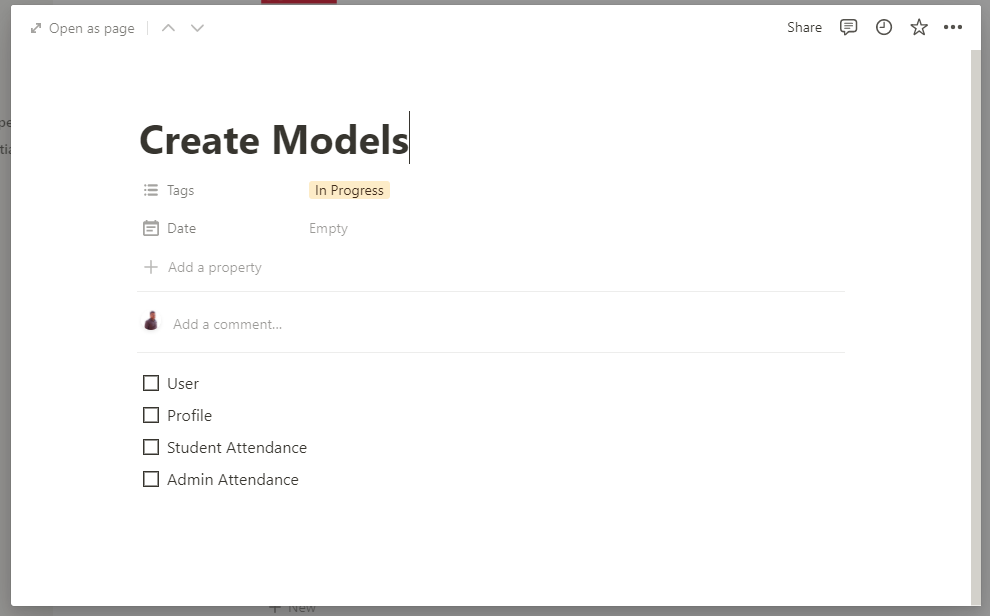

## Create Models, Write Pseudo Code and Adda

আজকে ক্লাসে আমরা আমাদের গত ক্লাসে Notion এ যে টুডু বানিয়েছিলাম সেটার আলোকে মডেলগুলো তৈরি করবো। আমাদের Create Models টুডু ছিল এরকম।



আমরা প্রথমে প্রজেক্ট স্ট্রাকচার নিয়ে একটু কথা বলি। আমরা প্রথমে আমাদের ডিরেক্টরিতে attendance-system নামে একটা ডিরেক্টরি ক্রিয়েট করবো। আমাদের এই প্রজেক্টে অ্যাপ্লিকেশন হবে দুইটা। একটা ক্লায়েন্ট আরেকটা সার্ভার। যদি আমরা Student ও Admin এর জন্য আলাদা আলাদা অ্যাপ্লিকেশন বানাতাম তাহলে আমাদের অ্যাপ্লিকেশন হতো ৩টা। এখন দুইটা দিয়ে আমাদের কাজ হয়ে যাবে। যেহেতু আমরা ক্লায়েন্ট সাইড নিয়ে এখন কাজ করবো না, ক্লায়েন্টের কোনো রিকোয়ারমেন্টস এখনও আমরা প্রোপারলি তৈরি করিনি, সুতরাং আমরা প্রথমে API নিয়ে কাজ করবো। এখন অনেকের প্রশ্ন থাকতে পারে আগে কেন ব্যাকএন্ড কেন? আমরা তো সবসময় দেখে এসেছি আগে HTML, CSS নিয়ে কাজ করে এরপর ব্যাকএন্ডে যেতাম। এখন দুনিয়াটা একটু চেইঞ্জ হয়ে গেছে। সিংগেল পেইজ অ্যাপ্লিকেশনে আগে ব্যাকএন্ডের কাজ করতে হয়। UI পরে। আবার পাশাপাশি করা যায়, যদি আমাদের কোনো টেমপ্লেট রেডি থাকতো বা অন্য একজন ফ্রন্টএন্ড ডেভেলপার থাকতো। যেহেতু এই অ্যাপ্লিকেশনে আমি একাই, তাই আগে যেটা কারো উপর ডিপেন্ড করে না সেটা বানিয়ে নিবো। সেটা হচ্ছে ব্যাকএন্ড। ফ্রন্টএন্ড ব্যাকএন্ডের উপর ডিপেন্ড করে। তাই আমরা আগে ডিপেন্ডেন্সি ক্রিয়েট করবো। এবার আমরা আমাদের attendance-system ডিরেক্টরিতে server নামে আরেকটা ডিরেক্টরি নিবো। পরবর্তীতে যখন ক্লায়েন্ট নিয়ে কাজ করবো তখন client নামে আরেকটা ডিরেক্টরি তৈরি করবো।

nodeJS প্রজেক্ট মানেই সেখানে একটা `package.json` ফাইল থাকবে। সেটা কিভাবে ক্রিয়েট করবো। দুইভাবে করা যায়। npm or yarn. আমরা যখন nodejs ইনস্টল করবো তখন সাথে সাথে npm ও ইনস্টল হয়ে যাবে। কিন্তু yarn আমাদের আলাদা করে গ্লোবালি ইনস্টল করতে হবে। সেটা কিভাবে করতে হবে?

```sh
npm install --global yarn
```

`--global` দেয়া মানে সেটা গ্লোবালি মেশিনে ইনস্টল হয়ে যাবে। আমাদের আর এই মেশিনের জন্য এটা ইনস্টল করার প্রয়োজন নেই। যদি `--global` না দিতাম তাহলে সেটা শুধু এই প্রজেক্টের জন্য ইনস্টল হতো। এবার আমরা আমাদের package.json ফাইল বানাবো। প্রথমে npm দিয়ে কিভাবে বানাবো দেখে নিই।

```sh
npm init -y
```

`-y` দেয়ার মানে হলো npm আমাদের কিছু প্রশ্ন করবে, আমরা সেগুলো সবগুলোর উত্তর ইয়েস দিয়ে দিয়েছি। এই কমান্ড লিখে এন্টার দিলেই আমাদের `package.json` ফাইল তৈরি হয়ে যাবে। এবার yarn দিয়ে কিভাবে বানাবো দেখে নিই। একই কমান্ড শুধু npm এর জায়গায় yarn লিখতে হবে।

```sh
yarn init -y
```

এবার এই `package.json` ফাইলের মধ্যে কি আছে একটু দেখি।

```json
{
	"name": "server",
	"version": "1.0.0",
	"description": "",
	"main": "index.js",
	"scripts": {
		"test": "echo \"Error: no test specified\" && exit 1"
	},
	"keywords": [],
	"author": "",
	"license": "ISC"
}
```

অনেক কিছুই আছে। তবে আমাদের সবচেয়ে জরুরী `scripts`, `dependencies` and `devDependencies`. dependencies এবং devDependencies এখনও দেখা যাচ্ছে না। আমরা যখন কোনো প্যাকেজ ইনস্টল করবো তখন দেখা যাবে।

এখন আমরা কি বানাতে পারি। nodejs একটি পাওয়ারফুল টুল যার মাধ্যমে আমরা আমাদের মেশিনে আমাদের কোড রান করতে পারি। তার মানে আমরা যা খুশি তাই বানাতে পারি। আমি ডেস্কটপ অ্যাপ্লেকশনও বানাতে পারি, মোবাইল অ্যাপ্লিকেশনও বানাতে পারি যেকোনো কিছুই বানাতে পারি। কিন্তু এই মুহূর্তে আমি চাইছি ওয়েব অ্যাপ্লিকেশন বানাতে। আমরা চাইলে [NodeJS API](https://nodejs.org/api) এ দেয়া পদ্ধতি দিয়ে পুরো একটা সার্ভার বানিয়ে ফেলতে পারি। কিন্তু কেন আমরা সেটা করতে যাবো যদি আমাদের কাছে একটা ফ্রেমওয়ার্ক থাকে। nodejs এর জন্য সবচেয়ে ভাল ফ্রেমওয়ার্ক হচ্ছে [Express JS](https://expressjs.com/)। কারণ এখানে কিছু শেখার নাই। দুই তিনটা কনসেপ্ট জাস্ট যা দিয়ে আমরা সব কাজ করতে পারবো। একে বলা হয় Minimalist Web Framework বা Micro Framework। মাইক্রো ফ্রেমওয়ার্ক শুনলে অনেক ভাবে এতে বুঝি সব দেয়া নেই। মাইক্রো ফ্রেমওয়ার্কের কনসেপ্ট হলো সব কিছু ছোট আকার দেয়া আছে। আমার যখন যা দরকার তা জোড়া লাগিয়ে লাগিয়ে কাজ করবো। জ্যাঙ্গোতে সবকিছু এর মধ্যেই দেয়া আছে। আপনাকে কোনো চিন্তাই করতে হবে না। আপনার হাতে সময় কম থাকলে জ্যাঙ্গো বেস্ট। কিন্তু আপনার দরকার বেস্ট পারফরম্যান্স, বেস্ট অপটিমাইজেশন, লগইনের জন্য এই মডিউলস ভাল, অথেনটিকেশনের জন্য এই মডিউলস ভাল, ফ্লেকিবিটি দরকার, তাহলে আপনার জন্য হচ্ছে এক্সপ্রেস। এর একটা খারাপ দিক আছে। আবার এই খারাপ দিকটাই ভাল দিক। খারাপ দিক কি? বিগিনার হিসেবে স্টেপগুলো মাথায় রাখা একটু কষ্টের। আপনার হাতে টাইম কম আপনি এই স্টেপগুলো মাথায় রেখে রেখে কাজ করাটা একটু কঠিন হয়ে যায়। আবার এই স্টেওপগুলোই মাথায় রাখতে রাখতে কবে যে আপনি একজন ওয়েব ডেভেলপার হয়ে যাবেন টেরই পাবেন না। আপনি কোনো একটা কাজের জন্য চাইছে flask ইউজ করতে, আপনি পারবেন। আপনি চাইছেন GO ইউজ করতে তাও পারবেন। কারণ আপনি এক্সপ্রেশ শিখতে গিয়ে জানেন কিভাবে মিডলওয়্যার তৈরি করতে হয়, রিকোয়েস্ট রেসপন্স কি, কিভাবে হ্যান্ডেল করতে হয়, আপনি ফ্রেমওয়ার্ক নির্ভর না। আপনি দুনিয়ার যেকোনো ফ্রেমওয়ার্কে কাজ করতে পারবেন। জাস্ট ডকুমেন্টেশন পড়ে তা কিভাবে ইউজ করতে হয় সেটা বের করে নিলেই হলো। এসব কারণে এক্সপ্রেস বেস্ট। সে আমাকে ফ্লেক্সিবিলিটি দিচ্ছে।

এখন থেকে আমরা yarn ইউজ করবো। কারণ তা ক্যাশে অনেক কিছু জমা করে রাখে, যার ফলে পরে ইনস্টল করতে গেলে সময় কম লাগে। আর এটা npm এর চেয়ে অনেক ফাস্ট। এবার আমরা express ইনস্টল করে ফেলি।

```sh
yarn add express
```

একটা কথা মাথায় রাখবেন একটা প্রজেক্টে কখনও npm এবং yarn ইউজ করবেন না। কারণ যখন আপনি ডেপ্লয় করতে যাবে তখন দুইটা প্যাকেজ ফাইল থাকলে তা কনফ্লিকশন তৈরি করবে। তাই যদি npm ইউজ করেন পুরো সিস্টেমে npm, আর yarn হলে yarn।

এবার আমাদের সার্ভার বানাতে হবে। সার্ভার মানে যে সার্ভ করে। অনেকটা রেস্টুরেন্টের ওয়েটারের মতো। আপনি ওকে অর্ডার দিবেন, ও সেটা শেফের কাছে নিয়ে যাবে, এরপর খাবার রেডি হলে আপনাকে এসে সার্ভ করবে। সার্ভার হলো অ্যাপ্লিকেশনের এমন একটা সিস্টেম যে রিকোয়েস্টগুলো শুনতে পারবে। আমরা আমাদের server ডিরেক্টরিতে server.js নামে একটা ফাইল ক্রিয়েট করবো।

আমরা এই ফাইলের মধ্যে প্রথমে express import করে আনবো।

```js
const express = require('express');
```

express হলো একটা ফাংশন যা আমাদের Express কনস্ট্রাক্টর রিটার্ন করে। এটা আমাদের অ্যাপ্লিকেশন তৈরিতে সাহায্য করে। কিভাবে?

```js
const app = express();
```

আমরা express() কল করার মাধ্যমে যে অ্যাপ্লিকেশন পেলাম তা app এর মধ্যে রাখলাম। এই app অনেক পাওয়ারফুল। আমাদের যা যা দরকার সব এটার মধ্যে আছে। এখন এটা এভাবে লিখে রাখলে তা কিছুই শো করবে না। যদি আমরা নিচের কমান্ড লিখে রান করি দেখবো কিছুই শো করছে না।

```sh
node server.js
```

যদি শো করাতে হয় তাহলে তাকে আগে রিকোয়েস্ট শুনতে হবে। এখন সে তো আর সব জায়গার রিকোয়েস্ট শুনতে পারবে না। তাহলে আমাদের একটা পোর্ট নাম্বার দিয়ে দিতে হবে ধরুন `4000`। এই পোর্ট থেকে যা রিকোয়েস্ট আসবে সব সে listen করবে। পোর্ট নাম্বার দেয়ার পর একটা কলব্যাক ফাংশন দিবো। যেখানে আমরা আপাতত এটা যে শুনছে তা কনসোলে লগ করে দেখবো।

```js
app.listen(4000, () => {
	console.log("I'm listening on port 4000");
});
```

এবার যদি server.js রান করি তাহলে দেখা যাবে সে আর থেমে যাচ্ছে না। চলছে। এখন যদি আমরা ব্রাউজারে গিয়ে localhost:4000 লিখে সার্চ দিই দেখবো একটা লেখা আসবে Cannot get /. মানে সে রাউট পাচ্ছে না। কিন্তু কোনো এররও দিচ্ছে না। এখন যদি আমরা টার্মিনাল ক্লোজ করে ব্রাউজারে রান করি আমাকে এরর দেখাবে যে সে সাইটটা খুঁজে পাচ্ছে না। তার মানে উপরে যে কোড লিখেছি সেই কোডগুলোর অনেক ভ্যালু।

এখন আমাদের Cannot get / এই ইস্যুটা নিয়ে কাজ করা যাক। আমরা গত ক্লাসে যে রাউটগুলো বানিয়েছিলাম সেরকম রাউট শুধুমাত্র '/' এর জন্য বানাতে হবে। সেটা বানাতে পারে আমাদের app. কিভাবে?

```js
app.get('/', (req, res) => {
	res.send('Thanks for your request');
});
```

app আমাদের থেকে একটা get রিকোয়েস্ট নিবে। আর একটা কলব্যাক ফাংশন রিটার্ন করবে। এই ফাংশনের মধ্যে থাকবে তিনটা জিনিস। req, res, next. আমাদের আপাতত next দরকার নেই। আমরা res নিয়ে কাজ করবো। এখন আমরা যদি / রাউট পাঠাই তাহলে সে আমাদের রেসপন্স সেন্ড করবে। কি সেন্ড করবে? আমরা যা চাই। আমরা চাই কেউ / এ হিট করলে Thanks for your request এই লাইনটা দেখাবে।

এখন যদি আমাদের ব্রাউজারে গিয়ে চেক করি তাহলে কিছুই পাবো না। কারণ আমি ফাইল চেইঞ্জ করেছি। সার্ভার রিস্টার্ট দিইনি। প্রতিবার ফাইল চেইঞ্জ করার পর সার্ভার রিস্টার্ট দিতে হবে। এটা অত্যন্ত প্যারাদায়ক কাজ। সেই সমস্যা থেকে উত্তোরণের জন্য আমরা nodemon নামে একটা প্যাকেজ ইউজ করবো।

```sh
yarn add -D nodemon
```

-D মানে হলো এটা devDependencies এ সেইভ হবে। এটার সাথে আমাদের প্রজেক্টের কোনো সম্পর্ক নেই। আমরা আমাদের ডেভেলপমেন্ট সহজ করার জন্য এটা ইউজ করছি। আর যেগুলো প্রজেক্টের সাথে রিলেটেড সেগুলোর ক্ষেত্রে আমরা -D দিবো না। ইনস্টল করার পর আমাদের package.json এ গিয়ে "scripts" এ একটা লাইন যোগ করতে হবে। সেটা হলো

```json
{
	"scripts": {
		"dev": "nodemon server.js"
	},
}
```

এবার যদি আমরা `yarn dev` লিখে কমান্ড লাইনে রান করি তাহলে ফাইল যতবার চেইঞ্জ করি আমাদের আর সার্ভার রিস্টার্ট দেয়ার প্রয়োজন পড়বে না।

আমরা এবার ব্রাউজারে গিয়ে localhost:4000 রান করলে দেখবো আমাদের জন্য Thanks for your request এই লাইনটা দেখাছে। এটা আর অন্য কোনো রাউটের ক্ষেত্রে দেখাবে না। আমরা যদি / এর পরে অন্য কিছু লিখি এটা আমাদের বলবে Cannot get অমুক রাউট।

আমাদের Thanks for your request এর পরিবর্তে যা খুশি আমরা সেটা পাঠাতে পারি। html, css, json, video, audio, pdf যা খুশি। আমরা একটু html পাঠিয়ে দেখি।

```js
app.get('/', (req, res) => {
	res.send(`<h1>Thanks for your request</h1>`);
});
```

ব্রাউজারে রান করলে দেখবো তা একটা h1 ট্যাগ রিটার্ন করছে।

আমরা যেহেতু API বানাচ্ছি তাই চিন্তা করবো json পাঠানোর জন্য।

```js
app.get('/', (req, res) => {
	const obj = {
		name: 'Ayman',
		email: 'ayman@example.com',
	};
	res.json(obj);
});
```

যদি ব্রাউজারে রান করি তাহলে আমাদের অবজেক্টটা json আকারে দেখাবে। তো আমাদের বেসিক ওয়েব সার্ভার রেডি।

এবার ধরে নিলাম আমাদের অ্যাপ্লিকেশনে ডাটাবেইজ আছে। মডেলের সাথে ডাটাবেইজের কমিউকেশন করার জন্য একটা সুন্দর ORM (Object Relational Mapping) আছে যার নাম [Mongoose](https://mongoosejs.com/). যদি আমরা mongodb নিয়ে কাজ করতে চাই তাহলে mongoose ইউজ করবো। আমরা mongoose ইনস্টল করে ফেলি।

```sh
yarn add mongoose
```

এবার আমরা আমাদের মডেল তৈরি করবো। আমরা আমাদের server ডিরেক্টরির মধ্যে আরেকটা ডিরেক্টরি তৈরি করবো যেটার নাম models. এই models এর মধ্যে মডেল ফাইলগুলো তৈরি করবো যাদের নাম User.js, Profile.js, AdminAttendance.js, StudentAttendance.js।

প্রথমে আমরা User মডেল নিয়ে কাজ করবো। গত ক্লাসে দেখেছিলাম আমাদের ইউজারের মধ্যে কি কি থাকবে। তা হলো

```txt
- Name
- Email
- Password
- Roles
- AccountStatus
```

মmongoose দিয়ে মডেল তৈরি করার জন্য আমাদের প্রথম দরকার হয় একটা Schema. Schema হচ্ছে একটা শেইপ, একটা চেহারা। যেমন User মডেলে যা যা থাকবে সেটাই তার শেইপ, এর বাইরে কিছু থাকতে পারবে না। প্রথমে আমরা আমাদের mongoose import করে নিয়ে আসি। আমার সব দরকার নেই। আমার দরকার শুধু model আর Schema.

```js
const { model, Schema } = require('mongoose');
```

এবার আমরা আমাদের Schema তৈরি করে নিই।

```js
const userSchema = new Schema({
	name: String,
	email: String,
	password: String,
	roles: [String],
	accountStatus: String,
});
```

এখানে আমরা যে টাইপগুলো লিখেছি তা mongoose এর ডকুমেন্টেশন থেকে আপনারা পড়ে নিলে জানতে পারবেন। roles এর ক্ষেত্রে মাল্টিপল রোল হতে পারে যা স্ট্রিং একটা অ্যারে। আর বাকিগুলো সব স্ট্রিং। এবার আমরা আমাদের মডেল তৈরি করবো।

```js
const User = model('User', userSchema);
```

প্রথম আর্গুমেন্ট হিসেবে ভ্যারিয়েবলে যে নাম দিবো সেটা স্ট্রিং আকারে দিতে হবে। দ্বিতীয় আর্গুমেন্টে দিতে হবে আমাদের Schema যেটা আমরা তৈরি করেছিলাম। এরপর আমরা আমাদের মডেলকে এক্সপোর্ট করে দিবো যাতে এই মডেলটা আমরা পুরো প্রজেক্টে যেকোনো জায়গায় ব্যবহার করতে পারি।

```js
module.exports = User;
```

এখানে একটা প্রব্লেম আছে। কারণ কোনো ভ্যালিডেশন নাই। ভ্যালিডেশন আমরা পরবর্তীতে শিখবো। আজকের ক্লাসের কনটেক্সটের বাইরে সেটা।

এবার আমরা আমাদের প্রোফাইল মডেল তৈরি করি।

```js
const { model, Schema } = require('mongoose');

const profileSchema = new Schema({
	firstName: String,
	lastName: String,
	phone: String,
	avatar: String,
	user: {
		type: Schema.Types.ObjectId,
		ref: 'User',
	},
});

const Profile = model('Profile', profileSchema);

module.exports = Profile;
```

সব আগের মতোই। কিন্তু user ডিফারেন্ট টাইপের। এটা হলো আমাদের প্রোফাইলটা কার সেটা বের করতে হবে। সেটা বের করার জন্য mongoose এ এই স্পেশাল টাইপের ডাটা ব্যবহার করতে হবে।

এবার আমরা আমাদের Admin Attendance ও Student Attendance মডেল তৈরি করবো।

```js
// AdminAttendance.js
const { Schema, model } = require('mongoose');

const adminAttendanceSchema = new Schema({
	timeLimit: Number,
	status: String,
	createdAt: Date,
});

const AdminAttendance = model('AdminAttendance', adminAttendanceSchema);

module.exports = AdminAttendance;
```

```js
// StudentAttendance.js

const { Schema, model } = require('mongoose');

const studentAttendanceSchema = new Schema({
	createdAt: Date,
	user: {
		type: Schema.Types.ObjectId,
		ref: 'User',
	},
	adminAttendance: {
		type: Schema.Types.ObjectId,
		ref: 'AdminAttendance',
	},
});

const StudentAttendance = model('StudentAttendance', studentAttendanceSchema);

module.exports = StudentAttendance;
```

আমাদের টুডু থেকে Create Models টাস্ক শেষ। এরপর আমরা Authentication শুরু করবো। তার আগে ব্যাকএন্ডের ৭টা ক্লাস দেয়া হবে। ওখানে এক্সপ্রেশ নিয়ে খুঁটিনাটি সব দেখানো আছে। সেগুলো শেষ করে সব সুডোকোড নিজে থেকে লেখার চেষ্টা করবেন। উদাহরণ হিসেবে দুইটা সুডোকোড দেখানো হলো।

**Registration Process:**

```txt
Start
name = input()
email = input()
password = input()
if name && email && password is invalid:
  return 400 error

user = find user with email
if user found:
  return 400 error

hash = hash password
user = save name, email, hash to user model
return 201
End
```

**Login Process:**

```txt
Start
email = input()
password = input()

user = find user with email
if user not found:
  return 400 error

if password not equal to user hash:
  return 400 error

token = generate token using user
return token
End
```


## AUTHOR

[Aditya Chakraborty](https://github.com/adityackr)
