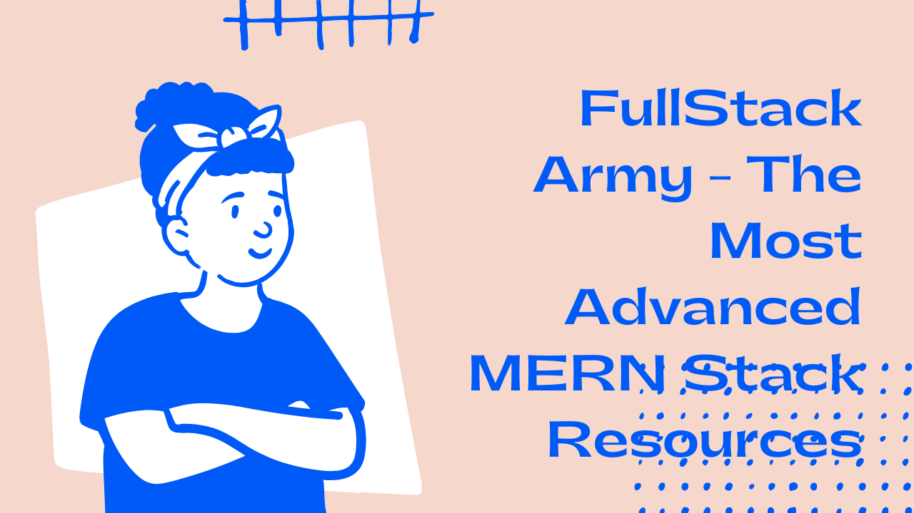

# FullStack Army - The Most Advanced MERN Stack Resources

**Documentation: https://fullstackarmy.taraldinn.me/**

**Source Code: https://github.com/mrhm-dev/full-stack-army**

???+ note

    In this repository, you will find source codes, explanations, and other resources for **FullStack Army - Complete MERN Stack Course in Bangla**. It is an open-source repository and feels free to add documentation, examples, and other references when necessary. Please create issues when you get confused or if something does not work. Other members will help you to solve your issues.

## Quick Links

- [Live Classes](live-classes/README.md)
- [Articles](articles/README.md)
- [Examples](examples/README.md)
- [Projects](projects/README.md)
- [References](references/README.md)
- [Resources](resources/README.md)
- [Source Code](src/README.md)
- [Class Overview](Class Overview/README.md)

## Live Class Recording

- [0. Full-stack Army - Welcome | Decision-Making Video](https://www.youtube.com/watch?v=ewBBT6Iph0M&t=784s)
- [Lecture 1 - Application Requirements & Landscape | Development Big Picture](https://youtu.be/AnD2KuKNsxE)
- [Lecture 2 - We Need Freedom, We have to Stop Technology War](https://youtu.be/9ltapy7kK5w)
- [Lecture 3 - Programming Language Foundation - A Bigger Landscape](https://youtu.be/1LWq-OdB7jY)
- [Lecture 4 - Programming Fundamentals using JavaScript](https://youtu.be/tAkUXTvm-xo)
- [Lecture 5 - Array Operations - Imperative vs Declarative](https://youtu.be/LADJO7KniNY)
- [Lecture 6 - JavaScript Array and Object Deep Dive](https://youtu.be/Mr5rksCjybA)
- [Lecture 7 - QNA 1 - Don't Miss The Last Part](https://youtu.be/TAa7gSbPVis)
- [Lecture 8 - Understand JavaScript Functions | Function as a value](https://youtu.be/lctjTl1ftdw)
- [Lecture 9 - Functional Programming in JavaScript](https://youtu.be/wMy2IZ12mxM)
- [Lecture 10 - Asynchronous Programming in JavaScript](https://youtu.be/OCkxS7W3gwU)
- [Lecture 11 - Async Iterator & Generator in JavaScript | Project Requirements](https://youtu.be/phzeyHwoIrQ)
- [Lecture 12 - Attendance System Requirement Analysis](https://youtu.be/Gsj7uU_7Um4)
- [Lecture 13 - Create Models, Write Pseudo Code and Adda](https://youtu.be/BfGOYh9Fdwg)
- [Lecture 14 - Backend 1 | Course planning and discussion](https://youtu.be/QBTOAGGgehA)
- [Lecture 15 - [Backend 2] Introduction to Backend Development](https://youtu.be/Mc6UEF957hU)
- [Lecture 16 - [Backend 3] Understand Express Middleware](https://youtu.be/kXeNJJ4mQ7w)
- [Lecture 17 - [Backend 4] Raffle Draw Project](https://youtu.be/4D2DIu8bhqU)
- [Lecture 18 - [Backend 5] Understand The Concepts of Database](https://youtu.be/SyKO3oZLz00)
- [Lecture 19 - [Backend 6] Adda with Random Topics | You can Skip](https://youtu.be/mqq5VgRMIho)
- [Lecture 20 - [Backend 7] Start Working with Mongoose](https://youtu.be/y5Rism0fEqE)
- [Lecture 21 - QNA on Express 101 and Books](https://youtu.be/krI6QUCGHY4)
- [Lecture 22 - Authentication System from Pseudo Code to Real Code](https://youtu.be/0gl4grplEcI)
- [Lecture 23 - Implement JWT and Refactor The Project Structure](https://youtu.be/D5A5BSGQVBU)
- [Lecture 24 - Implement User CRUD Operations](https://youtu.be/xr0sKPvAipQ)
- [Lecture 25 - QNA on 5 Recorded Courses and Motivational ADDA](https://youtu.be/KseSdSmvvuM)
- [Lecture 26 - Implement Attendance System Main Functionalities](https://youtu.be/A5S7mWxqs2s)
- [Lecture 27 - Frontend Core Concepts and Communication](https://youtu.be/0T7YagglhFY)
- [Lecture 28 [Frontend 1] - Frontend Course Planning & Discussion](https://youtu.be/FppAFtsxICk)
- [Lecture 29 [Frontend 2] - Understand React in A Different Way](https://youtu.be/vmw-sSTFwAk)

## Add Necessary References

Feel free to update this `README.md` file to add additional resources like youtube videos, youtube playlists, articles, books, and other references.

## Youtube Videos

- `CLI` [Command Line Interface For Beginners](https://youtu.be/xF6t9h8iD6I)

**Youtube Playlists:**

- `Git` [Git Bangla Tutorial](https://www.youtube.com/playlist?list=PL_XxuZqN0xVDDw5eyzuRDXBzgdnW7UpDF)
- `Development` [Development Essentials - Must Learn](https://www.youtube.com/playlist?list=PL_XxuZqN0xVAebtxbmfZUaq69AS3ST4RZ)
- `JavaScript` [JavaScript All You Need to Know](https://www.youtube.com/playlist?list=PL_XxuZqN0xVAu_dWUVFbscqZdTzE8t6Z1)
- `JavaScript` [Make Fun of JavaScript Array](https://www.youtube.com/playlist?list=PL_XxuZqN0xVDr08QgQHljCecWtA4jBLnS)

**Articles:**

**Books:**

- `FullStack` [FullStack Development - Connecting The Dots](https://www.rokomari.com/book/211527/fullstack-development)

**Others:**

## Our Contributors

