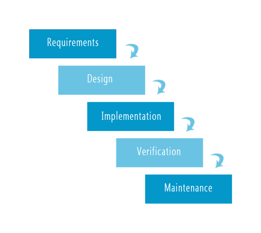

# Application Requirements and Landscape

## SRS (Software Requirements Specifications)

ধরে নিলাম আমরা প্রত্যেকেই একেকজন উদ্যোক্তা। আমরা একটা ব্যবসা শুরু করতে যাচ্ছি। সে ব্যবসার নাম হলো Problem Solvers Caffe (PS Caffe)। এটা মূলত যারা প্রোগ্রামার বা problem solvers তাদের জন্য একটা বিশেষ ক্যাফে আমরা শুরু করতে যাচ্ছি।

এর requirements আছে কিছু। এই ধরণের রিকোয়ারমেন্টসকে বলা হয় SRS (Software Requirements Specifications)। এই অ্যাপের জন্য SRS হলোঃ

> PS Caffe is an imaginary online coffee delivery service. This business is designed specially for programmers by keeping their life style in mind. We need an application to accept orders from online. The application will have the following functional and non functional requirements.
> **Special Notes:** We are not planning to grow fast. We need an [MVP (Minimal Viable Product)](https://en.wikipedia.org/wiki/Minimum_viable_product) or Workable Prototype to research our targeted market.

খুবই সিম্পল একটা অ্যাপ্লিকেশন। আমরা প্রোগ্রামারদের লাইফস্টাইল মাথায় রেখে আমরা যেখানে আছি সেখানে একটি কফি ডেলিভারি সার্ভিস তৈরি করতে চাইছি। যেহেতু আমরা প্রোগ্রামারদের লাইফস্টাইল চিন্তায় রেখে তা করতে চাইছি তার মানে আমাদের ২৪/৭ সার্ভিস দিতে হবে। এটি একটি অনলাইনভিত্তিক সার্ভিস। একটি স্পেশাল নোট আছে যাতে লেখা আছে আমরা খুব দ্রুত ব্যবসাটাকে বাড়াতে চাইছি না। আমরা শুধু মার্কেট রিসার্চের জন্য একটি MVP (Minimal Viable Product) or Workable prototype তৈরি করতে চাইছি। এই MVP এবং রিয়েল লাইফ অ্যাপ্লিকেশনের মধ্যে অনেক বিশাল একটা পার্থক্য রয়েছে। এটা বলে নেয়া জরুরী MVP টার্মটি শুধু যে সফটওয়্যার ডেভেলপমেন্টের সাথে জড়িত এমন নয়। এর বাইরে যেকোনো ফিল্ডেই এটা ব্যবহার করা যেতে পারে এবং ব্যবহার হচ্ছে।
MVP কে আমরা অন্য ভাষায় Workable Prototype ও বলে থাকি। প্রোটোটাইপ দুই ধরণের হয়। এক ধরণের প্রোটোটাইপ যার শুধুমাত্র UI দেখা যাবে কিন্তু কোনো কাজ করা যাবে না। আর আমাদেরটা হলো ওয়ার্কেবল প্রোটোটাইপ। এর মানে আমরা এমন একটা অ্যাপ্লিকেশন বানাবো যার মাধ্যমে আমরা ২০০/৩০০ মানুষকে সার্ভিস দিতে পারবো। তাহলে প্রথম ভার্সনের জন্য অনেক ফাংশনালিটিজেরই প্রয়োজন হবে না। পরে ব্যবসা বৃদ্ধির সাথে সাথে আমরা এই জিনিসগুলোকে আপডেট করতে থাকবো।
যেহেতু আমরা MVP বানাচ্ছি এবং ভবিষ্যতে আমাদের ব্যবসা বৃদ্ধি করার কথাও মাথায় আছে, সুতরাং আমাদের খেয়াল রাখতে হবে যেন আমাদের অ্যাপ্লিকেশনটা পরবর্তীতে যেকোনো আর্কিটেকচারে সহজেই ট্রান্সফার করতে পারি সে ব্যবস্থা রাখা।
এই অ্যাপ্লিকেশনের কিছু funtional and non-functional requirements আছে। ইন্টারভিউতে গুরুত্বপূর্ণ একটি প্রশ্ন থাকে What is the difference between functional and non-functional requirements.

### ফাংশনাল রিকোয়ারমেন্টস

ফাংশনাল রিকোয়ারমেন্টস হলো এমন কিছু রিকোয়ারমেন্টস যা আমার অ্যাপ্লিকেশনের ফিচারে উপর ডিপেন্ড করে। এগুলো সাধারণত ক্লায়েন্ট বলে দেয়। আবার নাও বলে দিতে পারে। যেমন ক্লায়েন্ট হয়তো বললো অ্যাপ্লিকেশন লগিনের কথা। লগ আউটের কথা সে বললোই না। কিন্তু লগিন থাকলে অবশ্যই সেখানে লগ আউট থাকবেই। সুতরাং ক্লায়েন্ট বলে না দিলেও অ্যাপ্লিকেশনের খাতিরে আমাদের কিছু কিছু ফাংশনাল রিকোয়ারমেন্ট নিজেদের যুক্ত করতে হবে। এই অ্যাপ্লিকেশনের ফাংশনাল রিকোয়ারমেন্টস আছে কিছু। সেগুলো হলোঃ

> **Functional Requirements (Mostly client requirements):**
>
> - Local Authentication:
>   At the beginning we don't want to spend more on authentication services. Just keep it simple by implementing a local authentication using email & password. But make sure, we can extend local AUTH to OAuth2 anytime in future. We need the following features -
>   - Hashed password
>   - Email verification
>   - Forget password
>   - Block users if necessary

প্রথমে আমাদের কোনো ধরণের পেইড অথেনটিকেশন সার্ভিসের প্রয়োজন নেই। আমরা শুধু ইমেইল আর পাসওয়ার্ড দিয়ে লোকাল অথেনটিকেশন করবো। তবে আমাদের খেয়াল রাখতে হবে যেন ভবিষ্যতে আমরা যেন local AUTH to OAuth2 তে এক্সটেন্ড করতে পারি এই সিস্টেম রাখা। এটা আমরা যখন মডেল তৈরি করবো বা কন্ট্রোলার তৈরি করবো তখন এরকম একটা ব্যবস্থা আমাদের রাখতে হবে। এছাড়া আমাদের কিছু ফিচার রাখতে হবে যেমন - পাসওয়ার্ড হ্যাশ করা, ইমেইল ভেরিফিকেশন, ফরগেট পাসওয়ার্ড এবং যখন চাইবো তখন যেন আমরা যেকোনো ইউজারকে ব্লক করে দিতে পারি।

> - Multiple Roles (Role Based Access Control):
>   There will be mainly five roles:
>   - Admin: Admin can create and manage everything including sales data
>   - Manager: Manager can't be able to create anything but can see sales data, inventory and products
>   - Chef: They can only see queue orders
>   - Delivery Man: They can manage the queue orders and change status
>   - User: won't able to see any admin information but able to check products, reviews and place orders.

এই অ্যাপ্লিকেশনে ৫টা মেইন রোল থাকবে। অ্যাডমিন সবকিছুতে এক্সেস নিতে পারবে। ম্যানেজার শুধু সেলস ডাটা, ইনভেনটরি আর প্রোডাক্ট দেখতে পারবে। শেফ শুধু যেসব অর্ডার কিউতে আছে তা দেখতে পারবে। ডেলিভারি ম্যান অর্ডার ম্যানেজ করতে পারবে আর স্ট্যাটাস চেইঞ্জ করতে পারবে। যেমন ডেলিভারির জন্য বের হলে সে স্ট্যাটাস চেইঞ্জ করে out for delivery, ডেলিভারি হয়ে গেলে Delivered এরকম স্ট্যাটাস চেইঞ্জ করতে পারবে। ইউজার কখনও অ্যাডমিন ইনফরমেশন দেখতে পারবে না, শুধু প্রোডাক্ট চেক করতে পারবে, অর্ডার প্লেইস করতে পারবে এবং রিভিউ দিতে পারবে।

> - User will be able to place orders

ইউজার অর্ডার প্লেইস করতে পারবে নিজের পছন্দমতো।

> - User will be able see existing reviews and only place review after a successful order

ইউজার এক্সিস্টিং রিভিউগুলো দেখতে পারবে। কিন্তু নিজে ততক্ষণ পর্যন্ত রিভিউ দিতে পারবে না যতক্ষণ পর্যন্ত একটা অর্ডার দিবে না এবং সেই অর্ডারের ডেলিভারি কমপ্লিট হবে না। প্রতিটা অর্ডারের বিপরীতে শুধু সেই অর্ডারের রিভিউ দিতে পারবে।

> - Sales dashboard

এখান থেকে সেলস স্ট্যাটাস জানা যাবে। যে কত বিক্রি হলো, এই সপ্তাহে বেশি হলো না কম এসব ডাটা অ্যানালাইসিস করা যাবে এই ড্যাশবোর্ড থেকে।

> - Manage inventory

এখানে থেকে সমস্ত ইনভেনটরির ট্র্যাকিং রাখা যাবে। যেমন চিনি, কফি, দুধ ইত্যাদির মজুত কি পরিমাণ আছে তা এখানে রেকর্ড থাকবে। এছাড়াও এমন একটি ফিচার অ্যাড করা যায়, যেমন একটা ক্যাপাচিনো বানাতে কি পরিমাণ কফি, চিনি বা দুধ লাগে তা একটা অর্ডারের বিপরীতে বাদ দিয়ে বাকিটা শো করানো যায়।

> - Live tracking of the order

ইউজার তার অর্ডারটা লাইভ ট্র্যাকিং করতে পারবে। যেমন অর্ডার প্লেইস হলে অর্ডার প্লেইসড এরকম একটা স্ট্যাটাস দেখাবে। অনুরূপভাবে যখন কফি বানানো হচ্ছে তখন প্রসেসিং, ডেলিভারির জন্য বের হলে আউট ফর ডেলিভারি এরকম কিছু স্ট্যাটাস সে দেখতে পারবে। পরবর্তীতে অ্যাপ্লিকেশনের গ্রোথের উপর নির্ভর করে গুগল ম্যাপের API কানেক্ট করে লাইভ লোকেশন ট্র্যাকিং এর ব্যবস্থাও করা যেতে পারে।

এই গেলো আমাদের ফাংশনাল রিকোয়ারমেন্টস।

### নন ফাংশনাল রিকোয়ারমেন্টস

নন ফাংশনাল রিকোয়ারমেন্টস হলো এমন কিছু রিকোয়ারমেন্টস যা অ্যাপ্লিকেশনের ফিচার কেমন হবে না হবে তার উপর ডিপেন্ড করে না। আর এই নন ফাংশনাল রিকোয়ারমেন্টসগুলো প্রায় সব অ্যাপ্লিকেশনের জন্য একই হয়। এগুলো মূলত আমাদের অ্যাপ্লিকেশন কতো সুন্দরভাবে, সেইফলি পারফর্ম করবে তা নিশ্চিত করে। যেমন এই অ্যাপ্লিকেশনের কিছু নন ফাংশনাল রিকোয়ারমেন্টস আছে। সেগুলো হলোঃ

> **Non Functional Requirements:**

> - Secure

একটা অ্যাপ্লিকেশন বানাতে গেলে অবশ্যই তা সিকিউর হতে হবে। আমরা কেউই চাই না আমার অ্যাপ্লিকেশনে যে কেউ ঢুকে যা খুশি তা করে ফেলবে। তাই প্রয়োজন অনুসারে অ্যাপ্লিকেশন সিকিউর করতে হবে।

> - Reliable

অবশ্যই আমাদের অ্যাপ্লিকেশন এমন হতে হবে যেন সবাই rely করতে পারে। ধরুন কেউ একটা কফি অর্ডার করলো। ৩০ মিনিট পর ঢুকে দেখলো তার ড্যাশবোর্ড থেকে অর্ডার উধাও। কিন্তু তার টাকা কেটে ফেলেছে। এরকম হলে কেউই এই অ্যাপ্লিকেশনের উপর রিলাই করতে পারবেনা। সুতরাং আমাদের Data secure হতে হবে, reliable হতে হবে এবং Data consistency বজায় রাখতে হবে।

> - Easy Maintainability

MVP এমন একটি প্রোডাক্ট, যে প্রোডাক্ট আমরা পাবলিক রিসার্চের জন্য বানিয়েছি। সুতরাং এতে অনেক বাগ থাকবে এটা নিশ্চিত। এছাড়াও দিনে দিনে কাস্টমারের অনেক রিকোয়ারমেন্ট বাড়তে পারে। তারা ব্যবহার করে আমাদের রিকোয়ারমেন্ট দিলো যে এই ফিচারটা হলে ভাল হয়। আমরাও ব্যবসার ভালর জন্য দেখলাম কিছু ফিচার যোগ করলে ব্যবসা আরো ভাল হবে। এসব দিক মাথায় রেখে অবশ্যই আমাদের অ্যাপ্লিকেশনটি বানাতে হবে যেন প্রয়োজনে যেকোনো ফিচার সহজে অ্যাড করা যায়, সহজে যেকোনো বাগ ফিক্স করা যায়।

> - Awesome Usability

এটি পুরোপুরি একটি UX টার্ম। আমার অ্যাপ্লিকেশন যদি ইউজার সহজে ইউজ করতে না পারে তাহলে তা যত ভাল ফিচার্সই দিকনা কেন তা কেউই ইউজ করবে না। সুতরাং Usability অবশ্যই ভাল হতে হবে।

> - High availability (not main concern for MVP)

এর মানে হলো দুনিয়াতে যাই ঘটে যাক আমাদের অ্যাপ্লিকেশন ২৪/৭ অ্যাভাইলেবল থাকতে হবে। এখানে একটা কনসেপ্ট আছে - ইলেভেন নাইন (৯৯.৯৯৯৯৯৯৯৯৯%)। এর মানে হচ্ছে সবথেকে বেশি অ্যাভেইলেবল। এর চেয়ে বেশি অ্যাভেইলেবল হওয়া সম্ভব না। এগুলো মূলত ক্লাউড নিয়ে যারা কাজ করেন তারা এর সাথে পরিচিত। আমাদের খুঁজে বের করতে হবে অ্যামাজনের কোনো সার্ভিসগুলো কতটা অ্যাভাইলেবিলিটি দিচ্ছে তার জন্য এই কনসেপ্ট আমাদের লাগবে। যদিও এই ফাংশনালিটি MVP এর জন্য মেইন কনসার্ন নয়। আমরা জাস্ট কিছু ইউজারদের জন্য এই প্রোডাক্ট বানাবো। এরপর অ্যাপ্লিকেশনের ইউজের উপর ডিপেন্ড করে আমরা আমাদের অ্যাপ্লিকেশনের availablity বাড়াবো।

> - Scalability (not main concern for MVP)

এটাও MVP এর জন্য মেইন কনসার্ন না। ধরুন আমাদের অ্যাপ্লিকেশনের ইউজার দিন দিন বাড়তে থাকলো। শুরুতে ১০ জন। তারপরের মাসে ১০০ জন, এরপর ১০০০, ১০০০০ ইত্যাদি। এর সাথে সাথে আমাদের অ্যাপ্লিকেশনকেও scalable করতে হবে এত বিপুল পরিমাণ ইউজারদের জন্য। সার্ভার একাধিক ইউজ করতে হতে পারে। এটা যদিও MVP এর জন্য লাগে না, কিন্তু অ্যাপ্লিকেশন বানাতে গেলে এই জিনিসটা মাথায় রাখা প্রয়োজন।

মূলত এগুলোই আমাদের নন ফাংশনালিটিজ রিকোয়ারমেন্টস।

## SDLC Models

প্রজেক্ট ম্যানেজমেন্টের জন্য আমরা সাধারণত দুইটা মডেল নিয়ে কাজ করি। Water Fall Model এবং Agile Model. এই দুইটা ছাড়াও আরো অসংখ্য মডেল আছে। আপনি SDLC (Software Development Life Cycle) model লিখে সার্চ দিলে আরো অসংখ্য মডেল পাবেন। কিন্তু এই দুইটি মডেল বছরের পর বছর ধরে সফলতার সাথে ব্যবহার হয়ে আসছে।
এখন প্রশ্ন হলো কোন মডেল আমরা ব্যবহার করবো। তার জন্য আমাদের এই দুইটি মডেল সম্পর্কে একটু ধারণা থাকা দরকার।

### Water Fall Model

ধরুন আমাদের রিকোয়ামেন্টস ফিক্সড। আগামী ৪/৫ বছরেও রিকোয়ারমেন্ট চেইঞ্জ হবে না। আমরা এই রিকোয়ারমেন্ট অনুসারে প্রোডাক্ট বানাবো। এরপর ৪/৫ বছর পর যদি প্রয়োজন হয় আপডেট করবো। এই ধরণের প্রজেক্টের ক্ষেত্রে ওয়াটার ফল মডেল খুবই কার্যকরী।

উপরের ছবি থেকে আমরা বিষয়টা বুঝতে পারবো। আমরা এতক্ষণ পর্যন্ত যা করলাম তা সব Requirements এর অন্তর্গত। এখন এই রিকোয়ারমেন্টস অ্যানালাইসিস করে কোন আর্কিটেকচার ইউজ করতে হবে, কিভাবে আর্কিটেক্ট করতে হবে, কোন সিস্টেম ডিজাইন ইউজ করতে হবে, কি কি চ্যালেঞ্জ আসতে পারে, কি কি constrains আসতে পারে, কিভাবে আমরা এই প্রব্লেমগুলোকে সলভ করতে পারি, কিভাবে আমরা টাইম কমিয়ে আনতে পারি এই সবগুলো Design এর আলোচ্য বিষয়। এরপর আমরা UI/UX করি, ফ্রন্টএন্ড ডেভেলপমেন্ট করি, ব্যাকএন্ড ডেভেলপমেন্ট করি, এপিআই বানাই সবকিছু Implementation এর অন্তর্গত। এরপর আমাদের বিভিন্ন টেস্টিং এর মধ্য দিয়ে যেতে হবে। লোড টেস্ট, একসেপ্টেন্স টেস্ট, সিকিউরিটি টেস্ট ইত্যাদি টেস্ট পাশ করলে এরপর আমাদের অ্যাপ্লিকেশন আমরা ডেপ্লয় করতে পারি। এসমস্ত টপিক Verification এর অন্তর্গত। অ্যাপ্লিকেশন বানালে অবশ্যই বাগ থাকবেই। এই বাগ ডিবাগ করা Maintanence এর অন্তর্ভুক্ত।
এই মডেলের একটা বিরাট প্রব্লেম আছে। প্রব্লেমটা হলো ধরেন রিকোয়ারমেন্টস অ্যানালাইসিস শেষ, সেই অনুযায়ী ডিজাইনও শেষ। ইমপ্লিমেন্টেশনের ৫০% শেষ। এখন ক্লায়েন্ট এসে এমন একটা চেইঞ্জের কথা বললো যে পুরো সিস্টেমই ব্রেক হয়ে গেলো। এমন হলে আবার প্রথম থেকে সবকিছু শুরু করতে হবে। আপনার এতদিনের কষ্ট সব মাঠে মারা গেলো।

### Agile Model

উপরের মডেলে যে সমস্যার কথা আমরা বলেছিলাম সে সমস্যা থেকে পরিত্রাণের উপায় হলো Agile Model। এখন প্রশ্ন হলো What is Agile Model. Agile model হলো এক ধরণের Water Fall Model. ওয়াটার ফল মডেলে আমরা যে কাজটা করি তা একটা লং টার্মের জন্য। ২/৩ বছরের জন্য। অপরদিকে Agile model হলো ১৫ দিন বা ৭ দিনের জন্য একটা ওয়াটার ফল মডেল। ৭ দিনের জন্য একটা রিকোয়ারমেন্ট থাকবে। সেই অনুযায়ী ডিজাইন, ইমপ্লিমেন্টেশন, ভেরিফিকেশন হবে। পরবর্তী ৭ দিন অন্য রিকোয়ারমেন্ট নিয়ে কাজ হবে। এভাবে চক্রটা চলতে থাকবে। যেমন আমাদের অ্যাপ্লিকেশনে ধরেন আমরা প্রথম ১৫ দিন লোকাল অথেনটিকেশন নিয়ে কাজ করবো। পরবর্তী ১৫ দিন রোল বেইজড এক্সেস কন্ট্রোল নিয়ে কাজ করবো। এভাবে চলতে থাকবে। এখন দুই মাস পর যদি ক্লায়েন্ট এসে বলে অথেনটিকেশনে ইমেইল দিয়ে করা হইসে। এখন সে ফোন নাম্বারও অ্যাড করতে চাইছে। যেহেতু আমরা আলাদাভাবেই অথেনটিকেশন নিয়ে কাজ করেছিলাম সুতরাং শুধু সেটাই চেইঞ্জ করলে হবে। বাকি কাজের উপর কোনো সমস্যা আসবে না। জাস্ট ওয়াটার ফল মডেলই একটা নির্দিষ্ট শর্ট টাইম পর পর।

যেহেতু আমাদের অ্যাপ্লিকেশনটি MVP সুতরাং চোখ বন্ধ করে আমরা Agile Model সিলেক্ট করবো।

## Choose Necessary Technology

আমাদের অ্যাপ্লিকেশন ডেভেলপমেন্টের জন্য আমাদের বুঝতে হবে কোন টেকনোলজি আমাদের এই অ্যাপ্লিকেশন ডেভেলপমেন্টের জন্য উপযুক্ত। তার জন্য আমাদের একটা ল্যান্ডস্কেপ দরকার। এখানে একটা Overview দেয়া হলো যাতে একটা আইডিয়া আপনারা পেতে পারেন।

প্রথমেই আমাদের দরকার SRS তৈরি করা। তার জন্য আমাদের যে যে টুলস লাগতে পারে তা হলোঃ

- Google Docs, Microsoft Office, Notion.
- (To draw EML Diagram, ER Diagram, Activity Diagram etc.) draw.io, Lucid chart

এরপর আমরা জাম্প করবো ডিজাইন পার্টে। এটাকে বলা হয় যেকোনো অ্যাপ্লিকেশনের Blue Print. এই পার্টে যা থাকবে তা হলোঃ

- System Design

  - Architectural Decision

    - Monolithic (Layered)
      - Easy to develop, but very complex to maintain when application grows
    - Microservice
      - Very hard to develop, but easy to maintain.
    - Serverless (FAAS - Function as a service)

    Monolithic Application হলো একটা অ্যাপ্লিকেশনের সব ফিচার্স এক জায়গাতেই থাকবে। অপরদিকে Microservice হলো ঐ অ্যাপ্লিকেশনের সব ফিচারকে আলাদা করে ফেলে আলাদা আলাদা সার্ভারে রাখা। যেহেতু আলাদা আলাদা ডাটাবেইজ থাকবে সেহেতু তাদের মধ্যে কমিউনিকেশন সিস্টেম তৈরি করা একটু কঠিন। তাই সিঙ্গেল পার্সন বা ছোট টীমের জন্য Microservice avoid করাই ভাল।
    যদি MVP হয় তাহলে চোখ বন্ধ করে Monolithic Architecture এ যেতে হবে। আর যেখানে বলা হবে আমার high availability and high scalability দরকার সেখানে আমরা মাইক্রোসার্ভিস ব্যবহার করবো।

    Serverless Architecture আমরা ইউজ করবো তখন, যখন ক্লায়েন্ট বলবে আমি MVP চাইছি, কিন্তু খুব সম্ভাবনা আছে এই অ্যাপ্লিকেশন খুব তাড়াতাড়ি গ্রো করার। যদি গ্রো করে ফেলে খুব তাড়াতাড়ি আমি চাই না কোনো ধরণের কোনো সমস্যা ইউজার ফেইস করুক বা ইউজার কোনো অভিযোগ আমাদের জানাক। কারণ এটা হাইলি স্কেলেবল।

  - Select Database
    অনেক রকমের ডাটাবেইজ হয়েছে মার্কেটে। কোন কাজের জন্য কোন ধরণের ডাটাবেইজ লাগবে তা আমাদের খুঁজে বের করতে হবে।
    - SQL (যখন আমি জানি যে ডাটাতে কি কি প্রোপার্টি থাকবে না থাকবে)
      - PostgreSQL
      - MySQL
    - NoSQL (যখন রিকোয়ারমেন্ট চেইঞ্জ হবে র‍্যানডমলি)
      - MongoDB
      - Casandra
    - Key value
      - Redis (ক্যাশিং, জব শিডিউলিং, ম্যাসেজ ব্রোকার)
      - DynamoDB
    - Graph Database (গ্রাফ স্ট্রাকচারের ডাটাগুলোর জন্য)
      - Neo4j
    - Search Database (সার্চ ইঞ্জিন রিলেটেড কাজ করে)
      - Elastic Database (Open Source - Text Search)
      - Algolia Search (Open AI 3 - Natural Language Processing) যেমন আমি সার্চ করলাম Men's favorite pet তখন সে আমার লেখা পড়ে মানুষের প্রিয় পোষা প্রাণী কি হতে পারে সেটা সার্চ করে দিবে। এটা অনেক পাওয়ারফুল কিন্তু ফ্রি নয়।

- Software Architecture
  Software Architecture ডিরেক্টলি রিলেটেড টু কোডিং। এটা পুরোপুরি ডিপেন্ড করে সিস্টেম ডিজাইনের উপর। সফটওয়্যার আর্কিটেকচারের জন্য আমাদের যা যা জানতে হবে তা হলোঃ
  - OOP
  - OOP Design Pattern & Principles
  - DSA
  - Clean Code Architecture
  - Problem Solving
- Testing
  - Test Driven Development (আগে টেস্ট কোড লিখে এরপর মেইন কোড লিখবো)
  - E2E (End to End) (হেডলেস ব্রাউজার ইউজ করে টেস্ট করা)
- Distribution
  - DevOps (যে কাজগুলো অপারেশনাল রিলেটেড সেই কাজগুলো অটোমেট করা যায় এর মাধ্যমে)
    - Continuous - যে কথাগুলোর সাথে কন্টিনিউ কথাটা আছে সেখানেই ডেভঅপ্স। নিচের ছবি দেখলে আরো ক্লিয়ার হবে।
      
      - Git and Github
      - Linux, SSH - Secured Shell Homepage
      - Circle CI, Travis CI, Jenkins (Integration server)
      - Docker (For Single Service), Docker Compose (For Multiple Service)
      - Docker Swarm, Kubernetes (Multiple Place এ থাকা অ্যাপ্লিকেশন এক জায়গা থেকে ম্যানেজ করার জন্য)
      - Prometheus, Nagios (Continuous monitoring এর জন্য)
      - Ansible
  - Cloud Engineering - আমাদের একটা ক্লাউড দরকার যেখানে আমরা আমাদের অ্যাপ্লিকেশনকে ডেপ্লয় করতে পারি। এখানে অসংখ্য ডিজাইন ডিসিশন চলে আসে। যেমন
    - VPC (Virtual Private Cloud) এর মাধ্যমে এই ক্লাউডের মধ্যে যে অ্যাপ্লিকেশন আছে তারাই শুধুমাত্র আমার ডাটাবেইজের এক্সেস নিতে পারবে এই ব্যবস্থা করে দেয়া যাবে।
    - EC2 (Elastic Computing Cloud) Actual server যে আমার অ্যাপ্লিকেশনকে রান করবে
    - S3 (Provide Storage Service)
    - RDS (Relational Database Service)
    - DynamoDB
    - Route 53
    - CloudFront (CDN)
    - SES (Simple Email Service)
    - SNS (Simple Notification Service)
    - SQS (Simple Queue Service)
    - API Gateway
    - Lambda
    - Step Functions
    - Cloud Watch
    - Cloud Formation, Terraform, CDK
      এগুলো ব্যবহার করার মাধ্যমে আমরা Non functionalities requirements প্রোভাইড করতে পারবো।
- Maintenance

## Decision

উপরে যা শিখলাম তার উপর ভিত্তি করে এবার আমাদের অ্যাপ্লিকেশনের ডিসিশন নিয়ে নিই। যেহেতু MVP হবে এবং বলা আছে কোনো হাই এভেইলেবিলিটি বা স্কেলেবিলিটির দরকার নেই তাই আমরা ক্লাউড ইঞ্জিনিয়ারিং পার্ট বাদ দিতে পারি। জাস্ট ৪/৮ জিবি র‍্যামের সার্ভার হলেই চলবে। ইনিশিয়ালি ডেভঅপ্সেরও প্রয়োজন নাই কারণ আমাদের দ্রুত একটা ওয়ার্কেবল প্রোটোটাইপ লাগবে। পরে অবশ্যই দরকার হবে।

- যেহেতু MVP, সেহেতু Monolithic Architecture use করবো।
- যেহেতু ডিসিশন র‍্যানডম চেইঞ্জ হবে তাই আমরা ইউজ করবো NoSQL ডাটাবেইজ (MongoDB Atlas).
- ব্যাকএন্ডের জন্য আমাদের দুইটা প্রশ্ন করতে হবে নিজেদের। প্রথম প্রশ্ন আমাদের অ্যাপ্লিকেশনে হেভি কম্পিউটিং করতে হবে কিনা (ভিডিও প্রসেসিং / ইমেজ প্রসেসিং)? যদি না হয় তাহলে .Net, Java Spring boot, Go lang বাদ। দ্বিতীয় প্রশ্ন হলো আমার অ্যাপ্লিকেশন MVC, multipage কিনা? যদি হয় তাহলে NodeJS বাদ। আমরা সিলেক্ট করবো Django, Laravel বা Ruby on rails. যদি MVC না হয়, ডেটা ড্রাইভেন হয় এবং রিয়েল টাইম হয় তাহলে চোখ বন্ধ করে NodeJS. আমাদের অ্যাপ্লিকেশন ডেটা ড্রাইভেন তাই আমাদের অ্যাপ্লিকেশনের জন্য সিলেক্ট করবো NodeJS. কারণ সে কোনো রিকোয়েস্ট ব্লক করবে না। এক্ষেত্রে নোড জেএসের ফ্রেমওয়ার্ক হিসেবে Hapi, Express বা Fastify ব্যবহার করতে পারি।

## Resource for this lecture

এই লেকচারের সমস্ত রিসোর্স এই [লিংক](../../resources/lecture-01/README.md) এ পাবেন।

## AUTHOR

[Aditya Chakraborty](https://github.com/adityackr)
