# Lecture 5 - Array Operations - Imperative vs Declarative

### Today’s Agenda:

- Array Operations

  - Imperative traverse

    ```jsx
    const numbers = [2, 5, 6, 7, 89, 100];

    let sum = 0;
    for (let i = 0; i < numbers.length; i++) {
    	// console.log(numbers[i] * 2);
    	sum += numbers[i];
    }
    console.log(sum);
    ```
    `Result:`

    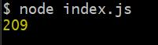

    </br>

    >নিচের Array থেকে শুধু Number গুলা বের করতে হবে, কোন নতুন Array 
    >তৈরি করা যাবে না। এই সিস্টেমে করলে memory তে জায়গা কম লাগবে।
    
    ```jsx
    let arr2=[1,2,3,null,false,6];

    count=0;
    for(let i=0;i<arr2.length;i++){
      for(let j=i;j<arr2.length-1;j++){
         if(!arr2[j]||typeof(arr2[j])!=="number"){
            arr2[j]=arr2[j+1];
            arr2[j+1]=undefined;
         }
      }
   
     if(arr2[i]==undefined){
       count++;
     }
  
    }
    arr2.length-=count;//Array থেকে undefined গুলো বাদ দিলাম
    console.log(count,arr2);
    ``` 
    `Result:`

    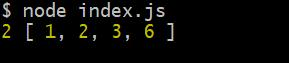

    </br>
    
    > ### Loop এর ভিতরের ঘটনা

    i=0 তে,

    যখন j=3 হবে,
    [1,2,3,false,undefined,6]

    যখন j=4 হবে,
    [1,2,3,false,6,undefined]

    new array [1,2,3,false,6,undefined]

    >#### আবার
    i=1 তে,

    যখন j=3 হবে, 
    [1,2,3,6,undefined,undefined]

    যখন j=4 হবে,
    [1,2,3,6,undefined,undefined]

    new array [1,2,3,6,undefined,undefined]
   
    >#### আবার
    i=2 তে,

    যখন j=4 হবে,
    [1,2,3,6,undefined,undefined]

    new array [1,2,3,6,undefined,undefined]
    
    >#### আবার
    i=3 তে,

    যখন j=4 হবে,
    [1,2,3,6,undefined,undefined]

    new array [1,2,3,6,undefined,undefined]

    >#### আবার
    i=4 তে
    যখন j=4 হবে,
    [1,2,3,6,undefined,undefined]

    new array [1,2,3,6,undefined,undefined]
    
    >#### আবার
    i=5 তে,

    j তে প্রবেশ করবে না, কারণ j=5 হওয়া সম্ভব না।

    >Final Array
    >>[1,2,3,6,undefined,undefined]
    > 
    >এই Array থেকে count বাদ দিলে আমাদের Final Result পাওয়া যাবে।
    >>[1,2,3,6]

    </br></br>
   
    
    >নতুন Array তৈরি করে উপরের কাজটা করা হল,এতে বেশি Memory লাগবে
    ```jsx
    const arr = [1, 2, 3, null, false, 4, 5, '', 'test', 6, 7];

    /* const filteredArray = arr.filter((val) => typeof val === 'number');
    console.log(filteredArray); */

    const newArr = [];
    for (let i = 0; i < arr.length; i++) {
    	if (typeof arr[i] === 'number') {
    		newArr.push(arr[i]);
    	}
    }
    console.log(newArr);
    ```
    `Result:`

    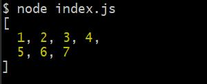

    </br></br>

    > ### Declerative way তে Travers করা [Built in method]
    ```jsx
    let arr20=[1,2,3,4];
    arr20.forEach((value,index,arr)=>{
      console.log(`index:${index} value:${value} Array:${arr}`);
    });
    ```
    `Result:`

    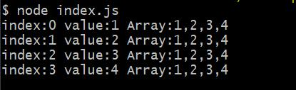

    forEach() এ argument আকারে যে function pass করা হয়, তার 
    Parameter এ ৩ টি item pass করা যায়। 

    প্রথমটাঃValue

    দ্বিতীয়টাঃindex

    তৃতীয়টাঃওই Array টা

    আমি যদি চাই value আর index বাদ দিয়ে শুধু Array টা show করাতে 
    তখন value ও index এর জায়গায় Underscore( _ ) ব্যবহার করতে 
    হবে। তবে arrow function এ পর পর ২ টা Underscore( _ ) ব্যবহার 
    করলে এটা error throw korbe


    >Underscore এর মাধ্যমে value ও index Skip করিছি
    ```jsx
    arr20.forEach(function(_,_,arra){
      console.log(`Array:[${arra}]`);
    });
    ```
    `Result:`

    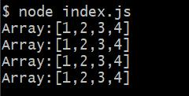

 
    
    ***Error Show*** করবে কারণ forEach() এর Argument এ Arrow Function
    ব্যবহার করেছি।
    ```jsx
    let arr404=[1,2,3];
    arr404.forEach((_,_,arra)=>{
      console.log(`Array:[${arra}]`);/*SyntaxError: Duplicate parameter name not allowed in this context*/
    });
    ```
    </br></br>


  - Update

    ```jsx
    const arr = [
    	{ id: 1, value: 10 },
    	{ id: 2, value: 20 },
    	{ id: 3, value: 30 },
    	{ id: 4, value: 40 },
    	{ id: 5, value: 50 },
    ];

    const obj2 = arr[2];
    obj2.value = 300;
    console.log(obj2);

    /* const index = arr.findIndex(function (val) {
    	return val.id === 4;
    });
    
    arr[index].value = 400;
    
    console.log(arr); */
    ```
    `Result:`

    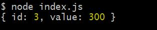

    </br>

    ```jsx
    /*find() Method Mutable Way তে কাজ করে, কারণ এটা মুল Array কে
    change করে ফেলে।*/
    const obj = arr.find(function (val) {
    	return val.id === 4;
    });

    obj.value = 400;
    console.log(obj);
    ```
    `Result:`

    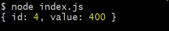
   
    </br>

    > arr ও পরিবর্তন হয়ে গেছে 

    ```jsx
    console.log(arr);

    ```
    `Result:`

    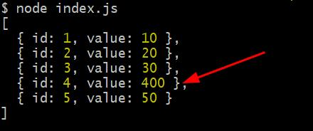

    </br></br>

    ```jsx
    console.log(arr[3] === obj);

    const a = { a: 10 };
    const b = { a: 10 };
    const c = a;
    console.log(a === c);
    ```
    </br>
    
  - Delete

    ```jsx
    const arr5 = [
    	{ id: 1, value: 10 },
    	{ id: 2, value: 20 },
    	{ id: 3, value: 30 },
    	{ id: 4, value: 40 },
    	{ id: 5, value: 50 },
    ];

    // splice -> mutable 
    const index = arr5.findIndex((item) => item.id === 4);
    const arr1 = arr5.splice(index, 1);//একটা item Delete হয়ে যাবে 
    console.log(arr5);
    ```
    `Result:`

    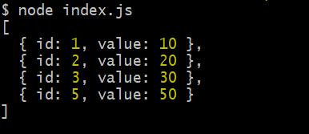
    
    </br></br>

    ```jsx
    // filter -> immutable
    const arr8 = [
    	{ id: 1, value: 100 },
    	{ id: 2, value: 200 },
    	{ id: 3, value: 300 },
    	{ id: 4, value: 400 },
    	{ id: 5, value: 500 },
    ];
    const arr7 = arr8.filter((item) => item.id !== 4);
    console.log(arr7);
    ```
    `arr7 Result:`

    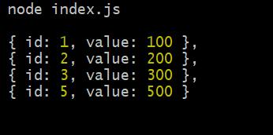

    ```jsx
    console.log(arr8);
    ```
    `arr8 বা মুল Array এর কোন পরিবর্তন হয়নিঃ`

    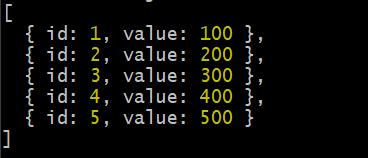

    </br></br>
    
  - Mutation
  - Map
  - Filter
  - Reduce
  - Deep copy vs Shallow copy

- Object Deep Dive

  - Object Operations

    ```jsx
    // Object Literal
    const microphone = {
    	brand: 'Fifine',
    	indictor: true,
    	price: 8000,
    	color: 'Black',
    	startRecording() {
    		console.log('recording started');
    	},
    	stopRecording() {
    		console.log('recording stopped');
    	},
    };
    /* Object.freeze(microphone);
    microphone.newProperty = 'my new property';
    console.log(microphone); */

    // console.log(Object.keys(microphone));
    // console.log(Object.values(microphone));

    /**
     * There are two different parts in object
     * 1. Noun / Adjective (State/data/property/field)
     * 2. Verb (functionalities -> start, stop)
     */

    // Constructor function
    // const testObj = new Object();
    // testObj.name = 'Test Object';
    // testObj.time = new Date();
    // console.log(testObj);

    /* for (let k in microphone) {
    	console.log(k, microphone[k]);
    } */

    // dot notation microphone.brand
    // array notation microphone['brand']

    const empty = {};
    console.log(Object.keys(empty).length === 0);
    console.log(Object.entries(microphone));
    const arr = [
    	['brand', 'Fifine'],
    	['indictor', true],
    	['price', 8000],
    	['color', 'Black'],
    ];

    console.log(Object.fromEntries(arr));
    ```

  - Function vs Method
  - Brief discussion on Prototype

- Object as a Data Structure
  - Array Operations
  - Object Over Array
- Multi Dimensional Array

### Important Links:

- [Make Fun Of Javascript Array](https://www.youtube.com/playlist?list=PL_XxuZqN0xVDr08QgQHljCecWtA4jBLnS)

### Task:

- How can we use object as a data structure? যে কাজগুলো আমরা array ব্যবহার করে করতে পারি সেগুলো কিভাবে object দিয়ে করতে পারি?
