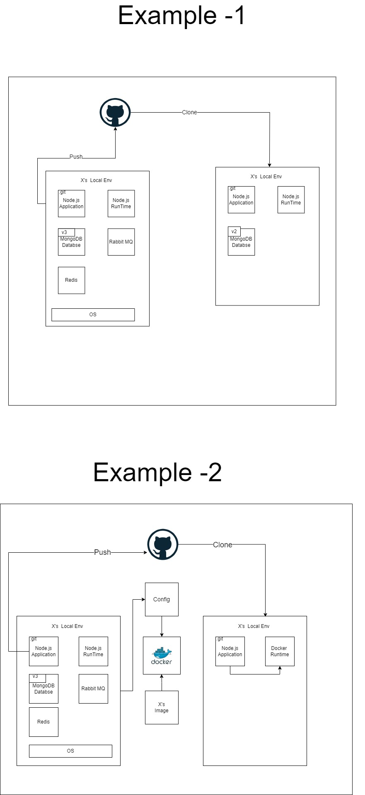

# Lecture - 117 | Introduction to Docker with Docker Compose and MongoDB

## Resources

- [Docker](https://www.docker.com/)
- [Docker Compose](https://docs.docker.com/compose/)
- [MongoDB](https://www.mongodb.com/)
- [MongoDB Docker](https://hub.docker.com/_/mongo)
- [Mongo Express](https://hub.docker.com/_/mongo-express)

## Docker

## Diagram of Docker

To see the diagram, open the file `Lecture-117.drawio` in [full-stack-army Repo](https://github.com/mrhm-dev/full-stack-army/tree/master/diagrams)

If you don't have draw.io, you can see the image below:

