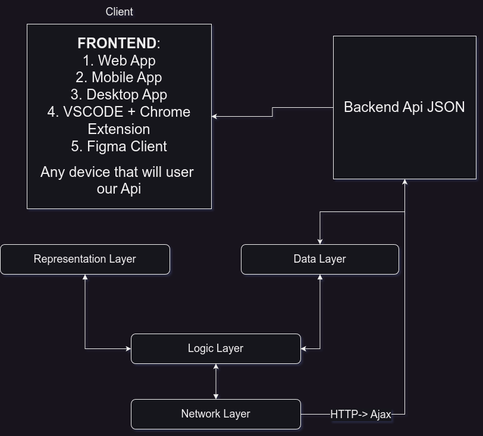
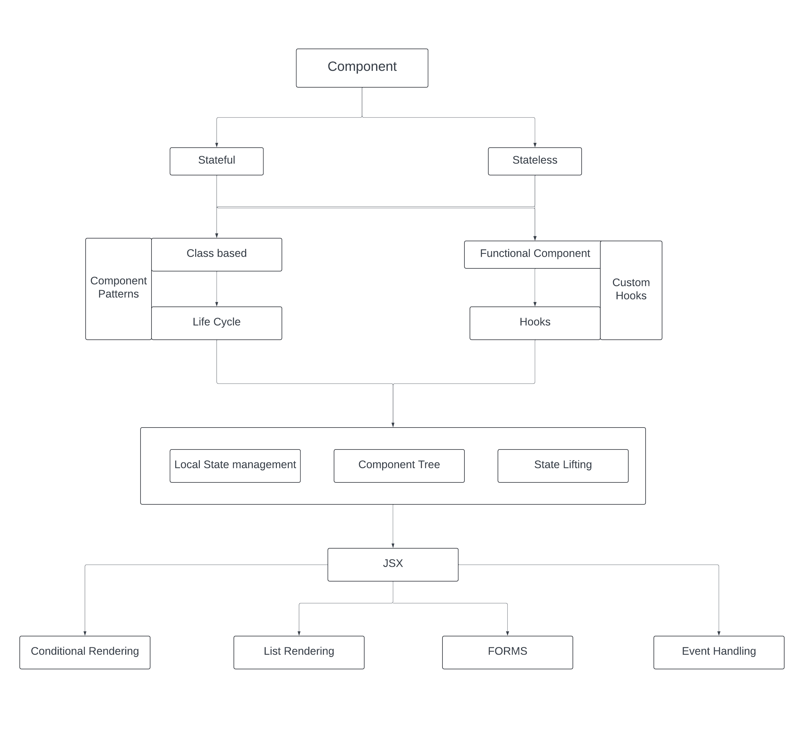

# Lecture 27 - Frontend Core Concepts and Communication

### Who is our client?

- device, browser, mobile, IOT are our clients.

- In fact, Everything that can take JSON data is our CLIENT and that is mostly FRONTEND

### What is located in the FRONTEND:

- Representation layer - what we see or the actual UI and get the feedback from the user
- Data layer -  where we will manage our Data. these are two types: application data and backend or server data
- Logical Layer - takes input from the Data Layer and changes the Representation Layer according to the data changes and Vice versa. The logical Layer combines every other layer
- Network Layer - Will be connected with Logical Layer and connect the frontend with the backend and server

NOTE: **This is applicable for all frontend applications**

IF our backend server collects data from other servers then our backend server works as a frontend

### React
Mind map:
